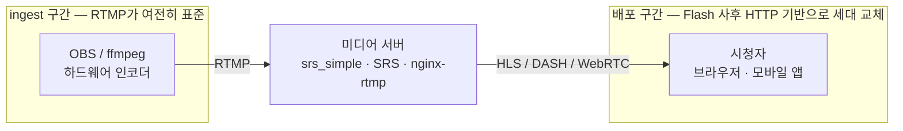
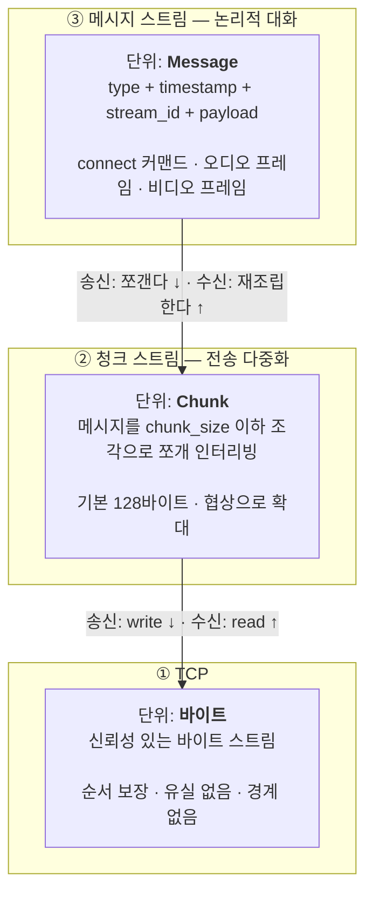
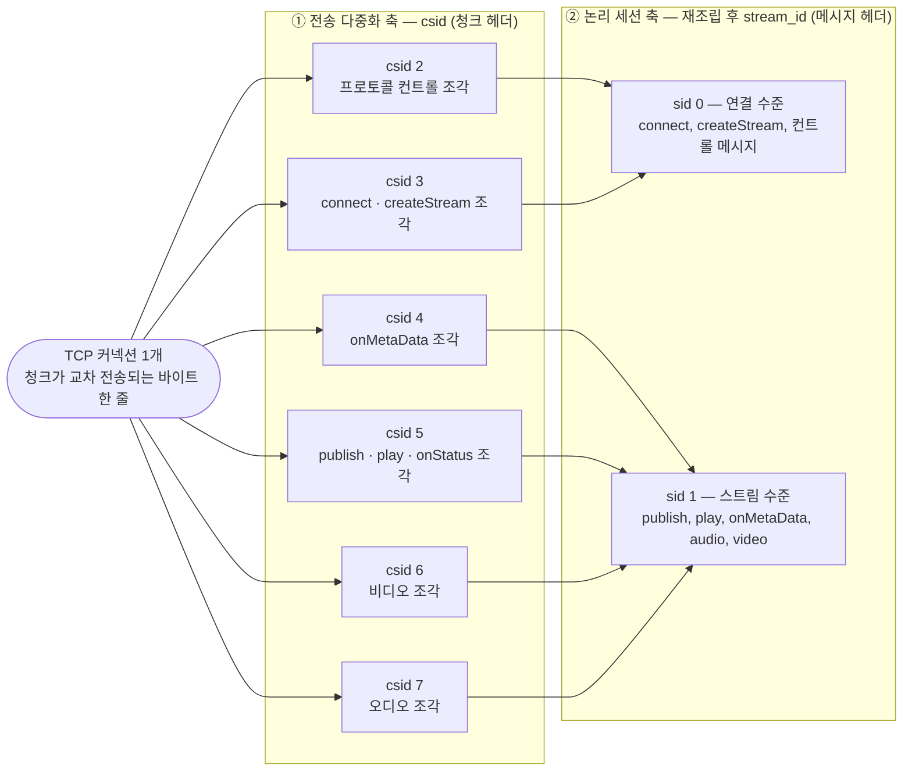
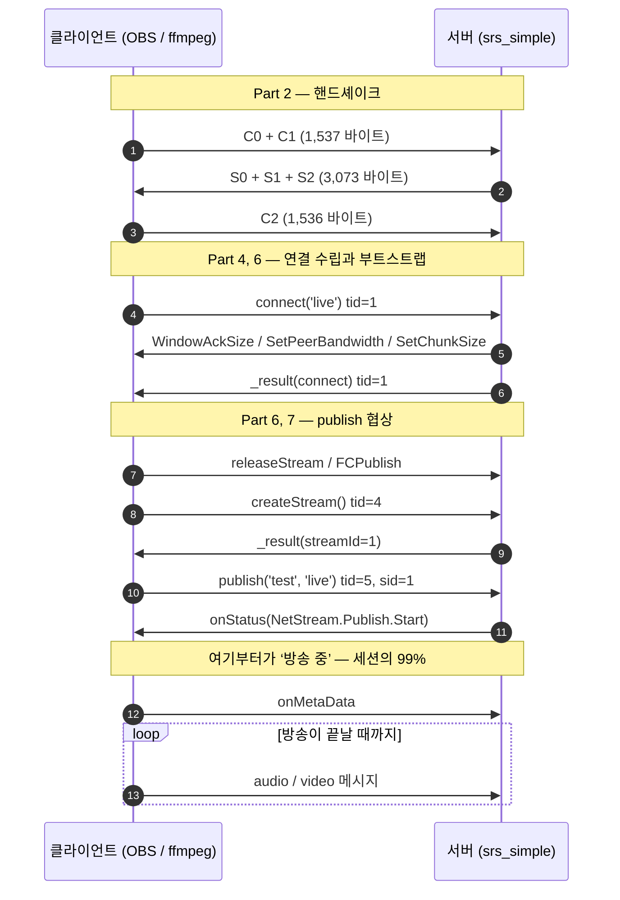
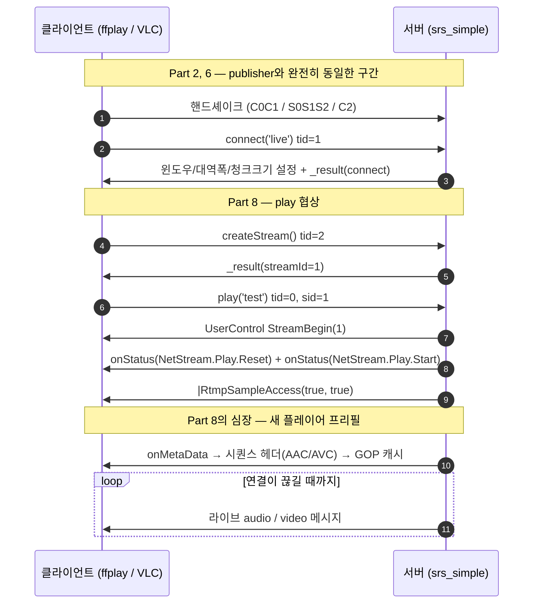

# RTMP 깊이 읽기 (1) — 조감도: 메시지, 청크, 스트림

> **시리즈 안내**: 이 시리즈는 교육용 RTMP 서버 [srs_simple](../README.md)의 코드를 읽기 위해 필요한
> RTMP 프로토콜 이론을 핸드셰이크부터 모든 패킷까지 정리한다. srs_simple은 원본
> [SRS](https://github.com/ossrs/srs)의 클래스/파일/메서드 이름을 1:1로 미러링하므로,
> 여기서 익힌 내용은 원본 SRS를 읽을 때 그대로 통한다.
>
> **시리즈 목차**
>
> 1. **RTMP 조감도 — 메시지, 청크, 스트림** (이 글)
> 2. [핸드셰이크 — 연결의 첫 3,073+1,536 바이트](part2-handshake.md)
> 3. [청크 스트림 — RTMP의 심장](part3-chunk-stream.md)
> 4. [프로토콜 컨트롤 메시지 5종](part4-control-messages.md)
> 5. [AMF0 — 커맨드의 언어](part5-amf0.md)
> 6. [커맨드 흐름 (1) — connect와 스트림 생성](part6-netconnection.md)
> 7. [커맨드 흐름 (2) — publish와 미디어 메시지](part7-publish.md)
> 8. [커맨드 흐름 (3) — play와 중간 입장 문제](part8-play.md)
> 9. [(보너스) 서버 내부 — 팬아웃, 캐시, 지터](part9-server-internals.md)
> 10. [(보너스 2) HLS — 같은 스트림을 HTTP로 배달하기](part10-hls.md)
> 11. [(보너스 3) LL-HLS — 지연과의 싸움: 파트, 블로킹 리로드, fMP4](part11-llhls.md)

이 글은 사전 지식을 가정하지 않는다. 세부 바이트 포맷은 다루지 않고, 이후 파트 전체를 관통하는
**세 개의 개념 — 메시지(Message), 청크(Chunk), 스트림(Stream) — 의 관계**를 잡는 것이 목표다.
이 그림 하나가 머리에 들어오면, RTMP의 나머지는 전부 이 그림의 특정 부분을 확대한 것이다.

---

## 1. RTMP는 왜 아직 살아 있는가

RTMP(Real-Time Messaging Protocol)는 Macromedia(이후 Adobe)가 Flash Player와
Flash Media Server 사이의 오디오/비디오/데이터 전송을 위해 만든 프로토콜이다. 2000년대의
인터넷 방송 — 아프리카TV, Ustream, 초기 YouTube Live — 은 전부 브라우저의 Flash Player가
RTMP로 서버에 붙는 구조였다.

Flash는 2020년에 공식적으로 죽었다. 그런데 RTMP는 2026년 현재도 방송 파이프라인의
**ingest(송출) 구간 표준**이다. OBS에서 "방송 시작"을 누르면 지금도 RTMP가 나간다:



시청자 쪽(배포 구간)은 브라우저에서 Flash가 사라지면서 HLS/DASH/WebRTC로 교체됐지만,
송출 쪽은 사정이 다르다:

- **송출 클라이언트는 소수의 소프트웨어다.** OBS, ffmpeg, 하드웨어 인코더 정도. 이들이 이미
  안정적으로 지원하는 프로토콜을 바꿀 유인이 약하다.
- **RTMP는 ingest에 충분히 좋다.** TCP 기반이라 방화벽을 잘 통과하고, 지연도 ingest 용도로는
  문제없는 1~3초 수준이며, 구현이 단순하다.
- **서버 생태계가 전부 받아준다.** YouTube, Twitch, SRS, nginx-rtmp 등 모든 미디어 서버가
  RTMP ingest를 지원한다.

그래서 "RTMP를 이해한다"는 것은 곧 "OBS가 서버로 보내는 바이트를 이해한다"는 뜻이고,
이 시리즈가 다루는 srs_simple이 바로 그 구간의 서버다. 덧붙여 srs_simple은 위 그림의
배포 구간 중 HLS와 LL-HLS도 구현하므로, 시리즈 마지막의 [Part 10](part10-hls.md)/[Part 11](part11-llhls.md)에서
그림의 오른쪽 절반 — 같은 스트림이 HTTP로 나가는 경로 — 까지 완주한다.

---

## 2. 계층 모델: 세 개의 층

RTMP를 처음 볼 때 가장 중요한 그림이다. RTMP는 TCP 위에 **두 개의 층**을 더 쌓는다:



- **TCP**는 그저 바이트를 순서대로 배달한다. 어디까지가 한 덩어리인지 모른다.
- **청크 스트림**은 그 바이트 흐름을 "조각(chunk)" 단위로 구획하는 층이다. 보내는 쪽은
  메시지를 조각으로 쪼개고, 받는 쪽은 조각을 모아 메시지로 재조립한다.
- **메시지 스트림**은 애플리케이션이 실제로 다루는 단위다. "connect 해라", "이것은
  타임스탬프 1000ms의 비디오 프레임이다" 같은 논리적 의미는 전부 이 층에 있다.

수신 서버의 관점에서 말하면: TCP 소켓에서 바이트를 읽고 → 청크 경계를 해석해 조각을 모으고 →
완성된 메시지를 위층에 올린다. srs_simple에서 이 재조립을 담당하는 것이
`SrsProtocol::recv_message()`이고([srs_protocol_rtmp_stack.cpp](../src/protocol/srs_protocol_rtmp_stack.cpp)),
그 내부가 Part 3의 주인공이다.

### 2.1 Message — 논리 단위

메시지는 헤더와 페이로드로 구성된다. 헤더의 핵심 필드는 세 개(type / timestamp /
stream_id)이고, 거기에 길이 필드가 붙는다:

```text
Message
├─ 헤더 ──┬─ message_type    (1B)  이 메시지가 무엇인가 — audio? video? command?
│         ├─ timestamp       (4B)  미디어 타임라인상의 시각 (ms)
│         ├─ stream_id       (4B)  어느 논리 스트림 소속인가
│         └─ payload_length  (3B)  페이로드 크기
│
└─ 페이로드 ─────────────────────  실제 내용 — 압축된 프레임 · AMF0 커맨드 · …
                                   (형식은 message_type이 결정한다)
```

헤더는 **논리 필드의 집합**이라는 점을 기억하자. 이 필드들이 조각마다 통째로 나가는
것이 아니라, 청크 층이 직전 청크와 겹치는 필드를 지워 가며 11 / 7 / 3 / 0바이트로
압축해 싣는다 (Part 3 §3.1).

`message_type` 값으로 메시지의 종류가 갈린다. srs_simple이 다루는 타입 전체:

| type | 이름            | 내용                                                   | 다루는 파트     |
| ---- | --------------- | ------------------------------------------------------ | --------------- |
| 1~6  | 프로토콜 컨트롤 | SetChunkSize, Ack, UserControl 등 프로토콜 자체의 관리 | Part 4          |
| 8    | Audio           | 압축된 오디오 프레임 (AAC 등)                          | Part 7          |
| 9    | Video           | 압축된 비디오 프레임 (H.264 등)                        | Part 7          |
| 18   | AMF0 Data       | 메타데이터 (onMetaData 등) — 응답 없는 통보            | Part 5, 7       |
| 20   | AMF0 Command    | connect, publish, play 등 RPC와 그 응답                | Part 5, 6, 7, 8 |

이 표가 srs_simple 코드에서는 [srs_kernel_flv.hpp:16-35](../src/kernel/srs_kernel_flv.hpp#L16-L35)의
`RTMP_MSG_*` 상수로, 메시지 헤더는 같은 파일의 `SrsMessageHeader` 클래스
([srs_kernel_flv.hpp:67-119](../src/kernel/srs_kernel_flv.hpp#L67-L119))로 나타난다.
원본 SRS에서도 같은 파일이다: `trunk/src/kernel/srs_kernel_flv.hpp`.

한 가지만 미리 봐두자. `SrsMessageHeader`에는 위 그림의 필드가 그대로 있고, 여기에
`is_audio()`, `is_amf0_command()` 같은 판별자가 붙어 있다. 서버 코드 전체에서 "이 메시지가
무엇인가"라는 질문은 전부 이 판별자들로 답한다 — 즉 **type 1바이트가 이후 모든 분기의 출발점**이다.

### 2.2 Chunk — 전송 단위, 그리고 인터리빙

메시지를 그냥 TCP에 통째로 쓰면 안 되나? 안 되는 이유가 RTMP 설계의 핵심 동기다.

비디오 키프레임은 크다. 1080p 스트림이면 키프레임 하나가 수백 KB에 달할 수 있다. 반면 오디오
프레임은 수백 바이트인데 **20~40ms마다 꼬박꼬박** 도착해야 한다. 메시지를 통째로 보내면:

```text
(A) 청크 없이 메시지를 통째로 보낼 때        TCP 바이트 순서 →

    |<------- video keyframe 300KB ------->|[a][a][a]
                                           ▲
    키프레임을 다 밀어낼 때까지 오디오는 대기열에서 굶는다
    → 20~40ms 간격이 무너지고 수신 측에서 소리가 끊긴다
```

그래서 RTMP는 모든 메시지를 `chunk_size`(기본 128바이트, 협상으로 확대 가능) 이하의
조각으로 쪼개고, **서로 다른 메시지의 조각을 한 TCP 스트림에서 교차(interleave)**시킨다:

```text
(B) chunk_size 단위로 쪼개 인터리빙할 때      TCP 바이트 순서 →

    [v1][v2][ a ][v3][v4][ a ][v5][v6][ a ]
             ▲              ▲              ▲
    비디오 조각 사이사이에 오디오 메시지가 끼어든다
    → 큰 메시지가 작은 메시지의 지연 상한을 지배하지 못한다
      (지연 상한 = chunk_size 하나를 밀어내는 시간)
```

각 조각 앞에는 작은 청크 헤더가 붙어서 "이 조각이 어느 메시지 흐름의 몇 번째 조각인지"를
알려준다. 수신 측은 이 헤더를 보고 조각들을 흐름별로 분류해 재조립한다. 헤더를 극단적으로
압축하는 기법(fmt 0~3, 최소 1바이트 헤더)이 RTMP에서 가장 정교한 부분이고, Part 3 전체가
여기에 할애된다.

### 2.3 csid vs message stream id — 서로 다른 두 개의 축

초심자가 RTMP에서 가장 헷갈리는 지점을 미리 짚는다. RTMP에는 "스트림 번호"처럼 보이는 것이
**두 개** 있고, 이 둘은 완전히 다른 층의 개념이다:

|           | chunk stream id (**csid**)             | message stream id (**sid**)                 |
| --------- | -------------------------------------- | ------------------------------------------- |
| 소속 층   | 청크 스트림 (전송)                     | 메시지 스트림 (논리)                        |
| 위치      | 청크 헤더의 basic header               | 메시지 헤더의 stream_id 필드                |
| 역할      | 인터리빙된 조각을 재조립 흐름별로 분류 | "어느 논리 세션의 메시지인가"               |
| 값의 예   | 2=컨트롤, 3=커맨드, 4~=미디어 (관례)   | 0=연결 수준, 1=createStream으로 만든 스트림 |
| 결정 주체 | 보내는 쪽이 임의로 (관례를 따를 뿐)    | 서버가 createStream 응답으로 발급           |



비유하면 csid는 **트럭 번호**(어느 트럭에 실어 나눠 보냈는가)이고, sid는 **수취인**(이 화물이
논리적으로 누구 것인가)이다. 같은 수취인의 화물이 여러 트럭에 나뉠 수 있고, 한 트럭이 여러
수취인의 화물을 나를 수도 있다 — 두 축은 독립이다.

위 그림의 csid 값은 임의로 고른 게 아니라 srs_simple이 실제로 쓰는
[srs_kernel_flv.hpp:39-54](../src/kernel/srs_kernel_flv.hpp#L39-L54)의 `RTMP_CID_*`
상수 그대로다 (`ProtocolControl`/`OverConnection`/`OverConnection2`/`OverStream`/`Video`/`Audio`).
다만 이건 **관례일 뿐 프로토콜이 강제하지 않는다** — 보내는 쪽이 다른 번호를 골라도 되고,
그래서 화살표의 방향(어느 csid가 어느 sid로 재조립되는가)은 구현마다 달라질 수 있다.
이 구분은 Part 3(청크 재조립)과 Part 6(createStream이 sid를 발급하는 순간)에서 다시 만난다.

---

## 3. 한 세션의 전체 수명주기 미리보기

이제 층을 세로로 쌓았으니, 시간을 가로로 펼쳐 보자. OBS가 방송을 시작해서 ffplay가 시청하기까지,
한 RTMP 세션은 다음 단계를 밟는다. 지금은 단계 이름만 눈에 익히면 된다 — 각 단계가 이후
파트의 장 제목이다.

**Publisher (OBS/ffmpeg가 송출할 때):**



**Player (ffplay/VLC가 시청할 때):**



두 시퀀스에서 관찰할 것 세 가지:

1. **핸드셰이크부터 createStream까지는 publisher와 player가 동일하다.** 서버는 그 다음에 오는
   커맨드(publish냐 play냐)를 보고서야 상대의 의도를 안다. 이 판별이 Part 6의 `identify_client`다.
2. **커맨드는 요청-응답 쌍이다** (connect→_result, createStream→_result). 이 RPC의
   직렬화 포맷이 AMF0이고(Part 5), 쌍을 맺어주는 것이 transaction id다(Part 6).
3. **마지막 줄의 "반복"이 세션의 99%다.** 커맨드 협상은 처음 몇 KB로 끝나고, 이후는 오디오/비디오
   메시지가 청크로 쪼개져 흐르는 시간이다. 협상이 "제어면"이라면 미디어 흐름은 "데이터면"이다.

srs_simple에서 이 수명주기는 연결 하나를 담당하는 `SrsRtmpConn`의 메서드 이름에 그대로
새겨져 있다: `do_cycle`(핸드셰이크→connect) → `service_cycle`(부트스트랩 응답) →
`stream_service_cycle`(identify→publish/play 분기) → `publishing`/`playing`(미디어 루프)
([srs_app_rtmp_conn.cpp](../src/app/srs_app_rtmp_conn.cpp), 원본은
`app/srs_app_rtmp_conn.cpp:173/396/491/925/702`). 지금은 이름만 기억하자 —
이 체인은 Part 6~8에서 단계별로 해부한다.

---

## 4. 시리즈 로드맵 — 각 파트는 이 그림의 어디인가

위 조감도에 이후 파트를 겹쳐 놓으면 이렇다. **가로는 시간**(§3의 수명주기 순서),
**세로는 층**(§1의 층 모델)이다 — 각 칸이 "그 층의 그 시점"을 다루는 파트다.

| 층 ↓ ＼ 시간 → | ① 핸드셰이크 | ② connect ~ createStream | ③ publish / play | ④ 미디어 반복 |
| --- | --- | --- | --- | --- |
| **메시지 스트림** (논리 단위) | — | **Part 5** AMF0 = 커맨드의 직렬화 언어 · **Part 6** 접속과 클라이언트 식별 | **Part 7** 송출 시작 · **Part 8** 시청 시작 | **Part 7 / 8** 미디어 메시지 릴레이 |
| **청크 스트림** (전송 단위) | — | **Part 3** 쪼개기·재조립 = RTMP의 심장 · **Part 4** 청크 층을 관리하는 컨트롤 메시지 | 동일 (Part 3·4) | 동일 (Part 3·4) — 세션 바이트의 99%가 여기 |
| **TCP** | **Part 2** 고정 바이트 교환 (층 모델 바깥의 서막) | 다루지 않음 — 신뢰성은 TCP가 공짜로 준다 | 〃 | 〃 |
| **서버 내부** (네트워크 밖) | — | — | **Part 9** 1 publisher → N player 팬아웃 | **Part 9** GOP·메타 캐시, 무복사 전달 |

- **Part 2 (핸드셰이크)**: 층 모델이 시작되기 전, 연결 벽두의 고정 바이트 교환. 왜 3,073바이트인지,
  Flash 시대의 암호 검증이 왜 흔적기관이 됐는지.
- **Part 3 (청크 스트림)**: 가운데 층의 전부. 청크 헤더 fmt 0~3, extended timestamp,
  재조립 상태 기계. **이 시리즈에서 가장 밀도 높은 파트다.**
- **Part 4 (컨트롤 메시지)**: 청크 층 자체를 관리하는 type 1~6 메시지들. "SetChunkSize를
  언제 보내야 하는가" 같은 타이밍 규칙.
- **Part 5 (AMF0)**: 커맨드 메시지의 페이로드 인코딩. connect의 실제 바이트를 손으로 읽는다.
- **Part 6~8 (커맨드 흐름)**: 위 시퀀스 다이어그램을 구간별로 확대 — 접속과 식별(6),
  송출(7), 시청과 중간 입장 문제(8).
- **Part 9 (서버 내부)**: 프로토콜을 벗어나, 받은 미디어를 N명에게 무복사로 뿌리는 서버 설계.
- **Part 10 (HLS)**: RTMP를 벗어나 — 같은 스트림을 TS 세그먼트와 m3u8로 바꿔 HTTP로
  배달하는 트랜스먹싱 경로. §1 그림의 배포 구간이다.
- **Part 11 (LL-HLS)**: 그 배달 경로의 지연(수십 초)을 ~2초로 줄이는 방법 — 0.5초 fMP4 파트,
  블로킹 리로드, 프리로드 힌트. 세그먼트 pull과의 대비가 주제다.

---

## 5. 정리

기억할 것은 그림 하나와 문장 세 개다:

1. **RTMP는 TCP 위에 청크 층과 메시지 층을 쌓는다.** 메시지가 논리 단위, 청크가 전송 단위다.
2. **청크가 존재하는 이유는 인터리빙이다.** 큰 키프레임이 작은 오디오를 굶기지 않도록,
   모든 메시지를 조각내 교차 전송한다.
3. **csid와 message stream id는 다른 축이다.** csid는 조각을 재조립 흐름별로 분류하는
   전송 축, sid는 논리 세션 축이다.

다음 파트는 시간순으로 맨 앞, 모든 RTMP 연결이 반드시 통과하는 첫 관문 — 핸드셰이크다.
클라이언트가 보내는 첫 1,537바이트에 무엇이 들었는지부터 시작한다.

---

_이 글은 [srs_simple](../README.md) 프로젝트의 RTMP 이론 시리즈 Part 1이다.
코드 대조 기준: srs_simple `src/kernel/srs_kernel_flv.hpp`,
`src/protocol/srs_protocol_rtmp_stack.hpp` / 원본 SRS 6.0 `trunk/src/kernel/srs_kernel_flv.hpp`,
`trunk/src/app/srs_app_rtmp_conn.cpp`._
