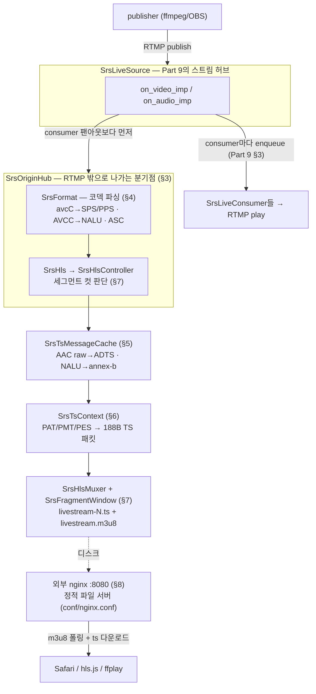
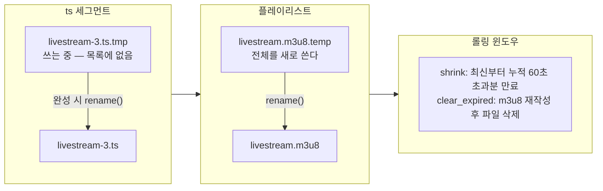
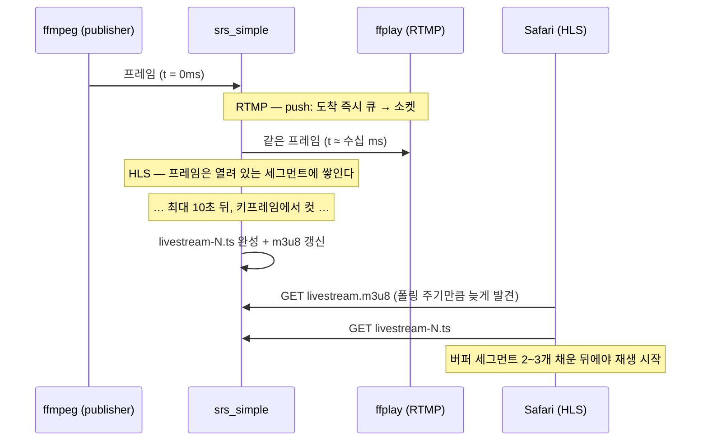

# RTMP 깊이 읽기 (10) — HLS: 같은 스트림을 HTTP로 배달하기

> **시리즈 안내**: 이 시리즈는 교육용 RTMP 서버 [srs_simple](../README.md)의 코드를 읽기 위해 필요한
> RTMP 프로토콜 이론을 핸드셰이크부터 모든 패킷까지 정리한다. srs_simple은 원본
> [SRS](https://github.com/ossrs/srs)의 클래스/파일/메서드 이름을 1:1로 미러링하므로,
> 여기서 익힌 내용은 원본 SRS를 읽을 때 그대로 통한다.
>
> **시리즈 목차**
>
> 1. [RTMP 조감도 — 메시지, 청크, 스트림](part1-overview.md)
> 2. [핸드셰이크 — 연결의 첫 3,073+1,536 바이트](part2-handshake.md)
> 3. [청크 스트림 — RTMP의 심장](part3-chunk-stream.md)
> 4. [프로토콜 컨트롤 메시지 5종](part4-control-messages.md)
> 5. [AMF0 — 커맨드의 언어](part5-amf0.md)
> 6. [커맨드 흐름 (1) — connect와 스트림 생성](part6-netconnection.md)
> 7. [커맨드 흐름 (2) — publish와 미디어 메시지](part7-publish.md)
> 8. [커맨드 흐름 (3) — play와 중간 입장 문제](part8-play.md)
> 9. [(보너스) 서버 내부 — 팬아웃, 캐시, 지터](part9-server-internals.md)
> 10. **(보너스 2) HLS — 같은 스트림을 HTTP로 배달하기** (이 글)
> 11. [(보너스 3) LL-HLS — 지연과의 싸움: 파트, 블로킹 리로드, fMP4](part11-llhls.md)

이 글은 Part 9까지 읽었다고 가정한다.

Part 1 §1의 첫 그림을 기억하는가 — OBS가 **RTMP로 밀어 넣고**(ingest), 시청자는
**HLS/DASH/WebRTC로 받는**(배포) 구조. Part 2~9는 그 그림의 왼쪽 절반이었다.
이번 파트는 오른쪽 절반이다: srs_simple은 S10에서 HLS를 구현했고(CLAUDE.md §5.6 S10),
지금 서버를 띄우면 같은 publish가 **RTMP로도, HLS로도** 나간다:

```text
ffmpeg ── RTMP publish ──▶ srs_simple ──┬─ RTMP play ──▶ ffplay      (지연 1초 미만)
                                        └─ HLS play ───▶ Safari/hls.js (지연 수십 초)
```

같은 스트림, 같은 허브(`SrsLiveSource`)에서 갈라진 두 배달 경로가 왜 이렇게 다른
지연을 갖는지 — 그 답이 이 파트의 목적지다. 가는 길에 RTMP에서 한 번도 열지 않았던
문 하나를 연다: **미디어 페이로드의 내부**다.

---

## 1. HLS는 왜 이렇게 생겼는가 — 스트리밍을 파일로 환원하기

HLS(HTTP Live Streaming)는 Apple이 2009년에 만든 프로토콜인데, 프로토콜이라
부르기 민망할 만큼 단순하다. 아이디어는 한 문장이다: **라이브 스트림을 잘게 자른
정적 파일들과, 그 파일 목록으로 환원한다.**

srs_simple이 실제로 생성하는 파일을 보자. publish 중에 `./objs/hls/live/`를 열면:

```text
livestream.m3u8          ← 플레이리스트 (목록 파일, 계속 갱신됨)
livestream-0.ts          ← 처음 10초
livestream-1.ts          ← 다음 10초
livestream-2.ts          ← 그 다음 10초 …
```

`livestream.m3u8`의 내용은 텍스트다:

```text
#EXTM3U
#EXT-X-VERSION:3
#EXT-X-MEDIA-SEQUENCE:0        ← 첫 항목의 세그먼트 번호 (윈도우가 밀리면 증가)
#EXT-X-TARGETDURATION:11       ← 세그먼트 최대 길이의 올림값 (스펙: 변하면 안 됨)
#EXTINF:10.020, no desc        ← 다음 파일의 재생 길이 (초)
livestream-0.ts
#EXTINF:10.000, no desc
livestream-1.ts
#EXTINF:10.000, no desc
livestream-2.ts
```

플레이어의 동작도 이 파일이 말해 준다: **m3u8을 주기적으로 다시 받아서**(폴링)
새 항목이 생겼으면 그 ts 파일을 받아 이어 재생한다. 이게 전부다. 연결 유지도,
핸드셰이크도, 청크 재조립도 없다 — 전송은 통째로 HTTP GET에 맡긴다.

Part 1~9를 통과한 눈으로 보면 RTMP와의 대비가 선명하다:

| 관점 | RTMP play (Part 8) | HLS play (이 파트) |
| --- | --- | --- |
| 전송 모델 | 서버가 프레임 단위로 **push** | 플레이어가 세그먼트 단위로 **pull** |
| 연결 | TCP 1개를 세션 내내 유지 | GET 요청의 반복 (상태 없음) |
| 서버의 일 | 소켓마다 큐·지터·팬아웃 관리 | 정적 파일 서빙 (아무 웹서버나 가능) |
| 배포 확장 | 서버가 시청자 수만큼 소켓 유지 | CDN이 파일을 캐시 — 시청자 수와 원본 서버 부하 분리 |
| 시청 환경 | 전용 플레이어 필요 (Flash는 죽음) | 브라우저 (`<video>` + hls.js, Safari는 네이티브) |
| 지연 | 1초 미만 | 세그먼트 길이 × 플레이어 버퍼 = 수십 초 |

배포 구간이 HLS로 세대 교체된 이유가 이 표에 있다. 시청자 100만 명에게 RTMP로
보내려면 서버가 100만 개의 소켓과 큐를 감당해야 하지만, HLS는 **파일을 CDN에
맡기면 끝**이다 — 스트리밍의 어려운 부분(팬아웃)을 이미 세계에서 가장 잘 푼
인프라(HTTP 캐싱)에 떠넘기는 설계다. 그 대가가 지연이고, 지연의 해부는 §9에서 한다.

그래서 서버가 할 일은 "RTMP로 들어온 프레임을 ts 파일과 m3u8로 바꾸는 것"이 된다.
코덱(H.264/AAC)은 그대로 두고 **컨테이너만 FLV → MPEG-TS로 갈아 끼우므로**,
이 변환을 트랜스코딩(재인코딩)과 구별해 **트랜스먹싱(transmuxing)**이라 부른다.

---

## 2. 파이프라인 조감도 — 등장인물 전원

srs_simple의 HLS 경로 전체를 한 장에 펼치면 이렇다. 위쪽 절반(허브까지)은
Part 7~9에서 이미 본 그림이고, 아래쪽 절반이 이 파트의 새 인물들이다:



이름과 배치는 전부 원본 SRS 그대로다. 레이어로 나누면 — **kernel**에 프로토콜
무관 변환기(`SrsFormat`, `SrsTsContext`, `SrsTsMessageCache`, `SrsFileWriter`),
**app**에 정책(`SrsOriginHub`, `SrsHls`, `SrsHlsController`, `SrsHlsMuxer`,
`SrsFragment`/`SrsFragmentWindow`)이 놓인다. 원본 대응은:

| srs_simple | 원본 SRS (`trunk/src/`) | 역할 |
| --- | --- | --- |
| [srs_kernel_codec.{hpp,cpp}](../src/kernel/srs_kernel_codec.hpp)의 `SrsFormat` | `kernel/srs_kernel_codec.*` (4,700줄) | FLV 페이로드 → 코덱 설정 + 샘플 |
| [srs_kernel_ts.{hpp,cpp}](../src/kernel/srs_kernel_ts.hpp) | `kernel/srs_kernel_ts.*` (5,900줄) | PES 변환 + TS 패킷 직렬화 |
| [srs_app_hls.{hpp,cpp}](../src/app/srs_app_hls.hpp) | `app/srs_app_hls.*` (1,900줄) | 세그먼트 컷·m3u8·롤링 윈도우 |
| [srs_app_fragment.{hpp,cpp}](../src/app/srs_app_fragment.hpp) | `app/srs_app_fragment.*` | 세그먼트 파일 수명주기 |
| [conf/nginx.conf](../conf/nginx.conf) (외부 nginx) | `app/srs_app_http_conn.*` + HTTP 스택 전체 | 파일 서빙 |

원본 줄 수를 보면 알 수 있듯 이 경로는 원본에서 가장 무거운 축에 든다.
srs_simple은 **쓰기(인코드) 방향만** 남기고 디코더·암호화·훅을 들어냈다
(CLAUDE.md §5.6 S10) — 그래도 개념은 전부 남아 있다.

---

## 3. 분기점 — SrsOriginHub, 그리고 열리는 페이로드

Part 9 §3에서 본 `on_video_imp` 한 바퀴에는 사실 한 줄이 더 있다.
[`SrsLiveSource::on_video_imp`](../src/app/srs_app_source.cpp#L1086)의 실제 순서는:

```cpp
bool is_sequence_header = SrsFlvVideo::sh(msg->payload, msg->size);

if (is_sequence_header) meta->update_vsh(msg);       // ① sh → MetaCache
hub->on_video(msg, is_sequence_header);               // ② OriginHub → 코덱 파싱 + HLS
for (컨슈머마다) consumer->enqueue(msg, jitter);      // ③ RTMP 팬아웃
if (is_sequence_header) return;                       //    sh는 GOP 캐시 제외
gop_cache->cache(msg);                                // ④ GOP 캐시
```

[`SrsOriginHub`](../src/app/srs_app_source.cpp#L683)
(원본 `app/srs_app_source.cpp:1028`, 생성은 :823)는 "RTMP 밖으로 나가는 모든
소비자"의 분기점이다. 원본에서는 여기서 HLS·DVR·Forward·Transcode가 갈라지는데,
srs_simple은 HLS만 남겼다 — 원본을 열면 같은 자리에서 나머지 분기가 나란히 보인다.

허브의 [`on_video`](../src/app/srs_app_source.cpp#L764)는 세 일을 순서대로 한다.
`format->on_video()`로 페이로드를 파싱하고(§4), 그 결과를 들고
`hls->on_video(msg, format)`를 부르고(§5 이후), 이어서 `llhls->on_video(msg, format)`를
부른다(S13에서 추가된 LL-HLS 분기 — [Part 11](part11-llhls.md)).
여기서 눈여겨볼 것이 **오류 전략**이다:

```cpp
if ((err = hls->on_video(msg, format)) != srs_success) {
    srs_warn("hls: ignore video error %s", ...);
    hls->on_unpublish();       // HLS만 내려놓고
    srs_error_reset(err);      // 오류는 삼킨다
}
```

디스크가 가득 차서 세그먼트를 못 쓰더라도 **RTMP publish와 play는 계속되어야
한다** — HLS는 부가 출구이지 본선이 아니기 때문이다. 원본은 이 정책을
`hls_on_error` 설정(ignore/disconnect/continue)으로 고르게 하는데, srs_simple은
'ignore'로 고정했다(CLAUDE.md §5.6 S10). 반면 `on_publish` 시점의 HLS 초기화
실패(디렉터리 생성 불가 등)는 publish 실패로 전파한다 — 시작조차 못 하는 것과
도중에 넘어지는 것을 다르게 취급한다.

그리고 이 분기점에서 시리즈의 전제 하나가 뒤집힌다. Part 7 §5에서 강조했었다 —
"서버의 분류 기준은 첫 1~2바이트가 전부다. **비트스트림 내부는 열지 않는다**."
릴레이만 하는 RTMP 경로에서는 그게 맞다: 페이로드는 뜯지 않고 나르는 화물이었다.
그런데 트랜스먹싱은 화물을 **다른 상자에 다시 담는 일**이므로, 상자 안에 뭐가
어떻게 들었는지 알아야 한다. 그 "열어보기"가 `SrsFormat`이다.

---

## 4. 코덱 파싱 — SrsFormat이 여는 세 개의 상자

[`SrsFormat`](../src/kernel/srs_kernel_codec.hpp#L269)은 FLV 태그 페이로드를 받아
두 가지를 꺼낸다: **코덱 설정**(시퀀스 헤더에서 — 한 번 채워지면 유지)과 **이번
프레임의 샘플 목록**(매 메시지마다 갱신). 열어야 할 상자는 셋이다.

### 4.1 avcC — SPS/PPS의 보관함

Part 7에서 AVC 시퀀스 헤더는 "디코더 초기화에 필요한 SPS/PPS를 담은 특별한
메시지"라고만 했다. 내부 구조는 `AVCDecoderConfigurationRecord`(통칭 avcC)다.
[`avc_demux_sps_pps`](../src/kernel/srs_kernel_codec.cpp#L453)
(원본 `kernel/srs_kernel_codec.cpp:2150`)가 읽는 레이아웃:

```text
FLV 비디오 태그:  [17] [00] [00 00 00] [ avcC … ]
                   │    │    └ composition time
                   │    └ AVCPacketType 0 = sequence header
                   └ keyframe(1) | AVC(7)
avcC:
  version(1) profile(1) compat(1) level(1)
  ┌────────────────────────────────────────────────┐
  │ lengthSizeMinusOne (하위 2bit)                  │ ★ NALU 길이 프리픽스 크기 - 1
  ├────────────────────────────────────────────────┤
  │ numOfSPS (하위 5bit)                            │
  │   [len(2B)] [SPS NALU: 67 64 00 1f …]          │ ← 저장 (§5에서 재삽입)
  │ numOfPPS                                        │
  │   [len(2B)] [PPS NALU: 68 eb …]                │ ← 저장
  └────────────────────────────────────────────────┘
```

여기서 챙긴 `lengthSizeMinusOne`이 다음 상자의 열쇠다.

### 4.2 AVCC 샘플 — 길이 프리픽스로 이어진 NALU들

시퀀스 헤더가 아닌 비디오 프레임(AVCPacketType=1)의 페이로드는 **AVCC 포맷**이다:
NALU들이 `[길이][NALU][길이][NALU]…`로 이어진다. 길이 필드의 크기가 바로 avcC의
`lengthSizeMinusOne + 1`바이트(보통 4)다.
[`avc_demux_ibmf_format`](../src/kernel/srs_kernel_codec.cpp#L853)
(원본의 `do_avc_demux_ibmf_format:2621`)은 이 목록을 걸으며 각 NALU의 위치와
크기를 [`SrsSample`](../src/kernel/srs_kernel_codec.hpp#L144) 배열에 기록한다 —
**복사가 아니라 페이로드 내부를 가리키는 뷰**다(Part 9의 무복사 정신 그대로).
걷는 김에 NALU 타입 5(IDR)가 있는지도 표시해 둔다(`has_idr`) — §5와 §7에서 쓴다.

이 규칙이 만드는 의존이 하나 있다: **시퀀스 헤더를 파싱하기 전에는 프레임을 읽을
수 없다.** 길이 필드가 몇 바이트인지 모르기 때문이다. 그래서 sh 전에 도착한
NALU는 경고만 찍고 드롭한다 — RTMP 팬아웃은 그런 프레임도 그대로 릴레이하지만
(열지 않으니까), HLS는 열어야 하므로 못 쓴다.

### 4.3 AudioSpecificConfig — 2바이트에 눌러 담은 오디오 명세

AAC 시퀀스 헤더의 페이로드(ASC)는 단 2바이트다.
[`audio_aac_sequence_header_demux`](../src/kernel/srs_kernel_codec.cpp#L334)
(원본 :2810)가 비트 단위로 꺼낸다:

```text
0xaf 0x00  [0x12 0x10]
            ││││ ││││
            └┴┴┴─┴─── audioObjectType(5bit)=2 (AAC-LC)
                └┴┴┴─ samplingFrequencyIndex(4bit)=4 (44100Hz)
                   └─ channelConfiguration(4bit)=2 (stereo)
```

이 세 값(object/rate/channels)은 §5의 ADTS 헤더 생성에 그대로 들어간다.
파싱 검증은 utest 3종이 맡는다:
[FormatAvcDemuxSpsPps](../utest/srs_utest_hls.cpp#L106) /
[FormatAvcDemuxNalus](../utest/srs_utest_hls.cpp#L166) /
[FormatAacDemuxSequenceHeader](../utest/srs_utest_hls.cpp#L188).

마지막으로 관용 하나: `SrsFormat`은 H.264/AAC가 아닌 코덱을 만나면 **에러가
아니라 id만 기록하고 성공 리턴**한다. 판정은 호출자(`SrsHls`)가 id를 보고 한다 —
VP6 스트림이 들어와도 publish는 살고, HLS만 조용히 쉰다.

---

## 5. PES 페이로드 — 컨테이너를 갈아입히는 진짜 작업

이제 파싱된 프레임을 TS에 담을 모양으로 바꾼다.
[`SrsTsMessageCache`](../src/kernel/srs_kernel_ts.hpp#L151)가 그 변환기다 —
FLV/RTMP의 표현을 MPEG-TS의 표현으로 옮기는, 트랜스먹싱의 심장부.

두 컨테이너의 철학 차이를 먼저 봐야 변환이 이해된다. **FLV는 시퀀스 헤더를 한 번
보내고 이후 프레임은 그것에 기댄다**(연결 지향 — 어차피 처음부터 듣고 있었을
테니까). **TS는 어느 지점부터 읽어도 재생 가능해야 한다**(방송 지향 — MPEG-TS는
원래 지상파/케이블 방송용 포맷이고, TV는 항상 "중간부터" 켜진다). 그래서 FLV에서
한 번만 왔던 정보를 TS에서는 **스트림 곳곳에 반복해 심어야** 한다. Part 8 §3의
"중간 입장 문제"와 정확히 같은 문제를, 이번에는 캐시가 아니라 **포맷 변환**으로
푸는 것이다.

### 5.1 오디오: AAC raw → ADTS

FLV의 AAC 프레임은 raw다 — 샘플레이트도 채널 수도 없는 알맹이뿐 (그 정보는
시퀀스 헤더에 한 번 왔다). [`do_cache_aac`](../src/kernel/srs_kernel_ts.cpp#L480)
(원본 `kernel/srs_kernel_ts.cpp:2916`)는 **모든 프레임 앞에 7바이트 ADTS 헤더**를
붙인다:

```text
FF F9 | profile(2) rate_idx(4) ch(3) | frame_length(13) | buffer_fullness(11) …
└syncword(12bit)+MPEG-2+no-CRC┘  └── §4.3의 ASC에서 온 값들 ──┘
```

ADTS 프레임 하나하나가 자기서술적이므로, 디코더는 스트림 어디서 합류해도 syncword를
찾아 그 지점부터 재생할 수 있다. FLV가 "설정 따로, 데이터 따로"라면 ADTS는 "매
프레임이 설정을 지참"이다. 비트필드 조립은
[CacheAacWithAdts](../utest/srs_utest_hls.cpp#L214)가 바이트 단위로 검증한다.

### 5.2 비디오: AVCC → annex-b, 그리고 SPS/PPS 재삽입

H.264 비트스트림의 담는 방식은 두 유파가 있다. FLV/MP4는 **AVCC**(길이 프리픽스,
§4.2), TS는 **annex-b**(구분자 `00 00 01`로 NALU를 잇는다).
[`do_cache_avc`](../src/kernel/srs_kernel_ts.cpp#L540)(원본 :3041)의 변환은 세 겹이다:

```text
FLV(AVCC):   [len][IDR NALU]
                 │
                 ▼
TS(annex-b): [00 00 00 01] 09 F0            ← ① AUD 삽입 (액세스 유닛 경계 선언)
             [00 00 01] 67 64 00 1f …       ← ② SPS 재삽입 (avcC에서 캐시해 둔 것)
             [00 00 01] 68 eb …             ← ②' PPS 재삽입
             [00 00 01] 65 88 …             ← ③ IDR 본체
```

- ① **AUD**(Access Unit Delimiter): TS의 액세스 유닛은 AUD로 시작하는 것이 관례다.
  인코더가 이미 넣었으면 그대로 두고, 없으면 기본 AUD(`09 F0`)를 만들어 넣는다
- ② **IDR 앞 SPS/PPS 재삽입**: 이것이 §5 서두의 철학 차이가 코드로 나타나는
  지점이다. FLV에서 시퀀스 헤더는 스트림 벽두에 한 번 — 그래서 `SrsHls`는 시퀀스
  헤더 메시지 자체는 **세그먼트에 쓰지 않고**
  ([마킹만 한다](../src/app/srs_app_hls.cpp#L531), §7의 DISCONTINUITY 후보),
  대신 avcC에서 꺼내 둔 SPS/PPS를 **모든 IDR 직전에** 다시 심는다. 덕분에 어느
  세그먼트를 첫 파일로 받은 플레이어든 그 안의 첫 키프레임에서 디코더를 초기화할
  수 있다 — Part 8 §4에서 MetaCache가 프리필로 해결한 문제의 TS판이다
- ③ 각 NALU 앞의 길이 프리픽스를 떼고 start code로 교체

타이밍도 여기서 환산된다. RTMP 타임스탬프는 ms지만 MPEG-TS의 시계는 **90kHz**라서
`dts = timestamp × 90`이고, B-프레임 재정렬용 cts(Part 7의 composition time)는
`pts = dts + cts × 90`으로 살아난다. 변환 전체는
[CacheAvcAnnexb](../utest/srs_utest_hls.cpp#L246)가 출력 바이트를 자로 재듯 검증한다.

참고로 원본은 오디오 dts를 타임스탬프 대신 "AAC 샘플 수 누적"으로 재구성하는 것이
기본인데(이슈 #547), srs_simple은 원본에도 있는 `hls_dts_directly`
방식(이슈 #1506) — 타임스탬프 × 90 직행 — 으로 고정했다(CLAUDE.md §5.6 S10).

---

## 6. 188바이트의 세계 — SrsTsContext

PES 페이로드가 준비되면 마지막 직렬화가 남는다. MPEG-TS의 물리 단위는 **고정
188바이트 패킷**이다 — 방송 전파에서 오류가 나도 다음 패킷 경계(`0x47` sync
byte)를 찾아 복구할 수 있게 한 설계다. 파일로 쓰는 HLS에도 이 골격이 그대로 온다.

[`SrsTsContext::encode`](../src/kernel/srs_kernel_ts.cpp#L108)
(원본 `kernel/srs_kernel_ts.cpp:281`)가 쓰는 패킷은 세 종류다:

```text
ts 파일 = [PAT][PMT][PES packet #1][PES #2] … 188B × N

PAT (pid 0)      "이 방송에는 프로그램 1번이 있고, 그 설명서는 pid 0x1001에 있다"
PMT (pid 0x1001) "프로그램 1번 = H.264 비디오(pid 0x100) + ADTS AAC 오디오(pid 0x101),
                  기준 시계(PCR)는 비디오 pid에 실린다"
PES (pid 0x100/0x101)  실제 프레임 — 페이로드가 크면 여러 188B 패킷으로 분할
```

TS를 청크 스트림(Part 3)과 겹쳐 보면 구조가 눈에 익는다 — **pid는 csid처럼
다중화된 흐름을 구분하는 축**이고, 큰 프레임은 작은 고정 단위로 쪼개지며, 패킷마다
continuity counter(mod 16)가 붙어 유실을 탐지한다. 같은 문제(하나의 바이트 흐름에
여러 스트림 싣기)를 푸는 두 시대의 답인 셈이다. srs_simple에서 유의미한 차이는
원본과의 구현 방식뿐이다: 원본은 `SrsTsPacket`/`SrsTsAdaptationField`/
`SrsTsPayloadPAT` 같은 클래스 트리로 조립하지만, srs_simple의
[`encode_pat_pmt`](../src/kernel/srs_kernel_ts.cpp#L135)와
[`encode_pes`](../src/kernel/srs_kernel_ts.cpp#L261)는 188바이트 버퍼를 직접
채운다 — **바이트 레이아웃은 동일**하고 코드만 평평하다(CLAUDE.md §5.6 S10).

디테일 몇 가지가 스펙의 향기를 전한다:

- **PSI에는 CRC32-MPEG2가 붙는다** ([`srs_crc32_mpegts`](../src/kernel/srs_kernel_ts.cpp#L19),
  poly `0x04C11DB7` — [표준 벡터 테스트](../utest/srs_utest_hls.cpp#L98)).
  PAT/PMT가 깨진 채 해석되면 이후 전부가 무너지므로 목차부터 무결성을 지킨다
- **PTS/DTS는 33비트**를 5바이트에 마커 비트와 섞어 심는다
  ([`srs_ts_encode_33bits_dts_pts`](../src/kernel/srs_kernel_ts.cpp#L244)) —
  90kHz로 약 26.5시간마다 순환한다
- **키프레임의 첫 패킷에는 PCR**(프로그램 기준 시계)과 random_access 표시가 실린다.
  페이로드가 184바이트에 못 미치면 adaptation field를 `0xFF`로 늘려 **정확히
  188바이트**를 맞춘다 — [EncodePatPmtPes](../utest/srs_utest_hls.cpp#L287)와
  [EncodePesLargeVideoWithPcr](../utest/srs_utest_hls.cpp#L369)이 분할·스터핑·
  카운터 증가를 전부 검증한다

그리고 세그먼트 경계에서의 규칙 두 개가 서로 대구를 이룬다:

1. **PAT/PMT는 세그먼트마다 다시 쓴다** — 새 세그먼트가 열릴 때
   [`context->reset()`](../src/kernel/srs_kernel_ts.cpp#L86)이 코덱 기억을 지우면
   다음 `encode`가 PAT/PMT부터 시작한다. 모든 ts 파일이 목차를 지참하므로 어느
   세그먼트든 독립 디코딩 가능하다 (§5의 SPS/PPS 재삽입과 한 세트)
2. **continuity counter는 세그먼트를 넘어 이어진다** — `SrsTsContext`가
   muxer 소유로 세그먼트들 사이에 공유되는 이유다. 플레이어는 세그먼트들을 이어서
   하나의 TS 스트림처럼 재생하므로, 파일 경계에서 카운터가 0으로 리셋되면 유실로
   오인한다

---

## 7. 세그먼터 — 언제 자르고, 어떻게 배달하는가

프레임을 TS 패킷으로 바꾸는 것이 메커니즘이었다면, **어디서 파일을 자를 것인가**는
정책이다. [`SrsHlsController::write_video`](../src/app/srs_app_hls.cpp#L573)
(원본 `app/srs_app_hls.cpp:1065`)의 컷 조건은 두 개의 AND다:

```cpp
if (muxer->is_segment_overflow()) {                      // ① 길이가 찼고 (≥ 10초)
    if (!muxer->wait_keyframe() ||                       // ② 키프레임이 도착했으면
        frame->frame_type == SrsVideoAvcFrameTypeKeyFrame) {
        reap_segment();                                   // → 자른다
    }
}
```

②가 붙는 이유는 Part 8 §3을 통과했다면 자명하다 — **세그먼트의 첫 프레임은
IDR이어야 한다.** GOP 중간에서 자르면 그 세그먼트부터 합류한 플레이어의 첫
화면이 참조 잃은 P/B 프레임 쓰레기가 된다. GOP 캐시가 "항상 키프레임부터
배달"했던 것과 같은 원리를, HLS는 "키프레임에서만 자르기"로 달성한다. 그 대신
세그먼트 길이는 `hls_fragment`(10초)를 넘어 다음 키프레임까지 늘어질 수 있다 —
길이 정확도보다 재생 가능성이 우선이다.

키프레임이 아예 없는 스트림(오디오 전용)은 ②를 영원히 통과하지 못하므로, 별도
탈출구 [`is_segment_absolutely_overflow`](../src/app/srs_app_hls.cpp#L205)가 있다:
`hls_aof_ratio`(2.1) × fragment ≈ 21초를 넘기면 오디오 쪽에서 강제로 자른다.

[`reap_segment`](../src/app/srs_app_hls.cpp#L612)(원본 :1106)의 순서에도 이유가
박혀 있다: close → open → **flush_video 먼저** → flush_audio. 새 세그먼트의
선두에 (컷을 승인한 바로 그) 키프레임이 오게 하는 순서다 — 이 자리에는 원본이
nginx-rtmp에서 가져온 "start fragment with audio to make iPhone happy" 주석까지
그대로 남아 있다. 세그먼트 선두 구성이 실기기 호환성 이슈였다는 흔적이다.

파일과 목록의 배달에는 **원자성 3종 세트**가 깔려 있다. 서버는 쓰는 중이고
플레이어는 아무 때나 GET을 날리므로, "반쯤 쓰인 파일"이 보이면 안 된다:



- **ts는 `.tmp`로 쓰고 완성되면 rename** ([`SrsFragment::rename`](../src/app/srs_app_fragment.cpp#L93)).
  m3u8에는 완성된 파일만 실리므로 플레이어가 미완성 세그먼트를 받을 길이 없다
- **m3u8은 매번 전체를 `.temp`에 다시 쓰고 rename**
  ([`refresh_m3u8`](../src/app/srs_app_hls.cpp#L380), 원본 :759). POSIX rename은
  원자적이므로 플레이어는 항상 온전한 옛 버전 아니면 온전한 새 버전을 읽는다
- **윈도우 shrink 후에 파일 삭제** ([`SrsFragmentWindow::shrink`](../src/app/srs_app_fragment.cpp#L155)
  → m3u8 재작성 → [`clear_expired`](../src/app/srs_app_fragment.cpp#L179)).
  라이브 스트림은 무한하므로 m3u8에는 최근 `hls_window`(60초)치만 남기고, 목록에서
  빠진 다음에야 디스크에서 지운다. 목록이 밀리면 `#EXT-X-MEDIA-SEQUENCE`가 첫
  항목의 번호를 알려 플레이어가 혼동하지 않는다

이 밖의 잔가지들: 100ms 미만 세그먼트는 재생할 것이 없으므로
[드롭](../src/app/srs_app_hls.cpp#L317)하고 시퀀스 번호를 되돌린다. 방송 중 시퀀스
헤더가 다시 오면(해상도 변경 후보) 그 세그먼트에
[`#EXT-X-DISCONTINUITY`](../src/app/srs_app_hls.cpp#L176)를 마킹해 플레이어가
디코더를 재초기화하게 한다. unpublish 시 `#EXT-X-ENDLIST`는 **쓰지 않는다** —
원본과 동일한 라이브 전용 시맨틱으로, 목록은 "방송이 끝났다"가 아니라 "다음
세그먼트를 기다려라"로 남는다.

세그먼터 전체는 [MuxerSegmentAndM3u8](../utest/srs_utest_hls.cpp#L460)이 실파일로
검증한다 — 키프레임 600ms 간격 + fragment 500ms 설정으로 프레임을 밀어 넣고,
세그먼트 3개가 파일로 존재하는지, 188바이트 정렬 + PAT로 시작하는지, m3u8 내용이
맞는지까지.

---

## 8. 배달의 마지막 구간 — 외부 nginx

만든 파일을 브라우저에 주는 일이 남았다. 여기서 주목할 것은 프로토콜이 아니라
**결합의 부재**다. §7까지 오면 HLS는 디스크 위의 정적 파일(ts + m3u8)이 되어
있고, 이것을 배달하는 일은 RTMP 서버와 아무 상태도 공유하지 않는다 — "GET 경로 →
파일"이면 충분하다. 그래서 srs_simple은 서빙을 서버에 넣지 않고 **외부 nginx**에
맡긴다([conf/nginx.conf](../conf/nginx.conf), CLAUDE.md §5.6 S11):

```nginx
location / {                    # "/" → HLS 플레이어 페이지 (www/hls.html)
    root www;
    index hls.html;
}
location ~ \.(m3u8|ts)$ {       # 세그먼트/플레이리스트 → hls_path (objs/hls)
    root objs/hls;
    add_header Access-Control-Allow-Origin *;   # hls.js가 다른 origin에서 fetch (CORS)
    add_header Cache-Control no-cache;          # 라이브 m3u8은 매번 새로 받아야 한다
}
```

MIME 타입 두 개(`.m3u8` → `application/vnd.apple.mpegurl`, `.ts` → `video/MP2T`)만
맞춰 주면 끝이다. `runner.sh`가 서버와 함께 nginx를 띄우고 내린다.
플레이어 페이지([www/hls.html](../www/hls.html))는 hls.js로 재생하면서 라이브 엣지
지연(`hls.latency`)과 버퍼 길이를 0.5초마다 표시하고, **라이브 전용(DVR 비활성)**으로
동작한다 — 뒤로 seek하거나 일시정지 후 재개하면 `seeking`/`play` 핸들러가 라이브
엣지로 스냅한다(YouTube 라이브의 "뒤로 돌려보기 금지"와 같은 정책). §9의 지연을
눈으로 재려면 항상 최신 지점을 보고 있어야 하기 때문이다.

이 분리는 원본 SRS의 배포 모델이기도 하다. 원본의 `hls_path` 기본값이
`./objs/nginx/html`인 이유가 바로 이것 — SRS는 세그먼트를 쓰고, 서빙은 nginx에
떠넘긴다(실서비스에서는 그 자리에 CDN이 선다). 원본에 내장 HTTP 서버
(`SrsHttpParser` + http-parser 라이브러리, `SrsHttpServeMux` 라우팅,
`SrsVodStream`)가 있긴 하지만, 이는 nginx 없이도 돌게 하는 편의 장치다. §1에서
말한 "팬아웃을 표준 HTTP 인프라에 떠넘기는 설계"가 서버 경계에서도 그대로
성립한다 — **HLS 파일을 만드는 것까지가 스트리밍 서버의 일이고, 배달부터는
아무 웹서버나 할 수 있다.**

---

## 9. 두 배달 모델 — 지연의 해부

이제 서두의 질문에 답할 수 있다. 같은 허브에서 갈라진 두 경로의 지연이 왜
1초 미만과 수십 초로 벌어지는가. 프레임 하나가 시청자에게 닿는 여정을 나란히 놓자:



지연이 층층이 **더해지는** 구조다:

| 지연 원천 | 크기 | 왜 존재하는가 |
| --- | --- | --- |
| 세그먼트가 닫힐 때까지 | 최대 `hls_fragment` = 10초 | 파일 단위 배달 — 완성된 파일만 목록에 실린다 (§7) |
| 플레이어의 m3u8 폴링 간격 | 초 단위 | pull 모델 — 서버는 새 세그먼트를 알릴 방법이 없다 |
| 플레이어의 사전 버퍼 | 세그먼트 2~3개 | HTTP 다운로드 속도 변동에 대한 보험 (HLS 스펙 권고) |

합치면 세그먼트 길이의 3~4배 — 10초 세그먼트면 30~40초다. 반면 RTMP는 프레임이
도착하는 순간 consumer 큐에 들어가고 merged-write 대기(Part 8 §7, 350ms) 정도만
얹힌다. **RTMP의 지연은 프레임 단위 상수, HLS의 지연은 세그먼트 길이의 배수**다.
그래서 HLS의 지연 싸움은 세그먼트를 줄이는 싸움이 되고(Apple 권고도 10초에서
6초로 내려왔다), 그 끝에 세그먼트를 더 잘게 쪼개 완성 전에 배달하는 LL-HLS가 있다
— srs_simple은 S12~S15에서 이것도 구현했다. [Part 11](part11-llhls.md)에서 다룬다.

이 대비를 몸으로 확인하는 것이 srs_simple의 데모다(README): 같은 publish를
ffplay(RTMP)와 브라우저(HLS)로 동시에 열면 두 화면이 수십 초 어긋난 채 나란히
재생된다 — 같은 스트림 허브의 두 출구가 서로 다른 배달 계약을 맺고 있다는 것을
이보다 잘 보여 주는 그림은 없다.

덤으로, 실전 트랜스먹서의 함정 하나를 검증 이력에서 만날 수 있다(CLAUDE.md §8).
ffmpeg는 publish를 끝낼 때 AVC **end-of-sequence** 패킷(AVCPacketType=2)을
보내는데, 이걸 §5의 변환기에 그대로 흘리면 "AUD만 있고 그림이 없는" PES가 마지막
세그먼트에 새어 나가 디코더가 "missing picture" 오류를 낸다. 그래서
[`SrsHls::on_video`](../src/app/srs_app_hls.cpp#L754)에는 NALU 타입이 아니거나
샘플이 0개인 프레임을 거르는 가드가 있다 — 프로토콜 문서에는 없고 실제 인코더를
물려 봐야 나오는 종류의 코드다.

---

## 10. 정리 — 그리고 다시 원본으로

HLS 경로에서 들고 갈 것:

1. **HLS = 정적 파일 + 목록 + HTTP.** 팬아웃을 CDN에 떠넘기는 대신 세그먼트
   단위의 지연을 치른다. RTMP는 push, HLS는 pull — 같은 허브의 두 출구
2. **트랜스먹싱은 페이로드를 연다.** RTMP 릴레이가 안 열던 문을 `SrsFormat`이
   연다: avcC→SPS/PPS, AVCC 길이 프리픽스→NALU, ASC→오디오 명세
3. **FLV는 "한 번만", TS는 "어디서든".** 그래서 매 프레임에 ADTS를, 매 IDR 앞에
   SPS/PPS를, 매 세그먼트에 PAT/PMT를 다시 심는다 — Part 8 중간 입장 문제의
   컨테이너판
4. **컷은 키프레임에서만** (`is_segment_overflow` AND keyframe) — 모든 세그먼트가
   IDR로 시작해 독립 재생 가능해야 하므로. 오디오 전용은 aof_ratio가 탈출구
5. **배달은 원자적으로.** ts는 tmp→rename, m3u8은 전체 재작성→rename, 롤링
   윈도우는 목록에서 뺀 뒤 삭제
6. **HLS 오류는 publish를 죽이지 않는다** — OriginHub가 경고 후 삼키는 'ignore'
   전략. 부가 출구는 본선을 볼모로 잡지 않는다

원본 SRS로 넘어갈 때의 진입점(CLAUDE.md §7에서 발췌):
`SrsHls::on_video`는 `app/srs_app_hls.cpp:1433`(오디오 dts를 샘플 수로 재구성하는
확장판 on_audio는 :1352), 세그먼트 컷은 `:1065`, m3u8 생성은 `:786`,
TS 먹싱은 `kernel/srs_kernel_ts.cpp:281`(패킷 클래스 트리를 쓰는 확장판),
코덱 파싱은 `kernel/srs_kernel_codec.cpp:832`. 원본에서 이 파일들을 열면
srs_simple에 없는 것들 — AES-128 암호화, `hls_ts_floor`, on_hls 훅, HEVC 분기 —
이 곳곳에 보일 텐데, 이제는 그것들이 **어느 뼈대에 붙은 살인지** 보일 것이다.

OBS의 첫 1,537바이트(Part 2)에서 출발해 청크 재조립(Part 3)과 커맨드
협상(Part 5~8)을 지나 서버 내부의 팬아웃(Part 9)까지 온 RTMP 프레임이, 마지막으로
컨테이너를 갈아입고 188바이트 패킷이 되어 브라우저의 `<video>` 태그에 닿는
데까지(이 글) — 라이브 스트리밍 한 바퀴다. 남은 것은 §9에서 해부한 그 지연을
실제로 줄이는 이야기, [Part 11 — LL-HLS](part11-llhls.md)다.

---

_이 글은 [srs_simple](../README.md) 프로젝트의 RTMP 이론 시리즈 Part 10이다.
코드 대조 기준: srs_simple `src/app/srs_app_source.cpp`(`SrsOriginHub:683`,
`on_video:764`, `on_video_imp:1086`), `src/kernel/srs_kernel_codec.{hpp,cpp}`
(`SrsFormat` hpp:269, `avc_demux_sps_pps:453`, `avc_demux_ibmf_format:853`,
`audio_aac_sequence_header_demux:334`), `src/kernel/srs_kernel_ts.{hpp,cpp}`
(`srs_crc32_mpegts:19`, `SrsTsContext::encode:108`, `encode_pat_pmt:135`,
`encode_pes:261`, `do_cache_aac:480`, `do_cache_avc:540`),
`src/app/srs_app_hls.cpp`(`segment_open:119`, `is_segment_overflow:187`,
`do_segment_close:317`, `refresh_m3u8:380`, `write_video:573`, `reap_segment:612`,
`SrsHls::on_video:754`), `src/app/srs_app_fragment.cpp`(`shrink:155`,
`clear_expired:179`), 파일 서빙은 `conf/nginx.conf`(외부 nginx)
/ 원본 SRS 6.0 `trunk/src/app/srs_app_hls.cpp:1433`(on_video),
`:1065`(write_video), `:386`(segment_open), `:786`(_refresh_m3u8),
`trunk/src/kernel/srs_kernel_ts.cpp:281`(encode), `:2916/3041`(do_cache_aac/avc),
`trunk/src/kernel/srs_kernel_codec.cpp:832`(SrsFormat::on_video),
`trunk/src/app/srs_app_fragment.cpp:208`(shrink).
실측 시퀀스: `utest/srs_utest_hls.cpp`의 `Crc32MpegTs:98`,
`FormatAvcDemuxSpsPps:106`, `FormatAvcDemuxNalus:166`,
`FormatAacDemuxSequenceHeader:188`, `CacheAacWithAdts:214`, `CacheAvcAnnexb:246`,
`EncodePatPmtPes:287`, `EncodePesLargeVideoWithPcr:369`, `FragmentDuration:422`,
`WindowShrink:437`, `MuxerSegmentAndM3u8:460`._
