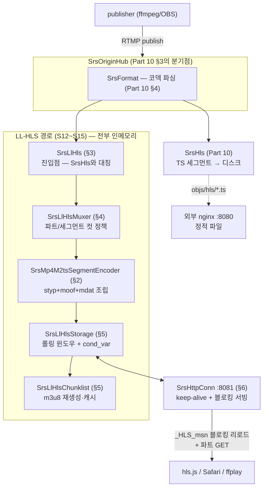

# RTMP 깊이 읽기 (11) — LL-HLS: 지연과의 싸움: 파트, 블로킹 리로드, fMP4

> **시리즈 안내**: 이 시리즈는 교육용 RTMP 서버 [srs_simple](../README.md)의 코드를 읽기 위해 필요한
> RTMP 프로토콜 이론을 핸드셰이크부터 모든 패킷까지 정리한다. srs_simple은 원본
> [SRS](https://github.com/ossrs/srs)의 클래스/파일/메서드 이름을 1:1로 미러링하므로,
> 여기서 익힌 내용은 원본 SRS를 읽을 때 그대로 통한다.
>
> **시리즈 목차**
>
> 1. [RTMP 조감도 — 메시지, 청크, 스트림](part1-overview.md)
> 2. [핸드셰이크 — 연결의 첫 3,073+1,536 바이트](part2-handshake.md)
> 3. [청크 스트림 — RTMP의 심장](part3-chunk-stream.md)
> 4. [프로토콜 컨트롤 메시지 5종](part4-control-messages.md)
> 5. [AMF0 — 커맨드의 언어](part5-amf0.md)
> 6. [커맨드 흐름 (1) — connect와 스트림 생성](part6-netconnection.md)
> 7. [커맨드 흐름 (2) — publish와 미디어 메시지](part7-publish.md)
> 8. [커맨드 흐름 (3) — play와 중간 입장 문제](part8-play.md)
> 9. [(보너스) 서버 내부 — 팬아웃, 캐시, 지터](part9-server-internals.md)
> 10. [(보너스 2) HLS — 같은 스트림을 HTTP로 배달하기](part10-hls.md)
> 11. **(보너스 3) LL-HLS — 지연과의 싸움: 파트, 블로킹 리로드, fMP4** (이 글)

이 글은 Part 10까지 읽었다고 가정한다.

Part 10 §9에서 HLS의 지연을 해부하며 세 개의 층을 찾았다 — **세그먼트가 닫힐
때까지**(최대 10초), **플레이어의 폴링 간격**(초 단위), **사전 버퍼**(세그먼트
2~3개). 합쳐서 수십 초. 그리고 그 끝에 "세그먼트를 더 잘게 쪼개 완성 전에 배달하는
LL-HLS가 있다"고 예고했었다. srs_simple은 S12~S15에서 그것을 구현했다. 서버를
띄우면 이제 같은 publish가 세 갈래로 나간다:

```text
ffmpeg ── RTMP publish ──▶ srs_simple ──┬─ RTMP play ──▶ ffplay          (지연 1초 미만)
                                        ├─ HLS play ───▶ nginx → 브라우저 (지연 ~30초)
                                        └─ LL-HLS play ▶ :8081 → 브라우저 (지연 ~2초, 실측 2.2초)
```

LL-HLS(Low-Latency HLS)는 별개의 프로토콜이 아니라 **HLS 스펙 2판**
([rfc8216bis](https://datatracker.ietf.org/doc/draft-pantos-hls-rfc8216bis/))에
편입된 확장이다. 이 파트의 재미는 LL-HLS가 Part 10의 지연 3층을 **하나씩 정면으로
격파**하는 방식에 있다 — 각 층마다 대응하는 메커니즘이 하나씩 있고, 그 셋이 이 글의
뼈대다:

| Part 10 §9의 지연 층 | LL-HLS의 대응 | 이 글의 절 |
| --- | --- | --- |
| 세그먼트가 닫힐 때까지 (10초) | **파트(Partial Segment)** — 0.5초 조각을 완성 즉시 게시 | §3, §4 |
| m3u8 폴링 간격 | **블로킹 리로드** — "다음 게시까지 응답을 잡아 둔다" | §6 |
| 사전 버퍼 (세그먼트 2~3개) | **PART-HOLD-BACK** — 버퍼 단위를 파트로 축소 (1.5초) | §5 |

그리고 이 확장은 컨테이너도 갈아탄다: MPEG-TS 대신 **fMP4(CMAF)**다(§2). 원본
SRS 6.0에는 LL-HLS가 없으므로 이 경로는 시리즈에서 유일하게 **참조 프로젝트가
둘**이다 — 커널의 fMP4 인코더는 원본 SRS의 DASH 경로에서 이름을 가져오고
(`SrsMp4M2tsInitEncoder`/`SrsMp4M2tsSegmentEncoder`), 앱 계층의 구조는 C++
LL-HLS 구현체인 [OvenMediaEngine](https://github.com/AirenSoft/OvenMediaEngine)
(OME)을 따른다(CLAUDE.md §5.6 S12~S15).

---

## 1. 파이프라인 조감도 — TS-HLS와 나란히

Part 10 §2의 그림에 LL-HLS 가지를 그려 넣으면 이렇다. 분기점은 같은
`SrsOriginHub`이고, 거기서부터 끝까지 전부 새 인물이다:



원본 대응은 이렇다 (LL-HLS 앱 계층은 원본 SRS에 대응물이 없어 OME가 참조다):

| srs_simple | 참조 | 역할 |
| --- | --- | --- |
| [srs_kernel_mp4.{hpp,cpp}](../src/kernel/srs_kernel_mp4.hpp) | 원본 SRS `kernel/srs_kernel_mp4.hpp:2145/2161` (DASH 경로, 9,000줄) | init.mp4 + m4s 인코더 |
| [srs_app_llhls.{hpp,cpp}](../src/app/srs_app_llhls.hpp) | OME `fmp4_packager/fmp4_storage/llhls_chunklist` | 컷 정책·스토리지·플레이리스트 |
| [srs_app_http_conn.{hpp,cpp}](../src/app/srs_app_http_conn.hpp) | OME `llhls_session` (블로킹 조건식) | keep-alive + 블로킹 서빙 |

기존 TS-HLS 경로는 **그대로 유지**된다 — 두 경로를 나란히 켜고 지연 차이를
관찰하는 것이 목적이므로.

---

## 2. 컨테이너 셋째 판 — fMP4, 그리고 "한 번만"의 귀환

Part 10 §5에서 FLV와 TS의 철학을 대비했었다 — FLV는 "설정은 한 번만"(연결 지향),
TS는 "매 프레임에 다시"(방송 지향). LL-HLS의 컨테이너 **fMP4**(fragmented MP4,
CMAF)는 놀랍게도 **FLV 쪽으로 돌아온다**:

```text
init.mp4 (한 번만):  [ftyp][moov: 코덱 설정 — avcC(SPS/PPS), esds(ASC), trak×2]
m4s (파트마다):      [styp][moof: 샘플 표 — dts/크기/플래그][mdat: 페이로드 원문]
```

설정(init 세그먼트)과 데이터(미디어 세그먼트)를 분리하고, 플레이리스트의
`#EXT-X-MAP` 태그가 "먼저 init.mp4를 받아라"라고 알려 준다. TS가 매 세그먼트에
PAT/PMT를, 매 IDR 앞에 SPS/PPS를 다시 심던 것(Part 10 §5~6)과 정반대다. 왜
돌아왔는가? **중간 입장 문제를 이제 플레이리스트가 풀기 때문이다.** TS는 "어느
지점부터 읽어도" 재생돼야 했지만, HLS 플레이어는 항상 m3u8을 먼저 읽으므로 MAP을
따라 init부터 받으면 된다. 반복 삽입의 오버헤드(0.5초 파트마다 SPS/PPS/PAT/PMT를
다시 싣는 비용)를 치를 이유가 없다.

부수 효과가 트랜스먹서를 눈에 띄게 단순화한다. Part 10 §5의 변환 3종(ADTS 헤더
생성, annex-b 변환, SPS/PPS 재삽입)이 **전부 사라진다** — mdat은 FLV 태그
페이로드에서 꺼낸 샘플(`SrsFormat`의 `raw/nb_raw` — AVCC 길이 프리픽스, AAC raw
그대로)을 **무변환으로 싣는다**. 대신 moof의 샘플 표(trun)가 각 샘플의
duration/크기/키프레임 여부를 서술한다. 컨테이너 변환이라기보다 **목차 재작성**에
가깝다.

### 2.1 인코더 두 개 — 원본 SRS의 DASH에서 온 이름

fMP4는 DASH의 컨테이너이기도 해서, 원본 SRS의 DASH 경로에 인코더가 이미 있다.
이름을 그대로 가져왔다(D1 — 1:1 미러링 원칙):

- [`SrsMp4M2tsInitEncoder::write`](../src/kernel/srs_kernel_mp4.cpp#L101) —
  ftyp + moov. moov 안에 트랙마다 trak(코덱 설정: `avc1`+`avcC` /
  `mp4a`+`esds`)과, fragmented 필수인 mvex(trex)가 들어간다. 원본 시그니처
  `write(format, video, tid)`(트랙 1개)에 muxed 오버로드
  [`write(format)`](../src/kernel/srs_kernel_mp4.cpp#L110)(video tid=1 + audio
  tid=2를 한 moov에)를 추가했다 — 이유는 §2.2
- [`SrsMp4M2tsSegmentEncoder`](../src/kernel/srs_kernel_mp4.hpp#L108) —
  styp + moof + mdat. [`write_sample`](../src/kernel/srs_kernel_mp4.cpp#L526)로
  샘플을 누적하고 [`flush`](../src/kernel/srs_kernel_mp4.cpp#L558)가 moof를
  조립한다. moof의 핵심 필드는 **tfdt**(이 조각의 시작 dts — timescale 1000이라
  RTMP ms 그대로)와 **trun**(샘플별 duration/size/flags/cts, 그리고 mdat 내
  오프셋 `data_offset` — moof 크기가 확정된 뒤 역산해 패치한다)

원본 9,000줄짜리 `srs_kernel_mp4`는 박스마다 클래스가 있는 트리인데, srs_simple은
Part 10 §6의 TS 먹서와 같은 방식으로 **박스 클래스 트리를 들어내고 인코더가
바이트를 직접 조립**한다(size 후패치 헬퍼 `srs_mp4_box_open/close`). 바이트
레이아웃은 동일하다 — utest가 ffmpeg이 만든 레퍼런스 파일과 박스 트리를 비교해
검증했다([spike](../TASKS.md), 차이는 의도적으로 뺀 선택 박스 edts/udta/sidx뿐).

### 2.2 muxed 단일 트랙 — OME와 갈라진 결정

OME는 비디오/오디오를 **트랙별 파일 + 트랙별 플레이리스트**로 분리하고
RENDITION-REPORT로 서로를 알린다. srs_simple은 **하나의 init.mp4(trak 2개) +
하나의 m4s 시퀀스(moof에 traf 2개)** 로 간다(D2) — ffmpeg의
`-f hls -hls_segment_type fmp4`가 만드는 형태이고, 마스터 플레이리스트 없이
미디어 플레이리스트 하나로 재생된다. 교육용에서 파일 수와 태그 수를 반으로 줄이는
결정이지만, 그 대가로 원본에 없던 함정 둘을 밟았다. 둘 다 실검증에서 발견됐고
회귀 테스트로 박제되어 있다:

1. **오디오 전용 파트의 트랙 오인** (S15에서 발견): muxed 스트림이라도 세그먼트
   꼬리 파트에는 비디오 샘플이 우연히 없을 수 있다. 초기 구현은 "단독 트랙이면 그
   traf가 tid"로 추론했는데, 이러면 오디오 전용 파트의 AAC가 **비디오 트랙(1)로
   선언되어 h264로 디코딩**된다 ("Invalid NAL unit size").
   [`set_audio_tid`](../src/kernel/srs_kernel_mp4.hpp#L136)를 추가해 파트 내용이
   아니라 **스트림 구성(init의 트랙 배치) 기준**으로 고정했다 —
   [`open_part`](../src/app/srs_app_llhls.cpp#L632)가 muxed면 2, 오디오 단독이면
   1을 명시한다
2. **해상도 0을 거부하는 브라우저** (S16에서 발견): S10에서 SPS 비트스트림 파싱을
   제거했으므로 처음에는 avc1/tkhd의 width/height를 0으로 뒀다 — ffprobe와 ffmpeg은
   avcC 안의 SPS에서 해상도를 읽으므로 문제가 없었다. 그런데 **Chrome MSE는 init
   의 avc1 해상도가 0이면 "Invalid video decoder config"로 append 자체를 거부**해
   hls.js 재생이 죽는다. 결국 원본의
   [`avc_demux_sps`](../src/kernel/srs_kernel_codec.cpp#L607)(SPS 비트스트림에서
   해상도만 — exp-Golomb 파서 포함)를 미러링해 되살렸다. 관용 도구(ffmpeg)로만
   검증하고 실제 타깃(브라우저)을 늦게 물리면 이런 것이 숨는다는 교훈까지 포함해서,
   이 경로에서 가장 값진 버그였다

---

## 3. 진입점 — SrsLlHls, 그리고 dts의 직진

허브에서 LL-HLS로 들어가는 문은 [`SrsLlHls`](../src/app/srs_app_llhls.hpp#L269)다.
Part 10의 `SrsHls`와 완전히 대칭인 인터페이스(initialize / on_publish /
on_unpublish / [on_audio](../src/app/srs_app_llhls.cpp#L813) /
[on_video](../src/app/srs_app_llhls.cpp#L851))로, `SrsOriginHub`가 기존 hls와
나란히 부른다. 오류 전략도 동일하다 — 경고 찍고 `on_unpublish` 후 삼킨다.
LL-HLS가 넘어져도 RTMP와 TS-HLS는 계속된다 (Part 10 §3의 'ignore' 전략).

눈에 띄는 차이 하나: Part 10 §5에서 RTMP 타임스탬프를 90kHz로 환산했지만
(`dts = timestamp × 90`), fMP4 경로는 timescale을 1000으로 선언했으므로 **RTMP의
ms 타임스탬프가 무환산으로 tfdt/trun에 들어간다**. 컨테이너가 시계 단위를
스스로 선언할 수 있다는 것 — MP4의 timescale 필드 — 이 90kHz 환산을 통째로
지워 버린다.

시퀀스 헤더의 취급도 대칭이다: 세그먼트에 쓰지 않고 마킹만 한다(Part 10 §5.2와
같은 이유 — 설정은 init.mp4의 몫이다). 단, **변경 감지**가 추가됐다.
[`on_sequence_header`](../src/app/srs_app_llhls.cpp#L491)는 avcC/ASC 원문을
비교해 동일 재전송(OBS가 재연결 때 자주 한다)은 무시하고, 실제로 달라졌으면 진행
중 세그먼트를 닫고 다음 세그먼트 선두에서 init.mp4를 재생성한다 — 다른 코덱
설정이 한 `#EXT-X-MAP`을 공유하면 안 되기 때문이다. (알려진 한계: init URL이
버전 없이 하나라, 재생 도중 교체되면 이미 받은 세그먼트와 어긋난다. OME는 content
version으로 URL을 분리한다 — 교육용 단순화. CLAUDE.md §5.6 S13)

---

## 4. 컷 정책 — 0.5초 조각을 자르는 규칙

지연 3층 격파의 첫 번째: **세그먼트가 닫힐 때까지 기다리지 않는다.** 세그먼트
(2초)를 **파트**(0.5초 목표)로 쪼개고, 파트가 완성될 때마다 즉시 게시한다.
플레이리스트에는 이렇게 나타난다 (실측 출력):

```text
#EXT-X-PART:DURATION=0.500,URI="test/2.0.m4s",INDEPENDENT=YES
#EXT-X-PART:DURATION=0.492,URI="test/2.1.m4s"
#EXT-X-PART:DURATION=0.488,URI="test/2.2.m4s"
#EXT-X-PART:DURATION=0.487,URI="test/2.3.m4s"
#EXT-X-PART:DURATION=0.033,URI="test/2.4.m4s"    ← 세그먼트 마지막 파트 (짧아도 됨)
#EXTINF:2.000,
test/2.m4s                                        ← 파트들의 부모 세그먼트
```

파트는 세그먼트를 **대체하지 않고 선행**한다 — 라이브 엣지의 플레이어는 파트를
따라가고, 늦게 합류한 플레이어는 완결된 세그먼트(`{msn}.m4s` = 파트들의 연결)를
통째로 받는다. 같은 바이트에 두 개의 접근 단위가 있는 셈이다.

어디서 자를 것인가가 [`SrsLlHlsMuxer::maybe_cut`](../src/app/srs_app_llhls.cpp#L603)
의 정책이고, 스펙의 두 제약이 규칙을 결정한다 — 파트는 PART-TARGET을 **넘으면 안
되고**(상한), 마지막 파트를 제외하면 85% **이상이어야 한다**(하한):

```cpp
// ① 세그먼트 컷이 우선: 목표(2초)를 채웠고 이 프레임이 새 세그먼트 선두가 될 수
//    있으면(키프레임) — 파트 길이와 무관. 마지막 파트는 짧아도 된다 (스펙 예외)
if (can_end_segment && segment_duration + part_dur >= segment_target) {
    return flush_part(dts, true);
}
// ② 파트 컷: target을 채웠거나, 85%를 넘겼는데 다음 프레임까지 넣으면 target을
//    넘길 것 같으면(직전 프레임 간격으로 예측) 미리 자른다 — 상한을 지키기 위해
if (part_dur >= part_target
    || (part_dur >= part_target * 85 / 100 && part_dur + frame_gap > part_target)) {
    return flush_part(dts, false);
}
```

②의 예측 컷이 OME `FMP4Packager::AppendSample`의 실제 규칙이다. 프레임은 33ms
단위로 오므로 "정확히 0.5초"는 존재하지 않는다 — 컷은 항상 프레임 경계에서
일어나고, 예측이 빗나가면 파트가 target을 약간 넘기도 한다(실측에서 0.511초
관찰 — 수용, PLANS.md 리스크 3).

세그먼트 컷 조건(키프레임 도착 && 목표 초과)은 Part 10 §7의 TS 세그먼터와 완전히
같은 정책이다 — **세그먼트의 첫 프레임은 여전히 IDR이어야 한다.** 파트에는 그
제약이 없는 대신, 키프레임으로 시작하는 파트에 `INDEPENDENT=YES`를 마킹한다
([`flush_part`](../src/app/srs_app_llhls.cpp#L668) — 비디오 없는 파트는
pure-audio 스트림에서만 independent다. AAC 프레임은 전부 독립이므로). 플레이어는
이 표시를 보고 "여기부터 디코딩을 시작할 수 있다"를 안다 — GOP 캐시(Part 8)와
키프레임 컷(Part 10)이 풀던 문제의 파트 버전이다.

여기서 세그먼트 길이가 10초 → **2초**로 준 것도 눈여겨봐야 한다(D5). 세그먼트는
키프레임에서만 잘리므로 **인코더의 GOP가 2초 이하**여야 한다 — 그래서 LL-HLS
데모는 `-c copy`가 아니라 `-g 60 -keyint_min 60`(30fps 기준 2초) 재인코딩으로
publish한다. GOP가 더 길면 세그먼트가 키프레임을 기다리며 늘어지고
TARGETDURATION이 커진다 (README에 명시).

---

## 5. 인메모리 스토리지 — 파일이 사라졌다

Part 10 §7의 배달 인프라를 떠올려 보자 — `.tmp` 쓰기 + rename, m3u8 원자적 교체,
디스크의 롤링 윈도우. LL-HLS 경로에는 **이 전부가 없다.** 파트(0.5초)는 수명이
짧고 초당 2번 게시되며, §6의 블로킹 서빙과 상태를 공유해야 한다 — 디스크를 거칠
이유가 없다 (OME도 gohlslib도 인메모리다. D3).

[`SrsLlHlsStorage`](../src/app/srs_app_llhls.hpp#L129)가 그 저장소다:

```text
SrsLlHlsStorage {
    deque<SrsLlHlsSegment*> segments_;   // 롤링 윈도우 (llhls_segment_count=10개 = 20초)
    SrsLlHlsSegment { deque<SrsLlHlsPart*> parts; msn; duration; completed; }
    SrsLlHlsPart    { payload(styp+moof+mdat); duration; independent; psn; }
    string init_;                        // init.mp4 바이트
    string playlist_;                    // m3u8 캐시 (게시마다 재생성)
    std::mutex + std::condition_variable // ← §6의 심장
}
```

Part 10의 원자성 3종 세트는 **락 하나**로 대체된다. muxer가
[`append_part`](../src/app/srs_app_llhls.cpp#L273)로 파트를 게시하면, 같은 락
안에서 — 윈도우 [shrink](../src/app/srs_app_llhls.cpp#L421)(완결된 앞쪽만 밀어냄,
파트는 부모 세그먼트와 함께 소멸) → m3u8 재생성
([`refresh_playlist`](../src/app/srs_app_llhls.cpp#L431)) → `notify_all()` 순서로
일어난다. **재생성이 notify보다 먼저**라는 순서가 §6의 정합성을 만든다: 블로킹
리로드에서 깨어난 HTTP 스레드는 항상 방금 게시된 파트가 실린 플레이리스트를 읽는다.

플레이리스트 생성기 [`SrsLlHlsChunklist::generate`](../src/app/srs_app_llhls.cpp#L123)
는 게시마다 문자열 전체를 다시 만든다(OME MakeChunklist의 태그 순서 준수). 새
태그들이 LL-HLS의 계약을 선언한다:

```text
#EXT-X-VERSION:6                                        ← PART 계열 태그는 버전 6부터
#EXT-X-SERVER-CONTROL:CAN-BLOCK-RELOAD=YES,PART-HOLD-BACK=1.500
#EXT-X-PART-INF:PART-TARGET=0.500
#EXT-X-MAP:URI="test/init.mp4"                          ← fMP4 필수 (§2)
…
#EXT-X-PRELOAD-HINT:TYPE=PART,URI="test/4.0.m4s"        ← 다음에 생길 파트 예고 (§6)
```

- **CAN-BLOCK-RELOAD=YES**: "블로킹 리로드를 지원하니 폴링하지 말라"(§6)
- **PART-HOLD-BACK=1.5** (3×PART-TARGET, 스펙 권장): "라이브 엣지에서 1.5초
  뒤에서 재생을 시작하라" — Part 10 §9의 "사전 버퍼 = 세그먼트 2~3개"가 **파트
  3개**로 줄어든 것이다. 30초 지연의 마지막 층이 여기서 1.5초가 된다
- **파트는 최근 3개 세그먼트에만** 나열한다(그 이전은 EXTINF만 — OME 코드와
  동일한 경계). 라이브 엣지에서만 파트가 의미 있고, m3u8이 무한히 비대해지는 것을
  막는다. 윈도우에서 밀려난 파트 리소스도 스펙이 허용하는 대로 404가 된다
- **PRELOAD-HINT는 active(publish 중)일 때만** 싣는다 — unpublish 후에 오지 않을
  파트를 힌트하면 클라이언트가 헛되이 홀드된다 (S14에서 확정한 게이트)

### 5.1 락 규율 — pthread 모델의 대가

이 저장소가 두 세계의 접점이다: **publisher 스레드**(hub → muxer → storage)가
쓰고, **HTTP 스레드들**(§6)이 읽는다. §5.1의 pthread 모델에서 이것은 실제 데이터
레이스 후보이므로 규칙을 명문화했다 (PLANS.md 리스크 5):

> hub는 source lock **안에서** storage lock을 잡는다. HTTP 스레드는 storage
> lock**만** 잡는다 — source lock은 절대 잡지 않는다.

락 순서가 한 방향뿐이므로 데드락이 없다. HTTP 스레드가 스트림을 찾을 때도
`SrsLiveSourceManager`의 manager lock까지만 쓴다 — 원본 ST 모델(단일 스레드,
락 불필요)에는 없는, 이 프로젝트가 pthread를 선택한 대가이자 §5.1의 연장이다.

---

## 6. 블로킹 서빙 — 폴링의 종말, 그리고 cond_wait의 재발견

지연 3층 격파의 두 번째이자 LL-HLS의 백미다. Part 10의 플레이어는 m3u8을
**폴링**했다 — 새 세그먼트가 나왔는지 주기적으로 다시 GET. 폴링 간격만큼 발견이
늦고, 간격을 줄이면 요청이 폭주한다. LL-HLS는 이를 뒤집는다: 클라이언트가 **아직
없는 버전을 지목해서** 요청하면, 서버가 **그것이 생길 때까지 응답을 잡아 둔다**:

```text
GET /live/test.m3u8?_HLS_msn=91&_HLS_part=1
                    └─ "msn 91의 파트 1이 실린 플레이리스트를 달라.
                        아직 없으면 생길 때까지 기다렸다가 달라."
```

서버는 이 요청을 파트가 게시되는 순간 응답한다 — 발견 지연이 0으로 수렴하고,
폴링 트래픽이 사라진다. (같은 원리로 **PRELOAD-HINT**에 예고된, 아직 없는 파트에
대한 GET도 홀드 후 200이다 — 파트가 생기고 나서 요청이 오가는 왕복 시간마저
선제 요청으로 지운다.)

이를 위해 S11에서 nginx로 밀어냈던 HTTP 서버가 **부활**한다
([`SrsHttpConn`](../src/app/srs_app_http_conn.hpp), D4). Part 10 §8의 결론 —
"HLS 서빙은 상태 없는 정적 파일 서빙"— 이 LL-HLS에서 뒤집히기 때문이다: 블로킹
리로드는 "다음 게시"라는 **서버 상태에 대한 대기**이므로 정적 파일 서버가 할 수
없다 (nginx를 쓰려면 캐싱 프록시로 오리진 앞에 세우는 구조가 된다 —
llhls-streaming의 배포 모델). S10의 정적 파일 코드에서 두 가지가 바뀌었다:

1. **keep-alive 루프** ([`do_cycle`](../src/app/srs_app_http_conn.cpp#L107)):
   LL-HLS 플레이어는 초당 수 회 요청한다(m3u8 리로드 + 파트 GET). 요청마다 연결을
   끊으면 폭주하므로, 요청 파싱 → 응답을 idle 타임아웃까지 반복한다.
   Content-Length를 정확히 쓰는 것이 전제다 — 그래야 클라이언트가 한 연결에서
   응답 경계를 안다
2. **블로킹 = cond_wait** ([`hold`](../src/app/srs_app_http_conn.cpp#L385)):
   여기서 §5.1의 pthread 선택이 **처음으로 원본(ST)보다 단순해진다**. OME는
   비동기 이벤트 루프라 홀드된 요청을 pending 큐에 넣고 게시 콜백이 꺼내는 구조가
   필요하지만, srs_simple은 1-connection-1-thread이므로 **HTTP 스레드가
   `storage->wait_for()`에서 그냥 잔다**. 게시의 `notify_all()`이 깨우면 응답하러
   돌아간다 — 조건 변수 대기가 곧 블로킹 리로드다

홀드할지 즉시 응답할지의 판정은 [`reached`](../src/app/srs_app_llhls.cpp#L395)에
있다 — OME `GetChunklist`의 조건식과 동치다:

```text
요청 (msn, psn) vs 최신 (latest_msn, latest_psn):
  msn이 윈도우에서 만료된 과거          → 즉시 true (기다릴 것 없음 — 조회 실패로 404)
  msn < latest                          → 즉시 true (이미 있다)
  msn == latest && psn <= latest_psn    → 즉시 true (_HLS_part 생략은 psn=0 취급 — Safari 관례)
  그 외 (미래)                          → 홀드
단, msn > latest + 2                    → 홀드 없이 400 (스펙 관례 — 너무 먼 미래)
```

[`serve_playlist`](../src/app/srs_app_http_conn.cpp#L313)가 이 판정으로 400/홀드를
가르고, 타임아웃(3×세그먼트=6초)이면 그 시점 최신으로 200을 준다.
[`serve_part`](../src/app/srs_app_http_conn.cpp#L359)는 힌트된 파트의 홀드 후
200과 만료 404를 맡는다.

마지막 디테일이 §5.1 이디엄의 총집편이다.
[`hold`](../src/app/srs_app_http_conn.cpp#L385)는 `wait_for`를 통짜 6초로 부르지
않고 **100ms 슬라이스**로 나눠 사이마다 `trd->pull()`을 확인한다 — 게시는
notify_all로 즉시, unpublish는 `active()` 확인으로, 연결/서버 종료는 pull()로,
어느 쪽이든 100ms 안에 깨어난다. 소켓 shutdown이 cond_wait를 깨울 수 없는 pthread
모델의 보완이며, 리스너의 poll(100ms), consumer의 timed wait(100ms)와 정확히 같은
패턴이다 — 이 프로젝트에서 "블록될 수 있는 모든 대기"가 공유하는 형태다.

검증은 utest 5종이 실소켓으로 한다
([srs_utest_http.cpp](../utest/srs_utest_http.cpp) — MockRtmpClient와 같은 방식의
간이 HTTP 클라이언트): keep-alive 연속 요청의 Content-Length 정합
(KeepAliveContentLength), 미래 msn 홀드가 다른 스레드의 게시로 깨어나 방금 게시된
파트를 실어 오는지(BlockingReloadWakesOnPublish), 400/404/타임아웃
경계(BlockingBoundaries), 힌트 파트 홀드 → 게시 → 바이트
일치(PreloadHintPartHold), unpublish가 홀드를 깨우고 연결이 누수 없이
reap되는지(UnpublishWakesHold).

---

## 7. 실측 — 지연 2.2초의 해부

S16의 통합 검증에서 세 경로를 동시에 물리고 재본 결과다 (macOS, ffmpeg 8.1,
Chrome/hls.js, 30fps + GOP 2초 + `-tune zerolatency` publish):

| 경로 | 실측 지연 | 구성 |
| --- | --- | --- |
| RTMP play | < 1초 | push — 프레임 단위 |
| TS-HLS (Part 10) | ~30초 | 10초 세그먼트 × 폴링 × 버퍼 3개 |
| **LL-HLS** | **2.2초** (hls.js 자체 측정 2.15초와 일치) | 0.5초 파트 + 블로킹 리로드 + PART-HOLD-BACK 1.5초 |

2.2초의 내역이 정확히 이 글의 구조다: PART-HOLD-BACK 1.5초(파트 3개 버퍼, §5) +
파트 하나가 닫히기까지 평균 0.25초(§4) + 인코딩/전송 잔량. Part 10 §9의 표와
나란히 놓으면 — 세그먼트 완성 대기(10초)는 파트 완성 대기(0.5초)로, 폴링 발견
지연은 블로킹 리로드로 0에 수렴, 버퍼는 세그먼트 2~3개에서 파트 3개로. **각 층이
한 자릿수씩 줄어 합계가 30초에서 2초가 됐다.**

블로킹 리로드가 실제로 도는 것은 서버 로그로 관찰할 수 있다 — hls.js가 붙어 있는
동안 로그에는 `_HLS_msn=90&_HLS_part=2` 류의 요청이 파트 게시 주기(≈0.5초)로
찍히고, 각 요청은 다음 파트가 게시될 때까지 홀드됐다가 200으로 풀린다.
`curl "http://127.0.0.1:8081/live/test.m3u8?_HLS_msn=999&_HLS_part=0"`처럼 먼
미래를 지목하면 400이 즉시 온다 — 스펙 경계까지 손으로 확인해 볼 수 있다
(내장 HTTP는 IPv4 전용이므로 `localhost`가 `::1`로 풀리는 환경에서는 붙지 않는다 —
[www/llhls.html](../www/llhls.html)의 기본 URL도 `127.0.0.1`이다).

플레이어 페이지 쪽 지연은 화면에서 바로 읽힌다. `www/llhls.html`은 hls.js가 보고하는
라이브 엣지 지연(`hls.latency`)과 버퍼 길이를 0.5초마다 갱신해 표시하고, Part 10 §8의
TS-HLS 페이지와 마찬가지로 **라이브 전용(DVR 비활성)**이다 — 뒤로 seek하거나 일시정지
후 재개하면 `seeking`/`play` 핸들러가 `hls.liveSyncPosition`으로 스냅한다. 두 페이지를
나란히 열면 같은 방식으로 측정한 지연이 ~30초와 ~2초로 갈리는 것을 볼 수 있다.

의도적으로 남긴 한계도 실측에서 확인된다: unpublish 직후의 마지막 파트가
`DURATION=0.000`으로 실릴 수 있다(파트에 프레임이 1개일 때 — duration을 dts
차이로 계산하는 방식의 꼬리 아티팩트. 라이브 전용 시맨틱에서 무해). `_HLS_skip`
델타 업데이트는 구현하지 않았고 `CAN-SKIP-UNTIL`도 선언하지 않으므로 스펙 위반은
없다. `#EXT-X-ENDLIST`를 쓰지 않는 것은 Part 10과 동일하다.

---

## 8. 정리 — 그리고 참조 프로젝트로

LL-HLS 경로에서 들고 갈 것:

1. **지연 3층을 각개 격파한다.** 세그먼트 완성 대기 → 파트(0.5초), 폴링 발견 지연
   → 블로킹 리로드(+프리로드 힌트), 사전 버퍼 → PART-HOLD-BACK(파트 3개). 실측
   30초 → 2.2초
2. **fMP4는 "한 번만"으로 돌아온다.** 설정은 init.mp4에 한 번, mdat은 샘플
   무변환 — TS의 반복 삽입(ADTS/annex-b/PAT/PMT)이 통째로 사라진다. 중간 입장
   문제는 이제 `#EXT-X-MAP`이 푼다
3. **파트는 세그먼트를 선행할 뿐 대체하지 않는다.** 세그먼트 컷은 여전히
   키프레임에서(GOP ≤ 세그먼트 길이 요구), 파트는 프레임 경계에서 85%~100% 규칙으로.
   키프레임 파트만 INDEPENDENT
4. **블로킹 서빙은 서버 상태다.** 정적 파일 서버로는 불가능 — 그래서 내장 HTTP가
   부활했고, 1-connection-1-thread에서는 cond_wait 하나가 OME의 비동기 pending
   큐를 대체한다 (pthread 모델이 원본보다 단순해지는 유일한 지점)
5. **인메모리 저장 + 단일 락.** 디스크의 원자성 3종 세트가 "락 안에서 게시 → m3u8
   재생성 → notify_all" 순서 하나로 준다. 락 규율: HTTP 스레드는 storage lock만
6. **관용 도구로만 검증하지 말 것.** ffprobe가 통과시킨 init.mp4를 Chrome MSE가
   거부했다(해상도 0). 트랙 id 추론은 오디오 전용 파트에서 무너졌다. 실제 타깃
   플레이어를 조기에 물려야 나오는 버그들이다

참조 구현으로 넘어갈 때의 진입점: **원본 SRS**의 fMP4 인코더는
`kernel/srs_kernel_mp4.hpp:2145/2161`(박스 클래스 트리를 쓰는 확장판), 호출부는
`app/srs_app_dash.cpp`(트랙별 파일 — muxed가 아닌 원형). **OME**는
`fmp4_packager.cpp`(AppendSample — §4의 컷 규칙 원형),
`fmp4_storage.cpp`(인메모리 저장 + 옵저버 콜백),
`llhls_chunklist.cpp` `MakeChunklist:423`(§5의 태그 순서),
`llhls_session.cpp` `OnMessageReceived:322`(§6의 블로킹 조건식 — 단 비동기
pending 큐 구조라 cond_wait 대신 콜백으로 깨운다). srs_simple에서 본 뼈대를 들고
가면 OME의 트랙 분리/RENDITION-REPORT/gzip 캐시가 "어느 뼈대에 붙은 살인지"
보일 것이다.

이번에야말로 시리즈의 끝이다. RTMP 프레임 하나가 밟을 수 있는 세 갈래 —
프레임째 push되는 RTMP(1초 미만), 파일이 되어 CDN을 타는 HLS(30초), 조각나서
블로킹 서빙되는 LL-HLS(2초) — 를 전부 한 코드베이스에서 만들었다. 지연과 확장성과
단순함 사이의 삼각 트레이드오프를 이보다 좁은 지면에서 체험하기는 어려울 것이다.
좋은 여행이 되길.

---

_이 글은 [srs_simple](../README.md) 프로젝트의 RTMP 이론 시리즈 Part 11이다.
코드 대조 기준: srs_simple `src/kernel/srs_kernel_mp4.{hpp,cpp}`
(`SrsMp4M2tsInitEncoder::write:101/110`, `write_video_trak:201`,
`SrsMp4M2tsSegmentEncoder::write_sample:526`, `flush:558`, `set_audio_tid` hpp:136),
`src/kernel/srs_kernel_codec.cpp`(`avc_demux_sps:607`),
`src/app/srs_app_llhls.{hpp,cpp}`(`SrsLlHlsChunklist::generate:123`,
`SrsLlHlsStorage::append_part:273`, `wait_for:381`, `reached:395`, `shrink:421`,
`SrsLlHlsMuxer::on_sequence_header:491`, `maybe_cut:603`, `open_part:632`,
`flush_part:668`, `SrsLlHls::on_audio:813`, `on_video:851`),
`src/app/srs_app_http_conn.cpp`(`do_cycle:107`, `serve_llhls:221`,
`serve_playlist:313`, `serve_part:359`, `hold:385`)
/ 원본 SRS 6.0 `trunk/src/kernel/srs_kernel_mp4.hpp:2145/2161`
/ OME `src/modules/containers/bmff/fmp4_packager/fmp4_packager.cpp`,
`fmp4_storage.cpp`, `src/projects/publishers/llhls/llhls_chunklist.cpp:423`,
`llhls_session.cpp:322`.
실측 시퀀스: `utest/srs_utest_mp4.cpp`(InitEncoderMuxed:101,
InitEncoderVideoResolution:266, SegmentEncoderMuxed:352,
SegmentEncoderAudioOnlyPartInMuxedStream:552),
`utest/srs_utest_llhls.cpp`(MuxerPartAndSegmentCut:152, StorageWaitFor:434,
ChunklistTagsAndValues:469, ChunklistPreloadHint:557,
MuxedAudioOnlyTailPartTrackId:646),
`utest/srs_utest_http.cpp`(KeepAliveContentLength:232,
BlockingReloadWakesOnPublish:300, BlockingBoundaries:343, PreloadHintPartHold:404,
UnpublishWakesHold:445)._
