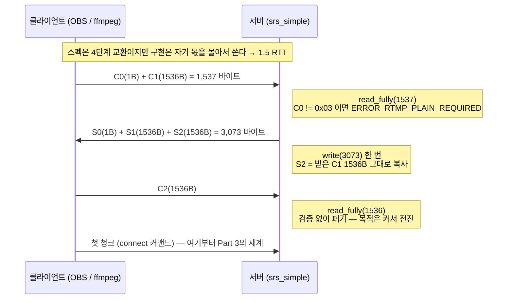
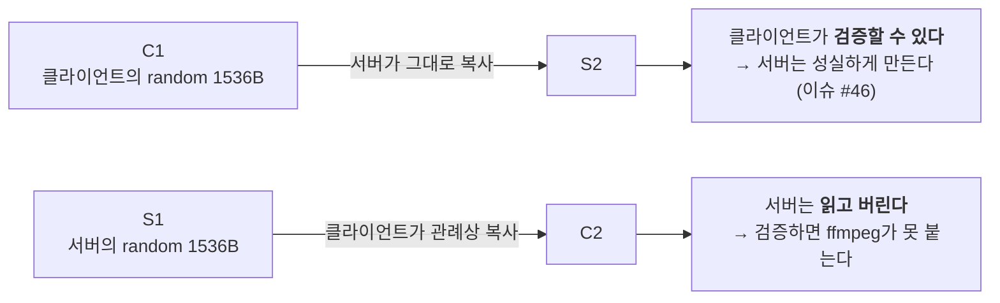

# RTMP 깊이 읽기 (2) — 핸드셰이크: 연결의 첫 3,073+1,536 바이트

> **시리즈 안내**: 이 시리즈는 교육용 RTMP 서버 [srs_simple](../README.md)의 코드를 읽기 위해 필요한
> RTMP 프로토콜 이론을 핸드셰이크부터 모든 패킷까지 정리한다. srs_simple은 원본
> [SRS](https://github.com/ossrs/srs)의 클래스/파일/메서드 이름을 1:1로 미러링하므로,
> 여기서 익힌 내용은 원본 SRS를 읽을 때 그대로 통한다.
>
> **시리즈 목차**
>
> 1. [RTMP 조감도 — 메시지, 청크, 스트림](part1-overview.md)
> 2. **핸드셰이크 — 연결의 첫 3,073+1,536 바이트** (이 글)
> 3. [청크 스트림 — RTMP의 심장](part3-chunk-stream.md)
> 4. [프로토콜 컨트롤 메시지 5종](part4-control-messages.md)
> 5. [AMF0 — 커맨드의 언어](part5-amf0.md)
> 6. [커맨드 흐름 (1) — connect와 스트림 생성](part6-netconnection.md)
> 7. [커맨드 흐름 (2) — publish와 미디어 메시지](part7-publish.md)
> 8. [커맨드 흐름 (3) — play와 중간 입장 문제](part8-play.md)
> 9. [(보너스) 서버 내부 — 팬아웃, 캐시, 지터](part9-server-internals.md)
> 10. [(보너스 2) HLS — 같은 스트림을 HTTP로 배달하기](part10-hls.md)
> 11. [(보너스 3) LL-HLS — 지연과의 싸움: 파트, 블로킹 리로드, fMP4](part11-llhls.md)

이 글은 Part 1까지 읽었다고 가정한다. Part 1에서 본 층 모델(메시지/청크/TCP)이 시작되기 **전**,
모든 RTMP 연결이 반드시 통과하는 첫 관문이 핸드셰이크다. 청크도 메시지도 아닌, 크기가 고정된
날바이트 교환이라 프로토콜에서 가장 단순한 구간이다 — 그런데 그 단순함이 **역사의 산물**이라는
점이 이 파트의 재미다. 원본 SRS의 핸드셰이크 코드는 약 1,300줄이고, srs_simple은 그중
1,000줄을 지우고 약 210줄만 남겼다. 지워진 1,000줄이 무엇이었는지(복잡 핸드셰이크), 왜 지워도
OBS/ffmpeg가 멀쩡히 붙는지가 후반부의 주제다.

---

## 1. 전체 순서도: 세 번의 쓰기, 두 번의 읽기

핸드셰이크는 여섯 개의 패킷 C0, C1, C2 / S0, S1, S2를 교환한다 (C=클라이언트, S=서버).
스펙은 이것을 단계별 교환으로 기술하지만, 현실 구현은 왕복(RTT)을 아끼려고 **몰아서 보낸다**:



바이트 수를 세어 보면 제목의 숫자가 나온다. 서버가 소켓에 쓰는 것은 S0+S1+S2 = 1+1536+1536 =
**3,073바이트** 한 번이고, 그 뒤 클라이언트의 C2 **1,536바이트**를 마저 읽으면 핸드셰이크 종료다.
클라이언트 입장에서도 총량은 같다 (C0+C1 = 1,537, C2 = 1,536).

여기서 눈여겨볼 설계가 하나 있다. 스펙대로라면 S2는 "C1을 받은 뒤의 응답"이고 C2는 "S1을 받은
뒤의 응답"이라 단계가 네 번이지만, 서버는 C0+C1을 받자마자 S0/S1/S2를 **한 write로 합쳐**
보낸다. 클라이언트도 C0+C1을 붙여 보낸다. 검증을 하지 않는다면(뒤에서 설명) 각 패킷의 내용이
상대의 직전 패킷에 의존하지 않으므로, 이렇게 파이프라인해도 아무 문제가 없다. 결과적으로
핸드셰이크 전체가 **1.5 RTT**에 끝난다.

srs_simple에서 이 순서도는 `SrsSimpleHandshake::handshake_with_client` 함수 하나에 그대로
적혀 있다 ([srs_protocol_rtmp_handshake.cpp:124-161](../src/protocol/srs_protocol_rtmp_handshake.cpp#L124-L161)):
`read_c0c1` → C0 검사 → `create_s0s1s2` → `write(3073)` → `read_c2`. 다섯 줄이 전부다.

---

## 2. 와이어 포맷: 각 패킷의 바이트 구성

### 2.1 C0 / S0 — 버전 1바이트

```text
C0 / S0 — 1 byte
0        1
┌────────┐
│ version│  0x03 = RTMP 버전 3
└────────┘
```

`0x03` 하나면 된다. 3은 "RTMP 버전 3"이라는 뜻으로, 우리가 아는 RTMP는 전부 버전 3이다.
0x06 같은 값은 RTMPE(암호화 변종) 시도인데, srs_simple은 원본과 마찬가지로 평문(plain text)만
받고 그 외에는 `ERROR_RTMP_PLAIN_REQUIRED`로 거부한다
([srs_protocol_rtmp_handshake.cpp:136-139](../src/protocol/srs_protocol_rtmp_handshake.cpp#L136-L139)):

```cpp
// plain text required.
if (hs_bytes->c0c1[0] != 0x03)
{
    return srs_error_new(ERROR_RTMP_PLAIN_REQUIRED, "only support rtmp plain text, version=%X", ...);
}
```

### 2.2 C1 / S1 — 1,536바이트의 명함

```text
C1 / S1 — 1,536 bytes                                     (offset, decimal)
0        4        8                                          1536
┌────────┬────────┬────────────────────────────────────────────┐
│  time  │ version│                   random                   │
│   4B   │   4B   │                   1528B                    │
└────────┴────────┴────────────────────────────────────────────┘
     │        │                          │
     │        │                          └─ 스펙: "충분히 랜덤한 값"
     │        └─ C1: 0 = 심플 / 0이 아니면 복잡 핸드셰이크 요구 (§4)
     │           S1: 아무도 읽지 않는 자리 — 서버는 C1의 time을 에코 (아래 코드)
     └─ 타임스탬프 기준점 — 아무도 읽지 않는다
```

- **time(4B)**: 상대와 타임스탬프 기준점을 맞추라고 스펙이 마련한 필드. 현실에서는 아무도
  안 쓴다. srs_simple의 서버는 `::time(NULL)`을 넣고, utest의 클라이언트는 0x0f로 채운
  버퍼를 그대로 보내는데 둘 다 잘 동작한다 — 받는 쪽이 읽지 않기 때문이다.
- **version(4B)**: 스펙상 "0이면 심플 핸드셰이크, 0이 아니면 확장"을 구분하는 자리.
  Flash Player는 여기에 자기 버전(예: `09 00 7C 02`)을 넣어 복잡 핸드셰이크(§4)를 요구했다.
  OBS/ffmpeg는 0을 넣는다. 이 구분이 의미 있는 곳은 **요구하는 쪽인 C1뿐**이다 — 응답인
  S1의 같은 자리는 아무도 읽지 않으므로, 서버는 관례상 C1의 time을 에코해 넣는다
  (아래 `create_s0s1s2` 코드에서 확인).
- **random(1528B)**: 나머지 전부. 스펙은 "충분히 랜덤한 값"이라고만 말한다. 원래 목적은
  에코 검증(상대가 내 random을 그대로 돌려주는지 확인)이었지만, 검증을 안 하는 현실에서는
  그냥 자리 채우기다.

그래서 "왜 1,536바이트인가?"의 답은 허무하다: time(4) + version(4) + random(1528)이라는
**스펙의 임의 선택**이고, 1528에 특별한 수학적 의미는 없다. 다만 이 1,536이라는 고정 크기
덕분에 파싱이 필요 없다 — 길이 필드도, 구분자도 없이 `read_fully`로 정확히 그만큼 읽으면 된다.
핸드셰이크가 층 모델(Part 1) 바깥에 있는 이유이기도 하다: 청크 헤더가 아직 없으므로 크기를
고정하는 것 말고는 경계를 알 방법이 없다.

srs_simple의 서버가 S0+S1을 만드는 코드를 보면 위 그림이 그대로 보인다. 코드의 3,073은
S0(1) + S1(1536) + S2(1536)의 합 — 서버 응답 세 조각을 연속 버퍼 하나에 담아
한 번의 write로 보내기 위한 크기다
([srs_protocol_rtmp_handshake.cpp:91-103](../src/protocol/srs_protocol_rtmp_handshake.cpp#L91-L103)):

```cpp
s0s1s2 = new char[3073];
srs_random_generate(s0s1s2, 3073);   // 일단 3,073바이트 전체를 랜덤으로 채우고

SrsBuffer stream(s0s1s2, 9);         // 앞 9바이트만 구조를 덮어쓴다
stream.write_1bytes(0x03);           // S0: version
stream.write_4bytes((int32_t)::time(NULL));  // S1.time
if (c0c1) {
    stream.write_bytes(c0c1 + 1, 4); // S1의 두 번째 4바이트 = C1의 time 에코
}
```

두 가지 관용을 볼 수 있다. 첫째, 버퍼 전체를 랜덤으로 채운 뒤 앞부분만 덮어쓴다 — random
1528바이트를 따로 채우는 것보다 단순하다. 둘째, S1의 version 자리에 자기 버전이 아니라
**C1의 time을 에코**한다(주석의 "s1 time2"). 심플 핸드셰이크 관례에서 이 자리는 "상대 time의
메아리(time2)"로 쓰이는데, 역시 아무도 검증하지 않으므로 예의상의 관례다.

랜덤 생성기 자체도 뜯어보면 "랜덤"이라는 이름이 무색하다
([srs_protocol_rtmp_handshake.cpp:16-23](../src/protocol/srs_protocol_rtmp_handshake.cpp#L16-L23)):

- `random() % 226`을 `0x0f`에 더해 모든 바이트를 [0x0f, 0xf0]으로 접는다 — 256개 값 중
  0x00~0x0e와 0xf1~0xff, 30개(약 12%)는 절대 나오지 않는다. 이 범위의 이유는 원본 주석
  ("the common value") 말고는 어디에도 문서화되어 있지 않고, `% 226`의 모듈로 바이어스까지
  있으니 통계적으로도 균일하지 않다.
- 더 극단적인 사실: srs_simple은 `srandom()`을 어디서도 부르지 않는다. 시드 없는 `random()`은
  POSIX상 `srandom(1)`과 동일하므로, **서버를 몇 번 재시작해도 매번 정확히 같은 "랜덤"
  바이트가 나간다** — 사실상 1,528바이트짜리 상수다. (원본 SRS는 `srs_random()` 래퍼가
  첫 호출에 time|pid로 시드를 건다 — `protocol/srs_protocol_utility.cpp:175`. 축소 과정에서
  이 래퍼를 떼어냈다.)

편향되고, 예측 가능하고, 심지어 상수인데도 어떤 클라이언트와도 문제가 없다. 이 지점이
보여주는 것은 하나다: **필드에 요구되는 품질을 결정하는 것은 스펙 문구("충분히 랜덤한 값")가
아니라 검증자의 존재다.** 심플 핸드셰이크에서 이 1,528바이트를 검사하는 상대는 아무도 없으므로
요구 품질은 0이고, 위 생성기로 충분하다. 반면 같은 자리가 복잡 핸드셰이크(§4)에서는 key/digest
블록을 숨기는 캔버스가 되고 HMAC이 그 바이트들 위에서 계산·검증된다 — 검증자가 생기는 순간
같은 필드의 요구 품질이 달라진다.

### 2.3 C2 / S2 — 메아리



스펙의 의도는 상호 확인이다: "내가 보낸 random이 그대로 돌아왔으니 상대는 진짜 RTMP를
말하는구나." 서버 쪽 절반(S2 = C1 복사)은 srs_simple도 지킨다
([srs_protocol_rtmp_handshake.cpp:105-110](../src/protocol/srs_protocol_rtmp_handshake.cpp#L105-L110)):

```cpp
// if c1 specified, copy c1 to s2.
// @see: https://github.com/ossrs/srs/issues/46
if (c1) {
    memcpy(s0s1s2 + 1537, c1, 1536);
}
```

주석의 이슈 번호가 힌트다 — 초기 SRS가 S2를 대충 채웠더니 **일부 클라이언트가 S2를 검증해서**
연결이 끊겼다. 즉 서버는 S2를 성실하게 만들어야 한다(상대가 검사할 수 있으므로).

반대 방향은 다르다. 서버는 C2를 **읽기만 하고 검증 없이 폐기한다**
([srs_protocol_rtmp_handshake.cpp:152-156](../src/protocol/srs_protocol_rtmp_handshake.cpp#L152-L156)).
원본 SRS도 똑같이 하는데, 이유가 원본 복잡 핸드셰이크 코드의 주석에 박제되어 있다
(원본 `protocol/srs_protocol_rtmp_handshake.cpp:1228-1230`):

```cpp
// verify c2
// never verify c2, for ffmpeg will failed.
// it's ok for flash.
```

ffmpeg가 보내는 C2는 스펙이 요구하는 형태가 아니어서, 검증하면 ffmpeg가 못 붙는다.
**스펙보다 호환성** — 이 시리즈에서 반복해서 만날 RTMP 생태계의 제1원칙이다.

그러면 "읽고 버릴 바이트를 왜 읽는가?"라는 질문이 남는다. TCP는 바이트 스트림이므로(Part 1),
C2 1,536바이트를 소비하지 않으면 다음에 읽을 "첫 청크"의 자리에 C2가 남아 있게 된다.
폐기가 아니라 **커서 전진**이 목적이다.

---

## 3. 상태 관리: `SrsHandshakeBytes`

핸드셰이크 버퍼는 별도 클래스 `SrsHandshakeBytes`가 소유한다
([srs_protocol_rtmp_handshake.hpp:18-36](../src/protocol/srs_protocol_rtmp_handshake.hpp#L18-L36)).
필드는 순서도의 세 덩어리와 정확히 일치한다:

```cpp
char* c0c1;     // [1+1536]      클라이언트에게 받은 것
char* s0s1s2;   // [1+1536+1536] 서버가 보낼 것
char* c2;       // [1536]        받고 버릴 것
```

메서드 `read_c0c1`/`read_c2`/`create_s0s1s2`에는 공통 패턴이 있다 — 전부 첫 줄에서
**이미 버퍼가 있으면 아무것도 안 하고 성공을 반환**한다
([srs_protocol_rtmp_handshake.cpp:46-49](../src/protocol/srs_protocol_rtmp_handshake.cpp#L46-L49)):

```cpp
srs_error_t SrsHandshakeBytes::read_c0c1(ISrsProtocolReader *io)
{
    srs_error_t err = srs_success;
    if (c0c1) {
        return err;   // 이미 읽었다 — 멱등
    }
    c0c1 = new char[1537];
    if ((err = io->read_fully(c0c1, 1537, &nsize)) != srs_success) { ... }
```

이 멱등성 가드는 srs_simple에서는 사실상 방어 코드지만, **원본에서는 핵심 메커니즘**이다.
원본은 복잡 핸드셰이크를 먼저 시도하고 실패하면 심플로 폴백하는데(§4), 이때 두 구현이
**같은 `SrsHandshakeBytes`를 공유**한다. 복잡판이 이미 `read_c0c1`으로 소켓에서 꺼낸
1,537바이트를, 폴백한 심플판이 다시 읽으려 하면 — 소켓에는 그 바이트가 더 이상 없다.
가드 덕분에 심플판의 `read_c0c1` 호출은 조용히 통과하고, 이미 읽어 둔 버퍼를 재사용한다.
"소켓은 한 번만 읽을 수 있다"는 제약을 버퍼 소유 객체의 멱등성으로 흡수한 설계다.

수명도 짚어 두자. 이 3개 버퍼는 합쳐서 약 6KB(1,537+3,073+1,536 = 6,146바이트)인데, 핸드셰이크가 끝나면 아무 쓸모가 없다.
그래서 소유자인 `SrsRtmpServer::handshake`가 성공 직후 `dispose()`로 반납한다
([srs_protocol_rtmp_stack.cpp:1806-1822](../src/protocol/srs_protocol_rtmp_stack.cpp#L1806-L1822)).
수만 연결을 다루는 원본에서는 연결당 6KB가 진지한 비용이라 이 정리가 의미 있고,
srs_simple은 구조를 그대로 유지했다.

호출 체인 전체를 이어 보면: `SrsRtmpConn::do_cycle`이 연결 벽두에 `rtmp->handshake()`를
부르고 ([srs_app_rtmp_conn.cpp:98](../src/app/srs_app_rtmp_conn.cpp#L98)),
`SrsRtmpServer::handshake`가 `SrsSimpleHandshake::handshake_with_client(hs_bytes, io)`에
위임한다. 핸드셰이크 로직(`SrsSimpleHandshake`)과 버퍼 상태(`SrsHandshakeBytes`)와
소켓(`io`)이 셋으로 분리되어 있는 것은 원본의 폴백 구조(로직 2개가 상태 1개 공유)의 흔적이다.

---

## 4. 지워진 1,000줄 — 복잡 핸드셰이크는 왜 삭제됐나

여기까지가 "심플 핸드셰이크"의 전부다. 그런데 원본 SRS의 핸드셰이크 파일은 1,310줄이다.
나머지 약 1,000줄이 **복잡 핸드셰이크(complex handshake)** — C1/S1/C2/S2의 random 자리에
HMAC-SHA256 다이제스트와 Diffie-Hellman 공개키를 숨기는 Adobe의 변종이다. srs_simple은
이것을 통째로 삭제했다. 이 절은 그 삭제의 근거만 요약한다.

**왜 존재했나.** 2000년대 후반, 역공학으로 RTMP 스펙이 사실상 공개되자 Adobe는 핸드셰이크에
암호 검증을 끼워 넣었다: Flash Player 9+는 C1의 random 자리에 구조를 숨겨 보내고, Adobe의
비밀 키로 올바른 응답을 만든 서버에만 재생을 허용했다. 목적은 보안이라기보다 **호환 구현
차단**이었고, 키가 전부 유출되어 공개 상수가 된 뒤로는 그마저도 못 하게 됐다.

**왜 지워도 되나.** 복잡 핸드셰이크를 요구하는 쪽은 클라이언트(Flash Player)였는데, Flash는
2020년 말 EOL로 소멸했다. 현역 ingest 클라이언트 — OBS(librtmp 계열), ffmpeg/ffplay, VLC,
하드웨어 인코더 대부분 — 는 전부 C1의 version 필드에 0을 넣는 심플 핸드셰이크다. 그래서
srs_simple의 `SrsRtmpServer::handshake`는 폴백 없이 심플로 직행하고
([srs_protocol_rtmp_stack.cpp:1812-1817](../src/protocol/srs_protocol_rtmp_stack.cpp#L1812-L1817)),
실클라이언트 검증(OBS 31, ffmpeg 8.1, VLC 3)도 전부 통과했다. HMAC-SHA256과 DH 구현,
key/digest 블록 파싱 약 1,000줄과 **OpenSSL 의존성 전체**가 이렇게 흔적기관이 됐다 —
덕분에 srs_simple은 OpenSSL 없이 빌드된다.

**원본에는 남아 있다.** 서버는 상대가 Flash인지 ffmpeg인지 미리 알 수 없으므로, 원본 SRS는
"복잡으로 시도 → 검증 실패 시 `ERROR_RTMP_TRY_SIMPLE_HS`(제어 흐름용 에러) → 심플 폴백"으로
두 세계를 지원한다 (폴백 분기는 원본 `srs_protocol_rtmp_stack.cpp:2219`, 심플판은
`srs_protocol_rtmp_handshake.cpp:1071`, 복잡판은 같은 파일 `:1152`). §3에서 본
`SrsHandshakeBytes`의 멱등성 가드가 바로 이 갈아타기를 가능하게 하는 장치다 — 복잡판이
소켓에서 이미 꺼낸 C0C1을, 폴백으로 넘겨받은 심플판이 버퍼에서 재사용한다.
원본의 복잡판 내부를 읽을 일이 있다면
"C1의 1,528바이트 안에 가변 오프셋으로 숨은 key/digest 블록을 두 가지 순서(schema0/1)로
파싱해 HMAC을 대조한다"는 요약만 들고 가면 구조가 읽힌다.

---

## 5. 실측: 테스트가 보여주는 핸드셰이크

srs_simple의 utest는 핸드셰이크를 소켓 없이 검증한다. `MockBufferIO`(가짜 소켓)에 클라이언트가
보낼 바이트를 미리 넣고, 서버 코드를 돌린 뒤, 서버가 쓴 바이트를 꺼내 검사하는 방식이다
([utest/srs_utest_protocol.cpp:302-336](../utest/srs_utest_protocol.cpp#L302-L336)):

```cpp
MockBufferIO io;

uint8_t c0c1[1537];
c0c1[0] = 0x03;                       // C0
for (int i = 1; i < 1537; i++) {
    c0c1[i] = (uint8_t)(i % 256);     // C1: 알아볼 수 있는 패턴으로 채움
}
io.append(c0c1, 1537);
io.append(c2, 1536);                  // C2도 미리 넣어 둔다

SrsHandshakeBytes hs_bytes;
SrsSimpleHandshake hs;
HELPER_ASSERT_SUCCESS(hs.handshake_with_client(&hs_bytes, &io));

ASSERT_EQ(3073, io.out_length());                      // S0+S1+S2 = 3,073
EXPECT_EQ(0x03, out[0]);                               // S0 = 0x03
EXPECT_EQ(0, memcmp(out + 1537, c0c1 + 1, 1536));      // S2 = C1 복사 ★
```

마지막 줄이 §2.3의 규칙 그대로다: 서버 출력의 1,537바이트 오프셋부터(=S2 자리) 클라이언트가
보낸 C1이 그대로 나타나야 한다. C1을 `i % 256` 패턴으로 채운 것은 이 대조를 위해서다.

이어지는 두 테스트는 실패 경로를 못박는다. `PlainTextRequired`는 C0=0x06(RTMPE 시도)이면
`ERROR_RTMP_PLAIN_REQUIRED`로 거부하고 **응답을 한 바이트도 보내지 않음**을,
`HandshakeIOFailures`는 C0C1이 1,537바이트에 못 미치면 read 에러가 전파됨을 검증한다.
후자에는 미묘한 단면이 하나 있다: C0C1만 오고 C2가 안 오면 실패하지만, **S0S1S2 3,073바이트는
이미 나간 뒤다** — §1에서 본 파이프라이닝(서버는 C2를 기다리지 않고 먼저 쓴다)의 증거다.

반대 방향(클라이언트 역할)은 통합 테스트의 `MockRtmpClient::handshake`가 보여준다
([utest/srs_utest_server.cpp:148-181](../utest/srs_utest_server.cpp#L148-L181)).
실소켓으로 서버에 붙어 C0C1을 쓰고, S0S1S2를 읽어 **S2 = C1 복사를 검증**하고(클라이언트는
검증해도 된다 — 서버가 성실하게 만드니까), C2 자리에는 받은 S1을 복사해 보낸다. 서버가 C2를
버리는 걸 알지만 관례대로 만드는, §2.3의 비대칭이 코드로 재현된 모습이다.

---

## 6. 정리

핸드셰이크에서 들고 갈 것:

1. **구조는 고정 크기 날바이트 교환이다.** 1,537 수신 → 3,073 송신 → 1,536 수신이면 끝.
   길이 필드가 없으므로 크기 고정이 곧 프레이밍이고, 파이프라이닝으로 1.5 RTT에 끝난다.
2. **검증은 비대칭이다.** 서버는 S2를 성실하게 만들지만(클라이언트가 검사할 수 있음),
   받은 C2는 읽고 버린다(검사하면 ffmpeg가 못 붙음). 스펙보다 호환성.
3. **복잡 핸드셰이크는 Flash의 흔적기관이다.** C1의 random 자리에 HMAC-SHA256/DH를 숨기는
   Adobe의 구현 차단 장치였고, 원본 SRS는 "복잡 시도 → `ERROR_RTMP_TRY_SIMPLE_HS` → 심플
   폴백"으로 두 세계를 지원한다. srs_simple은 심플만 남겼고 OBS/ffmpeg에는 그걸로 충분하다.
4. **`SrsHandshakeBytes`의 멱등 가드는 폴백의 유산이다.** "소켓은 한 번만 읽을 수 있다"는
   제약을, 버퍼를 소유한 객체의 멱등성으로 흡수했다.

핸드셰이크가 끝난 소켓에는 이제 클라이언트의 첫 청크 — connect 커맨드의 첫 조각 — 가 도착해
있다. 다음 파트는 이 시리즈에서 가장 밀도 높은 구간, 그 바이트를 메시지로 재조립하는
청크 스트림이다. `fmt(2bit) | csid(6bit)`의 1바이트 헤더부터 시작한다.

---

_이 글은 [srs_simple](../README.md) 프로젝트의 RTMP 이론 시리즈 Part 2다.
코드 대조 기준: srs_simple `src/protocol/srs_protocol_rtmp_handshake.{hpp,cpp}`,
`src/protocol/srs_protocol_rtmp_stack.cpp`(`SrsRtmpServer::handshake`) / 원본 SRS 6.0
`trunk/src/protocol/srs_protocol_rtmp_handshake.cpp:1071`(심플), `:1152`(복잡),
`trunk/src/protocol/srs_protocol_rtmp_stack.cpp:2219`(폴백 분기)._
