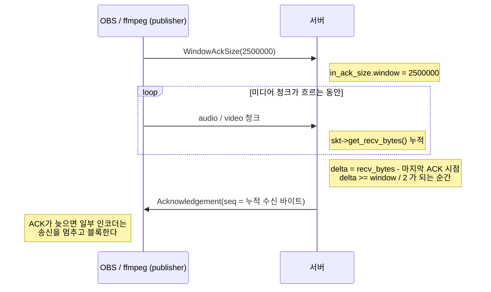
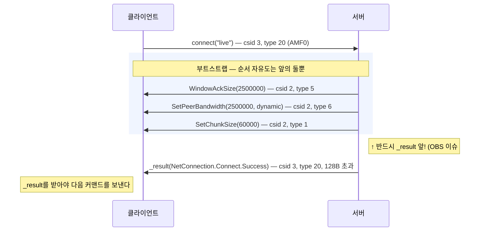

# RTMP 깊이 읽기 (4) — 프로토콜 컨트롤 메시지 5종

> **시리즈 안내**: 이 시리즈는 교육용 RTMP 서버 [srs_simple](../README.md)의 코드를 읽기 위해 필요한
> RTMP 프로토콜 이론을 핸드셰이크부터 모든 패킷까지 정리한다. srs_simple은 원본
> [SRS](https://github.com/ossrs/srs)의 클래스/파일/메서드 이름을 1:1로 미러링하므로,
> 여기서 익힌 내용은 원본 SRS를 읽을 때 그대로 통한다.
>
> **시리즈 목차**
>
> 1. [RTMP 조감도 — 메시지, 청크, 스트림](part1-overview.md)
> 2. [핸드셰이크 — 연결의 첫 3,073+1,536 바이트](part2-handshake.md)
> 3. [청크 스트림 — RTMP의 심장](part3-chunk-stream.md)
> 4. **프로토콜 컨트롤 메시지 5종** (이 글)
> 5. [AMF0 — 커맨드의 언어](part5-amf0.md)
> 6. [커맨드 흐름 (1) — connect와 스트림 생성](part6-netconnection.md)
> 7. [커맨드 흐름 (2) — publish와 미디어 메시지](part7-publish.md)
> 8. [커맨드 흐름 (3) — play와 중간 입장 문제](part8-play.md)
> 9. [(보너스) 서버 내부 — 팬아웃, 캐시, 지터](part9-server-internals.md)
> 10. [(보너스 2) HLS — 같은 스트림을 HTTP로 배달하기](part10-hls.md)
> 11. [(보너스 3) LL-HLS — 지연과의 싸움: 파트, 블로킹 리로드, fMP4](part11-llhls.md)

이 글은 Part 3까지 읽었다고 가정한다. Part 3에서 청크 층이 완성됐다 — `recv_message`가
완성된 메시지를 돌려주고, 위층은 청크를 볼 일이 없다. 그런데 그 층을 통과해 올라오는
메시지 중에는 특별한 부류가 있다. **청크 층 자신을 제어하는 메시지들** — 청크 크기를
바꾸고(SetChunkSize), 수신 확인을 주고받고(Acknowledgement), 연결이 살아 있는지 찌르는
(PingRequest) — message type 1~6의 프로토콜 컨트롤 메시지다.

이들의 공통점은 세 가지다. **AMF0가 아니라 고정 바이너리 페이로드**라서 Part 5를 기다릴
필요 없이 지금 다 읽을 수 있고, 전부 **4~5바이트짜리 초소형**이며, 대부분 **앱 코드가
아니라 프로토콜 스택이 자동으로 처리**한다. srs_simple이 구현한 것은 5종 —
SetChunkSize(1), Acknowledgement(3), UserControl(4), WindowAckSize(5),
SetPeerBandwidth(6)이고, 각각 `SrsPacket` 서브클래스 하나씩이다
([srs_protocol_rtmp_stack.hpp:932-1150](../src/protocol/srs_protocol_rtmp_stack.hpp#L932-L1150)).

이 파트의 또 다른 주제는 **타이밍**이다. 컨트롤 메시지는 내용보다 "언제 보내는가"가
어렵다 — SetChunkSize가 connect 응답보다 먼저 나가야 하는 이유(OBS 이슈 #454)가
대표적이다.

---

## 1. 공통 규약: csid=2, stream_id=0, 그리고 자동 처리

Part 1에서 csid(청크 채널)와 message stream id(논리 스트림)가 서로 다른 축이라고 했다.
컨트롤 메시지는 두 축 모두에서 **0번 자리**를 쓴다:

- **csid=2** — 청크 층의 예약 채널. 코드의 `RTMP_CID_ProtocolControl`
  ([srs_kernel_flv.hpp:39](../src/kernel/srs_kernel_flv.hpp#L39))이고, 다섯 패킷 클래스의
  `get_prefer_cid()`가 전부 이 값을 돌려준다
- **stream_id=0** — 특정 스트림이 아니라 연결 전체에 대한 메시지라는 뜻. 송신 코드에서
  `send_and_free_packet(pkt, 0)`의 두 번째 인자가 이것이다

message type 1~6 전체를 놓고 보면 srs_simple의 구현 범위가 그려진다
([srs_kernel_flv.hpp:16-21](../src/kernel/srs_kernel_flv.hpp#L16-L21)):

| type | 이름               | 페이로드 | srs_simple                  |
| ---- | ------------------ | -------- | --------------------------- |
| 1    | SetChunkSize       | 4B       | 송신 + 수신 반영            |
| 2    | AbortMessage       | 4B       | 상수만 정의, 미구현 (§7)    |
| 3    | Acknowledgement    | 4B       | 자동 송신, 수신은 무시      |
| 4    | UserControlMessage | 2+4(+4)B | StreamBegin 송신, Ping 에코 |
| 5    | WindowAckSize      | 4B       | 송신 + 수신 반영            |
| 6    | SetPeerBandwidth   | 5B       | 송신만 (관례상 1회)         |

"자동 처리"의 정체는 `recv_message`의 마지막 단계다. Part 3에서 본 수신 루프는 메시지가
완성되면 위로 돌려주기 **직전에** `on_recv_message`를 거친다
([srs_protocol_rtmp_stack.cpp:249](../src/protocol/srs_protocol_rtmp_stack.cpp#L249)):

```cpp
if ((err = on_recv_message(msg)) != srs_success) { ... }   // 프로토콜 상태에 반영
*pmsg = msg;                                                // 그 다음에 위로 전달
```

`on_recv_message`
([srs_protocol_rtmp_stack.cpp:1096-1194](../src/protocol/srs_protocol_rtmp_stack.cpp#L1096-L1194),
원본 `protocol/srs_protocol_rtmp_stack.cpp:1230`)는 type을 보고 SetChunkSize /
UserControl / WindowAckSize **3종만** 디코드해 내부 상태(`in_chunk_size`,
`in_ack_size.window`, `in_buffer_length`)에 반영한다. Acknowledgement(3)와
SetPeerBandwidth(6)는 switch의 default로 떨어져 **그냥 무시**된다 — 서버가 대역폭 제한을
받거나 자기가 보낸 바이트의 수신 확인을 셀 이유가 없기 때문이다.

주의할 점: 반영이 끝나도 메시지 자체는 위층으로 **올라간다**. 앱 층의 루프들은 컨트롤
메시지를 받으면 버릴 뿐이다 — `identify_client`가 좋은 예다
([srs_protocol_rtmp_stack.cpp:1963-1967](../src/protocol/srs_protocol_rtmp_stack.cpp#L1963-L1967)):

```cpp
if (h.is_ackledgement() || h.is_set_chunk_size() || h.is_window_ackledgement_size()
    || h.is_user_control_message()) {
    srs_freep(msg);
    continue;      // 프로토콜 층이 이미 반영했으니 앱은 버린다
}
```

즉 컨트롤 메시지의 처리 계약은 "**스택이 반영하고, 앱은 무시해도 된다**"이다. 원본에는
여기에 `set_auto_response`라는 스위치가 있어 응답(ACK, Pong)을 큐에 모았다 나중에 보내는
모드가 있는데 — 수신 전용 코루틴이 송신 경합을 피하려는 장치다 — 연결당 1스레드인
srs_simple은 항상 즉시 자동 응답한다 (CLAUDE.md §5.6).

---

## 2. SetChunkSize(1): 인바운드와 아웃바운드는 남남이다

페이로드는 새 청크 크기 4바이트가 전부다:

```text
SetChunkSize (type 1) — payload 4B
0               4
┌───────────────┐
│  chunk_size   │  4B, big-endian.  스펙 최대 65536, 최소 128 (§아래 흉터)
└───────────────┘
```

핵심 개념은 **방향별 독립**이다. 청크 크기는 "보내는 쪽이 자기 송신 방향에 대해
선언"한다. 서버는 60000으로 보내겠다고 선언하면서, OBS가 선언한 4096으로 받는다. 두 값은
협상되지 않고 서로를 모른다. 코드에도 두 변수가 따로 있다
([srs_protocol_rtmp_stack.hpp:165](../src/protocol/srs_protocol_rtmp_stack.hpp#L165),
[:190](../src/protocol/srs_protocol_rtmp_stack.hpp#L190)):

- `in_chunk_size` — 상대의 SetChunkSize를 받으면 갱신
  ([on_recv_message:1145-1168](../src/protocol/srs_protocol_rtmp_stack.cpp#L1145-L1168))
- `out_chunk_size` — 내가 SetChunkSize를 보내면 갱신
  ([on_send_packet:1208-1213](../src/protocol/srs_protocol_rtmp_stack.cpp#L1208-L1213)
  — 자기가 보낸 패킷을 자기 상태에 반영하는 대칭 후킹)

수신 반영 쪽에는 현실 세계의 흉터가 두 개 남아 있다. 스펙상 최대값은 65536인데 이를
넘겨 보내는 서버가 실존해서 **경고만 하고 수용**하고(이슈 #160), 반대로 128 미만은
`ERROR_RTMP_CHUNK_SIZE`로 **거부**한다(이슈 #541 — 크기 2 같은 값은 실수가 아니라 공격에
가깝다). utest는 이 중 아래쪽 경계(128 미만 거부)와 반영 자체(256으로 갱신)를 검증한다
([srs_utest_protocol.cpp:876-935](../utest/srs_utest_protocol.cpp#L876-L935)). 테스트의
네트워크로 오가는 바이트를 보자 — 컨트롤 메시지 전체 청크가 이렇게 생겼다:

```text
02             ──  basic header      fmt=0, csid=2 (프로토콜 컨트롤 채널)
00 00 00       ─┐                    timestamp      = 0
00 00 04        │                    payload_length = 4
01              │  message header    type = 1 (SetChunkSize)
00 00 00 00    ─┘  (fmt=0, 11B)      stream_id = 0 (연결 수준)
00 00 01 00    ──  payload (4B)      chunk_size = 256
```

### 타이밍 규칙: connect 응답보다 먼저 (OBS 이슈 #454)

SetChunkSize의 진짜 함정은 바이트가 아니라 순서다. 서버의 connect `_result` 응답은
fmsVer/capabilities에 서버 정보 EcmaArray까지 담아 **128바이트를 훌쩍 넘는다**. 기본 청크
크기 128인 채로 보내면 `_result`가 여러 청크로 쪼개지는데, 스펙상 합법이지만 **OBS가 이걸
제대로 못 받던 시절이 있었다**(SRS 이슈 #454). 그래서 순서 규칙이 생겼다: **128바이트를
넘는 첫 응답이 나가기 전에 SetChunkSize부터 보낸다.** `service_cycle`에 주석과 함께
박제되어 있다 ([srs_app_rtmp_conn.cpp:139-149](../src/app/srs_app_rtmp_conn.cpp#L139-L149)):

```cpp
// set the chunk size before any larger response greater than 128,
// to make OBS happy, @see https://github.com/ossrs/srs/issues/454
if ((err = rtmp->set_chunk_size(_srs_config->chunk_size)) != srs_success) { ... }

// response the client connect ok.
if ((err = rtmp->response_connect_app(req, local_ip.c_str())) != srs_success) { ... }
```

이 규칙 덕에 `_result`는 out_chunk_size=60000 상태에서 단일 청크로 나간다.

---

## 3. Acknowledgement(3) + WindowAckSize(5): 응용 계층의 TCP 흉내

이 두 메시지는 쌍이다. WindowAckSize가 "**W바이트 받을 때마다 수신 확인을 보내 달라**"는
요청이고, Acknowledgement가 그 수신 확인 — "지금까지 총 N바이트 받았다"는 4바이트
카운터다:

```text
WindowAckSize (type 5)          Acknowledgement (type 3)
"W바이트마다 확인해 달라"          "지금까지 총 N바이트 받았다"
┌─────────────────┐             ┌─────────────────┐
│   window  4B    │             │ sequence_number │  4B — 누적 수신 바이트
└─────────────────┘             └─────────────────┘
```

TCP가 이미 ACK를 해 주는데 왜 응용 계층에 또 있을까? RTMP가 설계된 환경에서는 중간에
프록시/터널이 끼어 TCP 연결이 끝단까지 이어지지 않는 경우가 많았고, 송신자가 "상대
**애플리케이션**이 실제로 소비했는가"를 알 방법이 필요했다. 현대의 실무적 의미는 하나로
줄었다: **인코더가 ACK를 기다린다.** OBS/ffmpeg 같은 publisher는 connect 직후
WindowAckSize를 보내는데, 서버가 ACK를 안 보내 주면 일부 인코더는 미전송 바이트가
윈도우를 넘는 순간 **송신을 멈추고 블록**한다. 즉 서버 입장에서 이 메시지의 처리는
선택이 아니라 publish가 몇 초 만에 얼어붙느냐의 문제다. 헤더 주석에도 이 사연이 적혀
있다 ([srs_protocol_rtmp_stack.hpp:210-216](../src/protocol/srs_protocol_rtmp_stack.hpp#L210-L216)).

흐름 전체는 이렇다:



자동 송신 로직이 `response_acknowledgement_message`
([srs_protocol_rtmp_stack.cpp:1264-1299](../src/protocol/srs_protocol_rtmp_stack.cpp#L1264-L1299),
원본 :1370)다. `on_recv_message`가 **모든 메시지 수신마다** 제일 먼저 이 함수를 부른다:

```cpp
// ignore when delta bytes not exceed half of window(ack size).
uint32_t delta = (uint32_t)(skt->get_recv_bytes() - in_ack_size.nb_recv_bytes);
if (delta < in_ack_size.window / 2) {
    return err;
}
```

읽을 거리가 세 군데 있다:

1. **window/2 규칙**: 스펙은 "윈도우만큼 받으면 ACK"라고 하지만 SRS는 절반마다 보낸다.
   꽉 찰 때까지 기다렸다가 보내면 ACK가 조금만 늦어도 인코더가 블록되므로, 절반 지점에서
   미리 보내 여유를 확보하는 방어적 선택이다
2. **랩어라운드 처리**: sequence number는 4바이트라 4GB에서 넘친다. 장시간 방송이면
   실제로 도달하는 값이다. `0xf0000000`을 넘으면 delta부터 다시 시작한다
   ([:1283-1286](../src/protocol/srs_protocol_rtmp_stack.cpp#L1283-L1286)) — 정확히 0을
   넘길 때까지 기다리지 않고 여유를 두고 미리 리셋하는, 역시 방어적 관용
3. **window=0이면 침묵**: 상대가 WindowAckSize를 보낸 적이 없으면 ACK도 없다
   ([:1268-1271](../src/protocol/srs_protocol_rtmp_stack.cpp#L1268-L1271))

수신 반영은 `in_ack_size.window`에 저장하는 한 줄이다
([:1131-1144](../src/protocol/srs_protocol_rtmp_stack.cpp#L1131-L1144)). 반대 방향 —
서버도 `service_cycle` 부트스트랩에서 WindowAckSize(2500000)를 보내고, 그 값이
`out_ack_size.window`에 기록된다
([on_send_packet:1214-1219](../src/protocol/srs_protocol_rtmp_stack.cpp#L1214-L1219)).
그런데 이 `out_ack_size`를 **검사하는 코드는 어디에도 없다.** 클라이언트가 ACK를 보내오면
type 3은 default로 무시된다. 즉 서버가 보내는 WindowAckSize는 사실상 의례적인 인사다 —
스펙이 시키니 보내지만, 클라이언트가 ACK를 안 해도 서버는 전혀 개의치 않는다. 프로토콜
문서만 읽으면 대칭 흐름 제어처럼 보이는 것이 실구현에서는 **publisher→server 방향만
실질**인 비대칭이라는 것, 이것이 코드를 읽어야 보이는 현실이다.

부속 메서드 하나: `set_in_window_ack_size`
([srs_protocol_rtmp_stack.cpp:213-217](../src/protocol/srs_protocol_rtmp_stack.cpp#L213-L217))는
"WindowAckSize를 안 보내면서 ACK는 기대하는" 별난 인코더를 위해 서버가 기본 윈도우를
강제로 켜는 장치다. 원본은 설정(`in_ack_size`)으로 노출하지만 srs_simple에서는 API만
남기고 호출처가 없다 — 기본값 0, 즉 상대가 요청할 때만 ACK한다.

실측은 utest `OnRecvWindowAckSizeAndAutoAck`
([srs_utest_protocol.cpp:938-982](../utest/srs_utest_protocol.cpp#L938-L982))가 좋다.
window=16을 주입하고 다음 메시지에서 delta가 8을 넘자마자 `02 ... 03` (csid=2, type=3)
청크가 자동으로 나가는 것, 그리고 페이로드 4바이트가 정확히 누적 수신 바이트와 일치하는
것까지 확인한다.

---

## 4. UserControl(4): 이벤트 봉투

UserControl은 단일 메시지가 아니라 **이벤트 봉투**다. 2바이트 event type 뒤에 이벤트별
데이터가 붙는다:

```text
UserControl (type 4) — 길이가 event_type에 따라 달라진다
┌──────────────┬──────────────────┬──────────────────────┐
│ event_type   │   event_data     │      extra_data      │
│    2B, BE    │  4B (0x1a: 1B)   │  4B - SetBufferLength│
└──────────────┴──────────────────┴──────────────────────┘
   ▲ 이 2바이트를 읽어야 나머지 길이를 알 수 있다 — 고정 스키마가 아니다
```

이벤트 테이블 ([SrcPCUCEventType, srs_protocol_rtmp_stack.hpp:1040-1105](../src/protocol/srs_protocol_rtmp_stack.hpp#L1040-L1105)):

| event | 이름             | 방향   | event_data               | srs_simple의 처리           |
| ----- | ---------------- | ------ | ------------------------ | --------------------------- |
| 0x00  | StreamBegin      | S→C    | stream id (4B)           | play 시작 시 송신 (§4.1)    |
| 0x01  | StreamEOF        | S→C    | stream id                | 미송신 (§7)                 |
| 0x02  | StreamDry        | S→C    | stream id                | 미송신                      |
| 0x03  | SetBufferLength  | C→S    | stream id + 버퍼 ms (8B) | `in_buffer_length`에 기록만 |
| 0x04  | StreamIsRecorded | S→C    | stream id                | 미송신                      |
| 0x06  | PingRequest      | 양방향 | timestamp (4B)           | 수신 시 자동 에코 (§4.2)    |
| 0x07  | PingResponse     | 양방향 | 받은 timestamp           | 에코의 응답                 |
| 0x1a  | FmsEvent0        | S→C    | **1바이트**              | 디코드만 지원               |

마지막 행이 이 봉투의 파싱을 성가시게 만드는 범인이다. FMS(Flash Media Server)가 보내는
0x1a 이벤트는 event_data가 4바이트가 아니라 **1바이트**다(페이로드 `00 1A 01`). 그래서
`SrsUserControlPacket::decode`는 "event_type을 읽고 → 0x1a면 1바이트, 아니면 4바이트 →
SetBufferLength면 4바이트 더"라는 3단 분기가 된다
([srs_protocol_rtmp_stack.cpp:1553-1590](../src/protocol/srs_protocol_rtmp_stack.cpp#L1553-L1590)).
고정 스키마가 아니라 **타입을 읽어야 길이를 아는** 구조 — AMF0(Part 5)의 축소판 예고편인
셈이다.

### 4.1 StreamBegin: play의 개막 신호

서버가 play 요청을 수락하면 제일 먼저 보내는 것이 StreamBegin이다. "이 스트림이 이제
살아 있으니 데이터를 기대하라"는 신호로, 이것 없이는 일부 플레이어가 이후의 onStatus를
무시한다. `start_play`의 첫 블록이다
([srs_protocol_rtmp_stack.cpp:2029-2039](../src/protocol/srs_protocol_rtmp_stack.cpp#L2029-L2039)):

```cpp
SrsUserControlPacket* pkt = new SrsUserControlPacket();
pkt->event_type = SrcPCUCStreamBegin;
pkt->event_data = stream_id;                        // 대상 스트림(1)은 데이터에
protocol->send_and_free_packet(pkt, 0);             // 메시지 자체는 stream_id=0으로
```

Part 1의 두 축 구분이 여기서 실전으로 나온다. **어느 스트림이 시작됐는지(1)는
event_data에 싣고, 메시지 자체는 stream_id=0으로 보낸다** — 컨트롤 메시지는 연결 소속이기
때문이다. 이 구분이 헷갈리면 Part 8의 play 응답 5연타에서 stream_id가 0과 1을 오가는
것이 미스터리로 보인다.

### 4.2 PingRequest → PingResponse: 스택이 알아서 치는 맞장구

RTMP의 keepalive다. 한쪽이 timestamp를 실은 PingRequest를 보내면 상대는 **같은
timestamp**를 PingResponse로 돌려준다. 처리는 `on_recv_message`의 자동 경로에 있다
([:1178-1185](../src/protocol/srs_protocol_rtmp_stack.cpp#L1178-L1185) →
[response_ping_message:1301-1319](../src/protocol/srs_protocol_rtmp_stack.cpp#L1301-L1319)) —
앱 층은 핑이 오갔다는 사실조차 모른다.

utest에 에코 전체가 실측되어 있다
([srs_utest_protocol.cpp:814-841](../utest/srs_utest_protocol.cpp#L814-L841)): PingRequest
청크(`... 04 | 00 06 | 00 00 0d 0f`)를 넣으면 출력 버퍼에 PingResponse(`00 07` + 동일
timestamp 4바이트)가 나타난다. 참고로 이 테스트의 입력은 fmt=1로 시작하는 신규
스트림이기도 하다 — Part 3 §3.4에서 본 librtmp 관용 수용의 재활용.

### 4.3 SetBufferLength: 기록만 하는 이유

플레이어(주로 Flash)가 "내 재생 버퍼는 N ms"라고 알려 오는 이벤트다. 원본 SRS는 이 값을
성능 튜닝 참고로 기록하고, srs_simple도 `in_buffer_length`에 저장만 한다
([:1174-1177](../src/protocol/srs_protocol_rtmp_stack.cpp#L1174-L1177)). 서버 동작을
바꾸는 데 쓰이지는 않는다 — 디버그 로그(`print_debug_info`)에 찍히는 것이 전부다.

---

## 5. SetPeerBandwidth(6): 5바이트짜리 의례

유일하게 페이로드가 5바이트인 컨트롤 메시지다:

```text
SetPeerBandwidth (type 6) — payload 5B
┌────────────────────┬────────────┐
│  bandwidth  4B BE  │  type  1B  │   0 = hard  (반드시 준수)
└────────────────────┴────────────┘   1 = soft  (현재 대역폭과 비교해 작은 쪽)
                                      2 = dynamic (hard였다가 상황 봐서 완화)
```

의도된 의미는 "상대의 송신 대역폭을 제한한다"이고 limit type이 강제 수준이다 — hard는
반드시 준수, soft는 현재 대역폭과 비교해 작은 쪽, dynamic은 hard였다가 상황 봐서 완화.
그러나 **현실에서 이 제한을 집행하는 구현은 사실상 없다.** 서버는 connect 부트스트랩에서
관례상 한 번 보내고(`set_peer_bandwidth`,
[srs_protocol_rtmp_stack.cpp:1894-1907](../src/protocol/srs_protocol_rtmp_stack.cpp#L1894-L1907),
type은 dynamic), 받는 쪽 경로는 아예 없다 — `SrsSetPeerBandwidthPacket`에는 `decode`
오버라이드 자체가 없고
([srs_protocol_rtmp_stack.hpp:1019-1037](../src/protocol/srs_protocol_rtmp_stack.hpp#L1019-L1037)),
수신되어도 `on_recv_message`의 default로 버려진다. "스펙에는 진지하게 적혀 있으나 실제 네트워크
위에서는 의례가 된 메시지"의 표본이다.

---

## 6. 타이밍 총정리: connect 부트스트랩의 4연타

지금까지의 조각을 모으면, 클라이언트가 connect를 보낸 직후 서버가 쏘는 부트스트랩
시퀀스가 완성된다 (`service_cycle`,
[srs_app_rtmp_conn.cpp:122-149](../src/app/srs_app_rtmp_conn.cpp#L122-L149)):



순서에 자유도가 있는 것은 앞의 둘뿐이다. SetChunkSize만은 반드시 `_result` 앞이어야
하고(§2), `_result`는 반드시 마지막이다(클라이언트는 `_result`를 받아야 다음 커맨드를
보낸다). 설정값 세 개는 전부 `_srs_config`의 상수다 (CLAUDE.md §5.4).

거꾸로 클라이언트도 자기 부트스트랩을 보낸다 — OBS는 connect 전후에 WindowAckSize와
SetChunkSize(4096)를 보내고, 서버의 `in_ack_size.window`/`in_chunk_size`가 그에 맞춰
갱신된다. 양쪽 다 "보내는 쪽이 선언하고, 받는 쪽이 반영"이라는 같은 문법을 쓴다.

---

## 7. 스펙에는 있으나 없는 것들 — 왜 없어도 되는가

- **Abort(2)**: "csid N에서 조립 중이던 메시지를 버려라." 송신자가 큰 메시지를 보내다
  중단할 때 쓰라고 만들어졌지만, OBS도 ffmpeg도 메시지를 보내다 마는 일이 없다.
  srs_simple은 type 상수만 있고
  ([srs_kernel_flv.hpp:17](../src/kernel/srs_kernel_flv.hpp#L17)) 처리 코드가 없다 —
  원본 SRS도 상수만 정의할 뿐, 받으면 `on_recv_message`의 default로 조용히 무시한다
- **StreamEOF(1) / StreamDry(2) / StreamIsRecorded(4)**: 서버가 보내는 안내 방송들.
  라이브 서버가 스트림 종료를 알리는 정석은 StreamEOF지만, 실전의 플레이어들은
  onStatus(NetStream.Play.Stop)나 소켓 종료로 아는 것이 보통이라 없어도 동작한다.
  srs_simple은 enum에 이름만 남겼다 — 파싱은 되지만(4바이트 규칙) 보내지 않는다
- **클라이언트발 SetBufferLength의 활용**: §4.3처럼 기록만

공통 패턴이 보일 것이다. 컨트롤 메시지 세계의 절반은 **Flash 시대의 유산이거나 집행자
없는 조항**이고, 실전 상호운용에 필요한 최소 집합은 "SetChunkSize 반영, ACK 자동 송신,
Ping 에코, StreamBegin 송신" 네 가지로 줄어든다. srs_simple의 실클라이언트 매트릭스
(ffmpeg/ffplay/VLC/OBS, README)가 이 최소 집합으로 전부 통과한 것이 그 증명이다.

---

## 8. 정리

컨트롤 메시지에서 들고 갈 것:

1. **csid=2, stream_id=0, 고정 바이너리.** 다섯 패킷 전부 `get_prefer_cid()` =
   `RTMP_CID_ProtocolControl`이고, 페이로드는 4~5바이트다. 유일한 파싱 변수는
   UserControl의 이벤트별 길이(0x1a는 1바이트)
2. **처리 계약은 "스택이 반영하고 앱은 버린다".** `recv_message` 말미의
   `on_recv_message`가 SetChunkSize/WindowAckSize/UserControl을 상태에 반영하고 ACK와
   Pong을 자동 송신한다. 메시지는 위층에도 올라가지만 앱 루프는 드롭한다
3. **타이밍이 내용보다 어렵다.** SetChunkSize는 128바이트 넘는 첫 응답(connect
   `_result`)보다 먼저(#454). ACK는 window 절반마다 미리. StreamBegin은 play 응답의 맨 앞
4. **문서와 실제 네트워크는 다르다.** WindowAckSize/ACK는 publisher→server 방향만 실질이고,
   SetPeerBandwidth는 집행자 없는 의례다. `out_ack_size`를 아무도 검사하지 않는다는 것은
   코드를 읽어야만 보인다

다음 파트는 지금까지 미뤄 온 빚을 갚는다. connect의 페이로드, onStatus의 내용물,
`_result`의 구조 — type 20/18 메시지의 언어인 **AMF0**다. 마커 바이트 7종만 알면 connect
커맨드의 hex 덤프를 처음부터 끝까지 손으로 읽을 수 있게 된다.

---

_이 글은 [srs_simple](../README.md) 프로젝트의 RTMP 이론 시리즈 Part 4이다.
코드 대조 기준: srs_simple `src/protocol/srs_protocol_rtmp_stack.{hpp,cpp}`
(`SrsProtocol::on_recv_message:1096`, `response_acknowledgement_message:1264`,
`response_ping_message:1301`, 패킷 5종 :1346-1652), `src/app/srs_app_rtmp_conn.cpp`
(`service_cycle:122`) / 원본 SRS 6.0 `trunk/src/protocol/srs_protocol_rtmp_stack.cpp:1230`
(on_recv_message), `:1370`(자동 ACK). 실측 바이트: `utest/srs_utest_protocol.cpp`의
`OnRecvSetChunkSize`, `OnRecvWindowAckSizeAndAutoAck`, PingRequest 에코 테스트._
