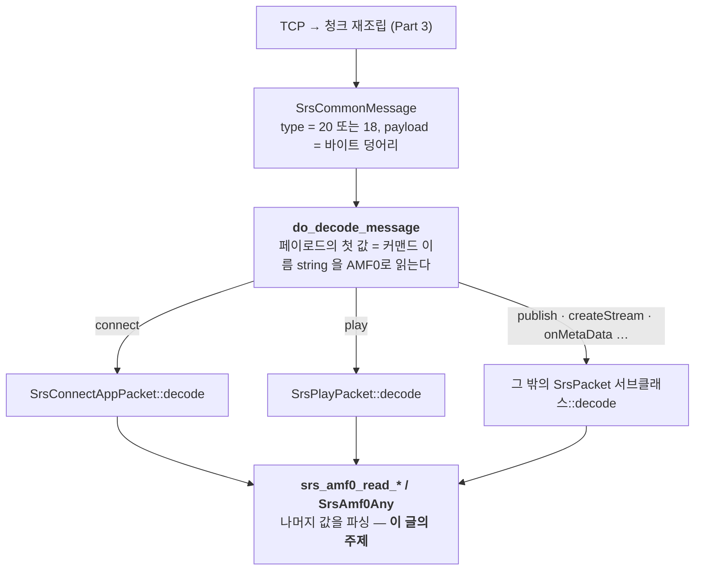

# RTMP 깊이 읽기 (5) — AMF0: 커맨드의 언어

> **시리즈 안내**: 이 시리즈는 교육용 RTMP 서버 [srs_simple](../README.md)의 코드를 읽기 위해 필요한
> RTMP 프로토콜 이론을 핸드셰이크부터 모든 패킷까지 정리한다. srs_simple은 원본
> [SRS](https://github.com/ossrs/srs)의 클래스/파일/메서드 이름을 1:1로 미러링하므로,
> 여기서 익힌 내용은 원본 SRS를 읽을 때 그대로 통한다.
>
> **시리즈 목차**
>
> 1. [RTMP 조감도 — 메시지, 청크, 스트림](part1-overview.md)
> 2. [핸드셰이크 — 연결의 첫 3,073+1,536 바이트](part2-handshake.md)
> 3. [청크 스트림 — RTMP의 심장](part3-chunk-stream.md)
> 4. [프로토콜 컨트롤 메시지 5종](part4-control-messages.md)
> 5. **AMF0 — 커맨드의 언어** (이 글)
> 6. [커맨드 흐름 (1) — connect와 스트림 생성](part6-netconnection.md)
> 7. [커맨드 흐름 (2) — publish와 미디어 메시지](part7-publish.md)
> 8. [커맨드 흐름 (3) — play와 중간 입장 문제](part8-play.md)
> 9. [(보너스) 서버 내부 — 팬아웃, 캐시, 지터](part9-server-internals.md)

이 글은 Part 4까지 읽었다고 가정한다. 다만 이 파트는 다른 파트와 의존이 얕다 —
청크 층(Part 3)이 "type 20 메시지의 페이로드"라는 바이트 덩어리를 건네준다는 것만
알면 충분하다.

지금까지 다룬 메시지는 전부 고정 바이너리였다. 핸드셰이크는 위치가 곧 의미였고,
컨트롤 메시지는 4~5바이트짜리 고정 스키마였다. 하지만 connect, publish, play,
onStatus — RTMP 세션을 실제로 진행시키는 **커맨드 메시지(type 20)와 데이터
메시지(type 18)** 는 다르다. 이들의 페이로드는 문자열, 숫자, 중첩 객체가 임의
순서로 늘어선 **자기 서술적(self-describing) 직렬화 포맷**, AMF0다.

AMF0(Action Message Format 0)는 Adobe가 ActionScript 객체를 와이어에 싣기 위해
만든 포맷이다. JSON과 역할이 같다 — 키-값 객체를 직렬화한다 — 다만 텍스트가 아니라
바이너리이고, 각 값 앞에 **마커 바이트 1개**가 붙어 "다음에 올 것"의 타입을
선언한다. 이 마커 체계만 익히면 connect 커맨드의 hex 덤프를 처음부터 끝까지 손으로
읽을 수 있고, 이 글의 종착지가 바로 그 연습이다(§7).

srs_simple의 구현은 [srs_protocol_amf0.{hpp,cpp}](../src/protocol/srs_protocol_amf0.hpp)
— 원본 `protocol/srs_protocol_amf0.*` 1,779줄에서 라이브 경로에 필요한 7타입
서브셋만 남긴 것이다 (CLAUDE.md §2.4, §5.6).

---

## 1. AMF0의 위치: 누가 이 코덱을 부르는가

먼저 좌표부터. Part 3의 `recv_message`가 완성된 메시지를 돌려주면, 헤더의 type이
20(AMF0 command) 또는 18(AMF0 data)인 경우 `do_decode_message`
([srs_protocol_rtmp_stack.cpp:368](../src/protocol/srs_protocol_rtmp_stack.cpp#L368))가
페이로드를 AMF0로 해석하기 시작한다:



즉 AMF0 코덱은 패킷 클래스들(Part 6~8의 주인공)의 **부품**이다. 이 글에서는 부품
자체 — `SrsAmf0Any`와 그 서브클래스들, 그리고 `srs_amf0_read_*`/`srs_amf0_write_*`
자유 함수들 — 만 다루고, 어떤 커맨드가 어떤 필드를 갖는지는 다음 파트로 미룬다.

한 가지 인터페이스 관찰: AMF0 코덱은 소켓을 전혀 모른다. 모든 read/write가
`SrsBuffer`(Part 2의 핸드셰이크 코드에서 처음 등장한 빅엔디언 바이트 커서) 하나만 받는다. 그래서 utest가
메모리 배열만으로 코덱 전체를 검증할 수 있다 —
[srs_utest_amf0.cpp](../utest/srs_utest_amf0.cpp)의 테스트 전부가 소켓 없이 돈다.

---

## 2. 마커 바이트 체계: 전체 지도와 실전 서브셋

AMF0의 문법은 한 문장이다: **모든 값은 마커 1바이트로 시작하고, 마커가 나머지
바이트의 해석을 결정한다.** 스펙의 마커는 0x00~0x11까지 18종이고, srs_simple은
주석 겸용으로 전체 목록을 `#define`으로 유지한다
([srs_protocol_amf0.cpp:15-37](../src/protocol/srs_protocol_amf0.cpp#L15-L37)):

| 마커 | 타입          | srs_simple | 비고                              |
| ---- | ------------- | ---------- | --------------------------------- |
| 0x00 | Number        | ✅         | 8B IEEE754 double, BE             |
| 0x01 | Boolean       | ✅         | 1B, 0=false / 그 외=true          |
| 0x02 | String        | ✅         | u16 len + utf8                    |
| 0x03 | Object        | ✅         | 키-값 나열, `00 00 09`로 종료     |
| 0x04 | MovieClip     | —          | 스펙에서도 reserved               |
| 0x05 | Null          | ✅         | 마커뿐                            |
| 0x06 | Undefined     | ✅         | 마커뿐                            |
| 0x07 | Reference     | —          |                                   |
| 0x08 | EcmaArray     | ✅         | count 4B + Object와 동일 본문     |
| 0x09 | ObjectEnd     | ✅         | 단독으론 안 오고 `00 00 09`의 끝  |
| 0x0A | StrictArray   | —          | §8                                |
| 0x0B | Date          | —          | §8                                |
| 0x0C | LongString    | —          | u32 len 문자열                    |
| 0x0D | UnSupported   | —          |                                   |
| 0x0E | RecordSet     | —          | 스펙에서도 reserved               |
| 0x0F | XmlDocument   | —          |                                   |
| 0x10 | TypedObject   | —          | 클래스 이름 붙은 Object           |
| 0x11 | AVMplusObject | —          | AMF3로의 전환 마커                |

✅ 7종 + ObjectEnd가 실전 서브셋이다. OBS/ffmpeg/VLC와의 상호운용에 이 7종이면
충분하다는 것은 srs_simple의 실클라이언트 매트릭스가 증명했다(README). 나머지를
만나면 어떻게 되는지는 §8에서.

각 타입의 와이어 포맷을 한 장에 모으면:

```text
Number     ┌──────┬──────────────────────────────────┐
 (0x00)    │ 0x00 │  IEEE754 double, 8B, big-endian  │   1.0 → 00 3F F0 00 00 00 00 00 00
           └──────┴──────────────────────────────────┘

Boolean    ┌──────┬──────┐
 (0x01)    │ 0x01 │  b   │                               true → 01 01
           └──────┴──────┘

String     ┌──────┬─────────┬───────────────────────┐
 (0x02)    │ 0x02 │ len 2B  │  utf8 bytes           │   "live" → 02 00 04 6C 69 76 65
           └──────┴─────────┴───────────────────────┘

Null       ┌──────┐          Undefined  ┌──────┐
 (0x05)    │ 0x05 │           (0x06)    │ 0x06 │          마커 1바이트가 전부
           └──────┘                     └──────┘

Object     ┌──────┬─────────────────────────────────┬──────────┐
 (0x03)    │ 0x03 │ (len 2B + key) + value(any) ... │ 00 00 09 │
           └──────┴─────────────────────────────────┴──────────┘
                      ▲ key에는 마커가 없다!            ▲ object-eof
                        (마커 없는 utf8)                  = 빈 key + 0x09

EcmaArray  ┌──────┬──────────┬─────────────────────────────────┬──────────┐
 (0x08)    │ 0x08 │ count 4B │ same property body as Object    │ 00 00 09 │
           └──────┴──────────┴─────────────────────────────────┴──────────┘
                      ▲ 파서는 이 값을 믿지 않는다 — eof까지 읽으며 직접 센다 (§3)
```

세 가지 함정을 짚어 둔다:

1. **Number는 무조건 double이다.** AMF0에 정수 타입이 없다. transaction id도,
   stream id도, 해상도도 전부 8바이트 IEEE754로 온다. `1.0`이
   `3F F0 00 00 00 00 00 00`인 것은 double의 비트 배치(부호 1 + 지수 11 + 가수
   52) 때문이다 — 지수 1023(0x3FF)에 가수 0이 곧 1.0. 코드는 빅엔디언 8바이트를
   `int64_t`로 읽은 뒤 `memcpy`로 double에 비트만 옮긴다
   ([srs_amf0_read_number, cpp:1113-1114](../src/protocol/srs_protocol_amf0.cpp#L1113-L1114))
2. **Object의 key에는 마커가 없다.** value 자리에는 마커 있는 any가 오지만, key는
   "마커 없는 utf8"(len 2B + 바이트)이다. 그래서 코드에도 두 함수가 따로 있다 —
   `srs_amf0_read_string`(마커 검사 후 utf8)과 내부용 `srs_amf0_read_utf8`(len부터
   바로) ([cpp:1019-1032](../src/protocol/srs_protocol_amf0.cpp#L1019-L1032),
   [:1206-1230](../src/protocol/srs_protocol_amf0.cpp#L1206-L1230))
3. **종료 마커 `00 00 09`는 사실 "빈 key + ObjectEnd 마커"다.** 길이 0인 utf8
   key(`00 00`) 뒤에 0x09가 오는 구조 — Object 문법(key 다음 value)을 그대로 쓰면서
   끝을 표시하는 트릭이다. 그래서 파서는 프로퍼티를 읽기 전에 항상 3바이트를
   엿본다(§5)

---

## 3. Object vs EcmaArray: 같은 몸, 다른 머리

표를 다시 보면 EcmaArray(0x08)는 Object(0x03)에 **count 4바이트가 앞에 붙은 것**이
전부다. 이름은 "배열"이지만 인덱스 배열이 아니라 연관 배열(associative array),
즉 그냥 키-값 객체다. ActionScript에서 `var a = {}; a.width = 1920;`으로 만든
객체와 `var a = []; a["width"] = 1920;`으로 만든 객체가 서로 다른 타입으로
직렬화되던 흔적이다.

이 구분이 실무에서 문제가 되는 지점이 하나 있다: **ffmpeg의 onMetaData는
EcmaArray로 온다.** 서버가 Object만 받겠다고 하면 ffmpeg publish의 메타데이터를
못 읽는다. 그래서 `SrsOnMetaDataPacket::decode`는 둘 다 받고, EcmaArray면 Object로
복사해 통일한다
([srs_protocol_rtmp_stack.cpp:3081-3094](../src/protocol/srs_protocol_rtmp_stack.cpp#L3081-L3094)):

```cpp
if (any->is_object()) {
    srs_freep(metadata);
    metadata = any->to_object();          // Object면 그대로
    return err;
}
if (any->is_ecma_array()) {
    SrsAmf0EcmaArray* arr = any->to_ecma_array();
    // if ecma array, copy to object.
    for (int i = 0; i < arr->count(); i++) {
        metadata->set(arr->key_at(i), arr->value_at(i)->copy());
    }
}
```

반대 방향도 있다 — 서버가 connect `_result`에 서버 정보를 담을 때는 관례상
EcmaArray를 만들어 보낸다
([response_connect_app, rtmp_stack.cpp:1740](../src/protocol/srs_protocol_rtmp_stack.cpp#L1740)).
그래서 srs_simple의 `SrsAmf0EcmaArray`는 "서버는 읽기만 필요"함에도 원본대로
write까지 유지한다 ([hpp:166](../src/protocol/srs_protocol_amf0.hpp#L166) 주석).

count 필드에 대한 주의: 파서는 count를 읽어 `_count`에 **보관만 하고**, 실제
프로퍼티 개수는 `00 00 09`가 나올 때까지 읽으면서 센다
([SrsAmf0EcmaArray::read, cpp:659-687](../src/protocol/srs_protocol_amf0.cpp#L659-L687)).
count를 믿고 루프를 돌면 count가 거짓말하는 인코더(실존한다)에 무너지기 때문이다.
utest `EcmaArrayToObject`
([srs_utest_amf0.cpp:326-371](../utest/srs_utest_amf0.cpp#L326-L371))가 이
경로를 ffmpeg 스타일 hex로 통째로 검증한다.

---

## 4. 프로퍼티 삽입 순서 보존: 정렬하면 FMLE가 죽는다

`SrsAmf0Object`의 내부 저장소는 `std::map`이 아니라 이름부터 의미심장한
`SrsUnSortedHashtable` — 실체는 `vector<pair<string, SrsAmf0Any*>>`다
([srs_protocol_amf0.hpp:377-403](../src/protocol/srs_protocol_amf0.hpp#L377-L403)).
조회는 선형 탐색이고 set/get/remove 전부 O(n)이다. 왜 해시테이블도 map도 아닌가?
원본 주석이 이유를 박제해 두었다
([hpp:371-375](../src/protocol/srs_protocol_amf0.hpp#L371-L375), 원본 hpp:778):

```cpp
/**
 * to ensure in inserted order.
 * for the FMLE will crash when AMF0Object is not ordered by inserted,
 * if ordered in map, the string compare order, the FMLE will creash when
 * get the response of connect app.
 */
```

`std::map`에 넣으면 키가 사전순으로 재정렬된 채 직렬화되고, 그 응답을 받은
FMLE(Flash Media Live Encoder)가 죽었다는 실전 기록이다. AMF0 스펙 어디에도
"프로퍼티 순서를 보존하라"는 조항은 없다 — 그러나 **와이어의 실질 계약은 스펙이
아니라 배포된 구현들이 정한다.** JSON 파서에게 키 순서를 기대하면 안 된다고
배우지만, AMF0 세계에서는 정확히 그 반대가 생존 조건이었던 셈이다.

프로퍼티 개수가 connect object 기준 4~8개 수준이니 O(n) 조회는 문제가 안 된다.
`set`은 같은 키가 있으면 지우고 **끝에 다시 추가**한다
([cpp:285-304](../src/protocol/srs_protocol_amf0.cpp#L285-L304)) — 교체가 순서를
바꾸는 유일한 경우다. utest `ObjectRoundtripKeepsOrder`
([srs_utest_amf0.cpp:150-198](../utest/srs_utest_amf0.cpp#L150-L198))가 사전순이
아닌 키들(width → app → secure)을 넣고 라운드트립 후에도 그 순서 그대로인 것을
확인한다.

---

## 5. discovery → read: 2단 파싱 프로토콜

임의 위치에서 "다음 값"을 읽는 진입점은 `srs_amf0_read_any`
([cpp:1001-1017](../src/protocol/srs_protocol_amf0.cpp#L1001-L1017))이고, 내부는
정확히 두 단계다:

```cpp
// 1단: 마커를 엿보고 타입에 맞는 빈 객체를 만든다 (스트림 소비 없음)
SrsAmf0Any::discovery(stream, ppvalue);
// 2단: 그 객체더러 자기 자신을 읽게 한다 (마커부터 다시)
(*ppvalue)->read(stream);
```

`discovery`
([cpp:182-237](../src/protocol/srs_protocol_amf0.cpp#L182-L237))는 마커
1바이트를 읽고 **즉시 `skip(-1)`로 되돌린 뒤**, switch로 해당 타입의 빈 인스턴스만
만들어 돌려준다. 실제 파싱은 각 클래스의 `read()`가 마커 검증부터 다시 한다.
peek(엿보기)와 parse(소비)를 분리한 이 구조 덕에 각 타입의 `read`/`write`가
대칭이 되고 — 자기가 쓴 것은 마커부터 자기가 읽는다 — 재귀도 공짜로 얻는다:
`SrsAmf0Object::read`가 프로퍼티 value 자리에서 `srs_amf0_read_any`를 다시 부르면
중첩 객체가 그대로 처리된다
([cpp:507-511](../src/protocol/srs_protocol_amf0.cpp#L507-L511)).

discovery에 특례가 하나 있다: switch보다 먼저 `srs_amf0_is_object_eof`
([cpp:1256-1267](../src/protocol/srs_protocol_amf0.cpp#L1256-L1267))로
3바이트를 엿본다. §2에서 봤듯 object-eof는 첫 바이트가 0x00 — Number 마커와
같다 — 이라서 마커 1바이트만으로는 구분이 안 되기 때문이다. `00 00 09` 3바이트를
읽고 `skip(-3)`으로 되돌리는, Part 3의 extended timestamp 감지(4바이트 미리
읽고 `skip(-4)`)와 같은 관용이다. `SrsBuffer`가 음수 skip을 지원하는 이유가 이런
데 있다.

클래스 설계도 여기서 정리하자. 모든 타입은 `SrsAmf0Any`
([hpp:56-115](../src/protocol/srs_protocol_amf0.hpp#L56-L115))를 상속하고,
사용자는 세 부류의 API만 만난다:

- **판별**: `is_string()/is_number()/is_object()/...` — marker 비교 한 줄씩
- **변환**: `to_str()/to_number()/to_object()/...` — 내부는 `dynamic_cast` +
  `srs_assert` ([cpp:93-133](../src/protocol/srs_protocol_amf0.cpp#L93-L133)).
  즉 **판별 없이 변환하면 죽는다**. 그래서 패킷 decode 코드는 항상
  `is_xxx()` 검사나 `ensure_property_string()` 같은 안전 조회를 거친다
- **생성**: `SrsAmf0Any::str()/number()/object()` 팩토리. 사용자용 서브클래스
  7종의 생성자는 전부 private이고 (`friend class SrsAmf0Any`), `SrsAmf0Object::set`은 값의
  소유권을 가져간다 — "만들면 넘기고, 컨테이너가 해제한다"가 이 코덱의 메모리 규칙

직렬화 방향에는 `total_size()`가 짝으로 붙는다. AMF0는 가변 길이라 버퍼를 먼저
할당해야 하는 송신 측은 크기를 미리 계산해야 하고, 그 계산기가 `SrsAmf0Size`
([cpp:784-844](../src/protocol/srs_protocol_amf0.cpp#L784-L844))다. hpp 상단의
Usages 주석([hpp:26-48](../src/protocol/srs_protocol_amf0.hpp#L26-L48))이 이
계약("total_size로 할당 → write") 전체를 5줄로 요약하고 있다.

---

## 6. 관용적 허용: 스펙보다 너그럽게 읽는다

Part 3~4에서 "보내는 쪽은 보수적으로, 받는 쪽은 관대하게"의 사례들을 봤다. AMF0
파서에도 같은 철학의 허용이 세 군데 있다:

**① utf8 len ≤ 0은 빈 문자열.** `srs_amf0_read_utf8`은 길이를 `int16_t`(부호
있는)로 읽고, 0 이하면 에러 없이 빈 문자열로 통과시킨다
([cpp:1214-1219](../src/protocol/srs_protocol_amf0.cpp#L1214-L1219)). 길이가
32768 이상이면 음수로 읽히는데, 그런 문자열을 보내는 정상 인코더는 없으므로
"깨진 길이 = 빈 문자열"로 삼키는 쪽을 택한 것이다. 이때 출력 인자를 건드리지
않는 것까지 원본과 동일하다 — utest가 이 미세 동작("dirty" 값이 그대로 남는다)을
검증한다 ([srs_utest_amf0.cpp:109-118](../utest/srs_utest_amf0.cpp#L109-L118)).

**② EOF 없이 끝나는 Object 허용.** `SrsAmf0Object::read`의 루프 조건은 "EOF를
만날 때까지"가 아니라 `while (!stream->empty())`다
([cpp:491](../src/protocol/srs_protocol_amf0.cpp#L491)). `00 00 09` 없이
스트림이 끝나 버리는 인코더가 있어도, 프로퍼티를 읽던 만큼 읽고 정상 반환한다.
스펙대로면 잘린 객체지만, 현실에서는 마지막 프로퍼티까지 읽혔으면 쓸 수 있다.

**③ Boolean은 0이 아니면 전부 true.** `!= 0` 비교 한 줄이라 0x01이 아닌 0x77
같은 값도 true다 ([cpp:1065](../src/protocol/srs_protocol_amf0.cpp#L1065),
utest [:74-81](../utest/srs_utest_amf0.cpp#L74-L81)).

관대함의 경계도 분명하다. 길이가 **모자라는** 쪽 — len=4라는데 2바이트만 남은
문자열, value가 잘린 프로퍼티 — 은 전부 `ERROR_RTMP_AMF0_DECODE`로 즉시
실패한다. 모든 read가 소비 전에 `stream->require(n)`을 거는 방어가 그것이고,
utest `DecodeErrors`
([srs_utest_amf0.cpp:400-438](../utest/srs_utest_amf0.cpp#L400-L438))가 실패
시 부분 생성물이 해제되는 것(`any == NULL`)까지 확인한다. 요약하면: **값이
이상한 것은 삼키고, 바이트가 모자란 것은 거부한다.**

---

## 7. 실전 디코드 연습: ffmpeg의 connect를 손으로 읽기

이제 도구가 다 모였다. 아래는 ffmpeg가 `rtmp://localhost:1935/live`로 publish를
시작할 때 보내는 **connect 커맨드 메시지(type 20)의 페이로드** hex 덤프다 —
utest `FfmpegConnectDecode`
([srs_utest_amf0.cpp:263-323](../utest/srs_utest_amf0.cpp#L263-L323))에 실측
바이트가 그대로 들어 있다. 청크 헤더는 Part 3에서 이미 벗겼다고 치고, 페이로드만
읽는다:

```text
02 00 07 63 6F 6E 6E 65 63 74                    ← ①
00 3F F0 00 00 00 00 00 00                       ← ②
03                                               ← ③
   00 03 61 70 70                                ← ④
   02 00 04 6C 69 76 65                          ← ⑤
   00 04 74 79 70 65                             ← "type"
   02 00 0A 6E 6F 6E 70 72 69 76 61 74 65        ← string "nonprivate"
   00 08 66 6C 61 73 68 56 65 72                 ← "flashVer"
   02 00 24 46 4D 4C 45 2F 33 2E 30 20 28 63 6F  ← string(0x24=36B)
   6D 70 61 74 69 62 6C 65 3B 20 4C 61 76 66 35    "FMLE/3.0 (compatible;
   38 2E 32 39 2E 31 30 30 29                       Lavf58.29.100)"
   00 05 74 63 55 72 6C                          ← "tcUrl"
   02 00 1A 72 74 6D 70 3A 2F 2F 6C 6F 63 61 6C  ← string(0x1A=26B)
   68 6F 73 74 3A 31 39 33 35 2F 6C 69 76 65       "rtmp://localhost:1935/live"
00 00 09                                         ← ⑥
```

순서대로 짚는다:

- **①** `0x02` → String 마커. len `00 07` = 7, 이어지는 7바이트는 ASCII로
  `connect`. **커맨드 메시지의 첫 값은 항상 커맨드 이름 문자열**이다 —
  `do_decode_message`가 이걸 읽고 어느 패킷 클래스로 보낼지 정한다
- **②** `0x00` → Number 마커. `3F F0 00 00 00 00 00 00` = double 1.0. 이것이
  **transaction id**다. 클라이언트가 요청에 번호를 붙이면 서버가 같은 번호로
  `_result`를 돌려준다 (요청-응답 매칭의 상세는 Part 6). connect는 관례상 항상
  tid=1
- **③** `0x03` → Object 마커. 여기부터 **command object** — connect의 인자
  꾸러미다
- **④** 마커가 없다! Object 내부이므로 key 자리 — utf8 len `00 03` + `app`.
  §2의 함정 2를 실전에서 확인하는 순간이다
- **⑤** key 다음은 value 자리이므로 다시 마커부터: `0x02` String, len 4,
  `live`. 즉 `app: "live"` — 서버는 이 값으로 스트림을 라우팅한다(Part 6의
  `srs_discovery_tc_url`). 이어서 같은 문법으로 `type: "nonprivate"`,
  `flashVer: "FMLE/3.0 (compatible; Lavf58.29.100)"`(ffmpeg가 FMLE를 사칭하는
  역사적 관례), `tcUrl: "rtmp://localhost:1935/live"`가 반복된다
- **⑥** 빈 key(`00 00`) + `0x09` = object-eof. Object가 닫히고, 스트림도 끝 —
  connect 페이로드 전체가 소비됐다

전부 합쳐 **string + number + object, 값 세 개**가 connect의 전부다. 같은 문법이
createStream에도 publish에도 onStatus에도 반복된다 — 커맨드 이름과 object의
내용물만 바뀔 뿐이다. 이 덤프를 손으로 읽어냈다면 Part 6~8의 어떤 hex도 읽을 수
있다.

참고로 utest는 이 디코드의 역방향까지 확인한다: 파싱한 object를 `write()`로 다시
직렬화하면 **원본 바이트와 정확히 일치**한다
([srs_utest_amf0.cpp:313-319](../utest/srs_utest_amf0.cpp#L313-L319)). 순서
보존(§4)이 지켜지기에 가능한 라운드트립이다.

---

## 8. 생략된 타입들: 만나면 어떻게 되는가

srs_simple이 제거한 타입(StrictArray/Date/LongString/XmlDocument/TypedObject/
Reference)의 마커가 들어오면 `discovery`의 default 분기가
`ERROR_RTMP_AMF0_INVALID`를 돌려준다
([cpp:231-235](../src/protocol/srs_protocol_amf0.cpp#L231-L235)):

```cpp
// StrictArray/Date 등은 서브셋에서 제거 — invalid로 처리 (원본은 지원).
case RTMP_AMF0_Invalid:
default: {
    return srs_error_new(ERROR_RTMP_AMF0_INVALID, "invalid amf0 message, marker=%#x", marker);
}
```

원본 SRS는 StrictArray(0x0A — 연관이 아닌 진짜 인덱스 배열)와 Date(0x0B)까지
파싱한다. srs_simple이 지워도 되는 근거는 실측이다: OBS/ffmpeg/VLC의 라이브
경로에서 이 마커들이 관측되지 않았다 (README의 상호운용 매트릭스). 파생 정리도
있다 — `is_complex_object`는 원본과 달리 strict-array를 검사하지 않고
object/object-eof/ecma-array 3종만 본다
([cpp:88-91](../src/protocol/srs_protocol_amf0.cpp#L88-L91)). 디버그 덤프
`human_print`와 JSON 변환 `to_json`도 함께 제거됐다 — JSON 계층 자체가 없기
때문이다 (전체 목록은 CLAUDE.md §5.6 S4).

에러가 나면 어떻게 되나? Part 3에서 본 대로 디코드 실패는 해당 메시지 처리
실패 → 연결 종료로 이어진다. "모르는 마커면 그 값만 건너뛴다"가 불가능한 것이
자기 서술 포맷의 대가다 — **길이를 알려면 타입을 알아야 하므로, 모르는 타입은
건너뛸 수조차 없다.** Part 4의 UserControl(타입을 읽어야 길이를 아는 구조)에서
예고한 성질이 AMF0에서는 포맷 전체의 성질이 된다.

---

## 9. 정리

AMF0에서 들고 갈 것:

1. **마커 1바이트가 문법의 전부다.** 실전 서브셋은 7종 — Number(0x00, 8B double
   BE), Boolean(0x01), String(0x02, u16 len), Object(0x03), Null(0x05),
   Undefined(0x06), EcmaArray(0x08) — 와 종료 표시 `00 00 09`. Object의 key만
   마커 없는 utf8이라는 예외를 기억하자
2. **파싱은 discovery → read 2단.** 마커를 엿보고(`skip(-1)` 되돌림) 타입별
   객체를 만든 뒤 그 객체가 자기를 읽는다. object-eof만 첫 바이트가 Number와
   겹쳐 3바이트 선행 검사가 필요하다
3. **삽입 순서 보존은 스펙 밖의 생존 조건.** `SrsUnSortedHashtable` =
   `vector<pair>`. 정렬하면 FMLE가 죽는다는 원본 주석이 "와이어의 계약은 배포된
   구현이 정한다"는 이 시리즈의 반복 교훈을 다시 보여준다
4. **읽기는 관대하게, 그러나 바이트 부족은 거부.** len≤0 문자열 허용, EOF 없는
   Object 허용, EcmaArray count 불신. 반면 모든 read는 `require(n)` 방어를
   거치고, 모르는 마커는 건너뛸 수 없어 `ERROR_RTMP_AMF0_INVALID`로 즉시 실패한다
5. **Object와 EcmaArray는 취급을 통일한다.** ffmpeg의 onMetaData가 EcmaArray로
   오므로 읽기는 둘 다 받고 Object로 변환해 쓴다

이제 커맨드의 "언어"를 읽을 수 있으니, 다음 파트부터는 "대화"를 읽는다. connect의
command object에 서버가 무엇으로 응답하는지, transaction id가 요청과 응답을
어떻게 묶는지, createStream이 만들어 주는 stream id의 정체, 그리고 서버가
publish 의도와 play 의도를 가려내는 `identify_client` 상태 기계 —
NetConnection 수준 커맨드 흐름이 Part 6의 주제다.

---

_이 글은 [srs_simple](../README.md) 프로젝트의 RTMP 이론 시리즈 Part 5이다.
코드 대조 기준: srs_simple `src/protocol/srs_protocol_amf0.{hpp,cpp}`
(`SrsAmf0Any::discovery:182`, `SrsAmf0Object::read:476`/`write:520`,
`SrsAmf0EcmaArray::read:640`, `SrsUnSortedHashtable` hpp:377,
`srs_amf0_read_utf8:1206`, `srs_amf0_is_object_eof:1256`),
`src/protocol/srs_protocol_rtmp_stack.cpp`(`SrsOnMetaDataPacket::decode:3054`) /
원본 SRS 6.0 `trunk/src/protocol/srs_protocol_amf0.cpp:672`(Object::read),
`:716`(Object::write), 순서 보존 주석은 hpp:778. 실측 바이트:
`utest/srs_utest_amf0.cpp`의 `FfmpegConnectDecode`, `EcmaArrayToObject`,
`ObjectRoundtripKeepsOrder`._
