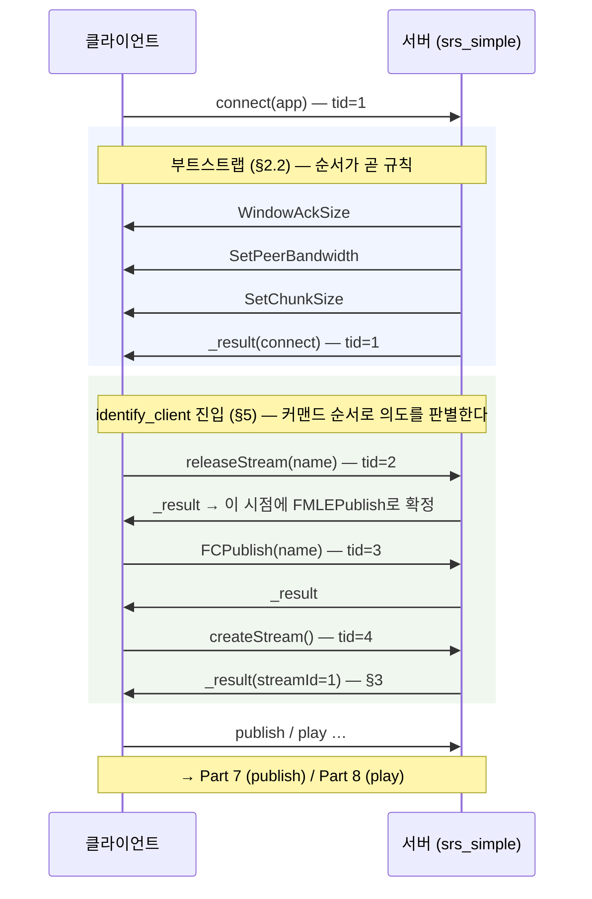
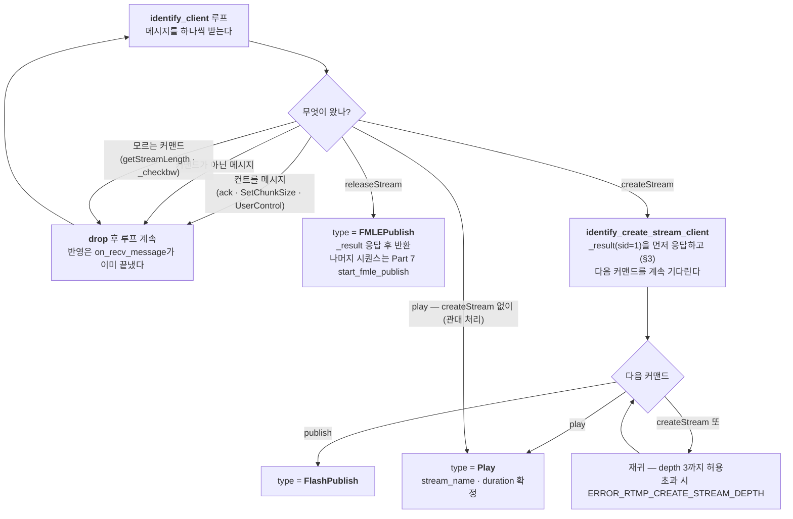

# RTMP 깊이 읽기 (6) — 커맨드 흐름 (1): connect와 스트림 생성

> **시리즈 안내**: 이 시리즈는 교육용 RTMP 서버 [srs_simple](../README.md)의 코드를 읽기 위해 필요한
> RTMP 프로토콜 이론을 핸드셰이크부터 모든 패킷까지 정리한다. srs_simple은 원본
> [SRS](https://github.com/ossrs/srs)의 클래스/파일/메서드 이름을 1:1로 미러링하므로,
> 여기서 익힌 내용은 원본 SRS를 읽을 때 그대로 통한다.
>
> **시리즈 목차**
>
> 1. [RTMP 조감도 — 메시지, 청크, 스트림](part1-overview.md)
> 2. [핸드셰이크 — 연결의 첫 3,073+1,536 바이트](part2-handshake.md)
> 3. [청크 스트림 — RTMP의 심장](part3-chunk-stream.md)
> 4. [프로토콜 컨트롤 메시지 5종](part4-control-messages.md)
> 5. [AMF0 — 커맨드의 언어](part5-amf0.md)
> 6. **커맨드 흐름 (1) — connect와 스트림 생성** (이 글)
> 7. [커맨드 흐름 (2) — publish와 미디어 메시지](part7-publish.md)
> 8. [커맨드 흐름 (3) — play와 중간 입장 문제](part8-play.md)
> 9. [(보너스) 서버 내부 — 팬아웃, 캐시, 지터](part9-server-internals.md)
> 10. [(보너스 2) HLS — 같은 스트림을 HTTP로 배달하기](part10-hls.md)
> 11. [(보너스 3) LL-HLS — 지연과의 싸움: 파트, 블로킹 리로드, fMP4](part11-llhls.md)

이 글은 Part 5까지 읽었다고 가정한다.

지금까지 쌓아 온 것을 정리하면: 핸드셰이크(Part 2)로 연결이 열리고, 청크 층(Part 3)이
바이트를 메시지로 조립해 주고, 컨트롤 메시지(Part 4)가 전송 파라미터를 맞추고,
AMF0(Part 5)로 커맨드의 페이로드를 읽을 수 있게 됐다. 이제부터 세 파트에 걸쳐
**대화 자체** — 클라이언트와 서버가 어떤 커맨드를 어떤 순서로 주고받는가 — 를 읽는다.

이번 파트의 범위는 **NetConnection 수준**이다. Flash 시절의 API 구분을 빌리면
RTMP 커맨드는 두 층으로 나뉜다: 연결 하나에 대한 커맨드(connect, createStream)와
그 위에 만들어진 스트림 하나에 대한 커맨드(publish, play, onStatus). 이 글은 전자,
즉 connect부터 서버가 "이 클라이언트는 publish하러 왔는가, play하러 왔는가"를
판별하는 `identify_client`까지를 다룬다. publish/play 시퀀스 자체는 Part 7/8이다.

CLAUDE.md §2.5의 시퀀스 다이어그램에서 이번 파트가 확대하는 구간은 여기다:



---

## 1. 커맨드 메시지의 일반형: 이름, transaction id, 그리고 응답

type 20(AMF0 command) 메시지의 페이로드는 예외 없이 이 꼴이다:

```text
┌──────────────────┬──────────────────┬─────────────────┬──────────────┐
│  command name    │  transaction_id  │ command object  │   args ...   │
│  string (0x02)   │  number (0x00)   │ object or null  │ 0..N values  │
└──────────────────┴──────────────────┴─────────────────┴──────────────┘
```

- **command name**: `"connect"`, `"createStream"`, `"publish"`, `"_result"` …
  — 이 문자열이 디코드할 패킷 클래스를 결정한다 (Part 5 §1)
- **transaction_id**: 요청-응답을 묶는 번호. 응답이 필요 없는 커맨드는 0
- **command object**: 커맨드의 인자 꾸러미. 인자가 없으면 Null(0x05)
- **args**: 커맨드별 추가 값. publish의 `"live"`, play의 start/duration/reset 등

요청에는 이름이 있지만, 응답의 이름은 `_result`(성공) 또는 `_error`(실패)뿐이다.
그럼 `_result`가 도착했을 때 이것이 **무슨 요청에 대한** 응답인지 어떻게 아는가?
페이로드에 남은 단서는 transaction id 하나다. 그래서 커맨드를 **보내는 쪽**은
"tid → 보낸 커맨드 이름" 맵을 유지해야 한다. srs_simple의 `SrsProtocol`이 가진
[`requests` 맵](../src/protocol/srs_protocol_rtmp_stack.hpp#L181)이 그것이다.

- 송신 시 기록: [`on_send_packet`](../src/protocol/srs_protocol_rtmp_stack.cpp#L1220)이
  connect/createStream/releaseStream류 패킷을 보낼 때 `requests[tid] = 커맨드 이름`을 남긴다
- 수신 시 조회: [`do_decode_message`](../src/protocol/srs_protocol_rtmp_stack.cpp#L421)가
  `_result`/`_error`를 만나면 tid를 먼저 읽고, `requests`에서 원래 커맨드 이름을 찾아
  그에 맞는 응답 패킷 클래스(`SrsConnectAppResPacket` 등)로 디코드한다. 맵에 없으면
  `ERROR_RTMP_NO_REQUEST` — 응답만으로는 타입을 알 수 없기 때문이다

서버 입장에서는 이 맵을 쓸 일이 거의 없다. 서버는 요청을 받고 응답하는 쪽이라,
받은 요청의 tid를 그대로 에코해 `_result`를 만들면 끝이다. srs_simple에서 이 맵을
실제로 쓰는 것은 **클라이언트 역할**을 하는 utest다 —
[MockRtmpClient](../utest/srs_utest_server.cpp#L96)가 connect를 보내고
`expect_message<SrsConnectAppResPacket>`으로 응답을 기다릴 때, 위의 두 경로가
맞물려 돌아간다 (CLAUDE.md §5.6 S6이 `requests`와 `_result` 디코드 경로를 남긴 이유).

한 가지 더: 커맨드를 기다리는 쪽의 관용구가
[`expect_message<T>`](../src/protocol/srs_protocol_rtmp_stack.hpp#L269)다.
"T 타입 패킷이 나올 때까지 메시지를 받아 디코드하고, 다른 타입은 조용히 버린다" —
이번 파트 내내 서버 코드에 반복해서 등장한다.

---

## 2. connect — 세션의 명함 교환

핸드셰이크가 끝나면 클라이언트가 보내는 첫 커맨드는 반드시 connect다.
관례상 **tid=1**, csid=3
([RTMP_CID_OverConnection](../src/kernel/srs_kernel_flv.hpp#L42) —
`SrsConnectAppPacket::get_prefer_cid`가 돌려주는 값), stream_id=0으로 흐른다.
command object에 클라이언트의 "명함"이 담긴다. ffmpeg가 보내는 실제 필드는
Part 5 §7에서 hex로 디코드했던 그것이다:

```text
connect의 command object (ffmpeg publish 기준):
  app:      "live"                                  ← 접속하려는 애플리케이션
  type:     "nonprivate"
  flashVer: "FMLE/3.0 (compatible; Lavf58.29.100)"  ← 클라이언트 버전 (FMLE 사칭)
  tcUrl:    "rtmp://localhost:1935/live"            ← 접속 URL 전체
```

player형 클라이언트(ffplay 등)는 여기에 fpad/capabilities/audioCodecs/videoCodecs/
videoFunction(사실상 무시됨)과 objectEncoding(0=AMF0, 3=AMF3)을 더 실어 보낸다.

서버 쪽 수신 코드는
[`SrsRtmpServer::connect_app`](../src/protocol/srs_protocol_rtmp_stack.cpp#L1824)
(원본 `protocol/srs_protocol_rtmp_stack.cpp:2244`)이다. 하는 일은 단순하다:
`expect_message<SrsConnectAppPacket>`으로 connect를 기다리고, command object에서
**tcUrl(필수 — 없으면 `ERROR_RTMP_REQ_CONNECT`)**, pageUrl/swfUrl/objectEncoding
(선택)을 꺼내 `SrsRequest`에 담은 뒤, tcUrl을 파싱한다.

[`SrsRequest`](../src/protocol/srs_protocol_rtmp_stack.hpp#L379)는 이 연결의
신원 그 자체다 — tcUrl에서 파생된 schema/host/vhost/app/stream/port/param이 모두
여기 모이고, Part 8에서 볼 스트림 허브의 키(`vhost/app/stream`)도 여기서 나온다.

디코드 쪽 디테일 하나
([`SrsConnectAppPacket::decode`](../src/protocol/srs_protocol_rtmp_stack.cpp#L2381)):
command object 뒤에 값이 더 남아 있으면 args로 읽되, **Object가 아니면 버린다**.
어떤 클라이언트는 여기에 문자열 따위를 넣어 보내기 때문이다(원본 이슈 #186).
tid도 1이 아니면 경고만 하고 진행한다 — "스펙대로 안 보내는 클라이언트가 실존한다"는
전제가 코드 전체에 깔려 있다.

### 2.1 tcUrl 파싱 — srs_discovery_tc_url

tcUrl 하나에서 서버는 다섯 가지를 뽑아야 한다: schema, host, port, **app**, 그리고
**vhost**. vhost가 낯설 수 있는데, HTTP의 가상 호스트와 같은 개념이다 — 한 서버가
여러 도메인의 스트림을 서비스할 때 "어느 도메인으로 들어왔는가"를 구분하는 축이다.
문제는 RTMP URL에 vhost 자리가 없다는 것. 그래서 관례가 생겼다:

- `rtmp://show.com/live` — host 자체가 도메인이면 그대로 vhost
- `rtmp://192.168.0.10/live?vhost=show.com` — IP로 접속하며 쿼리로 vhost 지정
- `rtmp://ip/live...vhost...show.com` — FMLE가 `?`를 못 쓰던 시절의 흔적.
  파싱 첫 줄에서 `?vhost=`로 치환된다

[`srs_discovery_tc_url`](../src/protocol/srs_protocol_utility.cpp#L36)
(원본 `protocol/srs_protocol_utility.cpp:47`)의 알고리즘을 순서대로 따라가면:

1. `...vhost...` → `?vhost=` 치환 (FMLE 호환)
2. tcUrl 뒤에 stream을 붙여 완전한 URL로 만든다 — tcUrl에는 스트림 이름이 없고,
   스트림 이름은 나중에 publish/play 커맨드로 온다 (그래서 이 함수는 §5의 identify
   **이후 한 번 더** 호출된다)
3. `rtmp://ip/app?k=v/stream`처럼 쿼리가 스트림보다 앞에 오는 FMLE 스타일이면
   `/stream`을 쿼리 앞으로 옮겨 표준형으로 교정
4. `/_definst_` 제거 (역시 FMLE 흔적)
5. 이제 표준 URL `schema://host[:port]/path[?query]`를 손으로 쪼갠다 — 원본은
   `SrsHttpUri`(HTTP 스택)를 쓰지만 srs_simple에는 HTTP 계층이 없어 같은 시그니처로
   손 파싱했다 (CLAUDE.md §5.6 S6)
6. path의 **마지막 슬래시 뒤가 stream, 앞이 app** — 그래서 `live/room1/test`는
   app=`live/room1`, stream=`test`가 된다 (다단계 app 허용)
7. 쿼리의 `vhost=`(없으면 `domain=`)를 vhost로, 그것도 없으면 **vhost=host**

몇 가지 입력을 표로 확인하면:

| tcUrl (+stream)                                 | schema | host         | vhost        | app  | stream | param             |
|-------------------------------------------------|--------|--------------|--------------|------|--------|-------------------|
| `rtmp://192.168.0.10:1935/live` + `test`        | rtmp   | 192.168.0.10 | 192.168.0.10 | live | test   |                   |
| `rtmp://ossrs.net/live?vhost=show.com` + `test` | rtmp   | ossrs.net    | show.com     | live | test   | `?vhost=show.com` |
| `rtmp://ip/live` + `test?token=abc`             | rtmp   | ip           | ip           | live | test   | `?token=abc`      |

세 번째 줄이 이 함수가 두 번 호출되는 이유다. connect 시점에는 스트림 이름을 모르므로
`?token=abc`가 어디 붙을지 알 수 없고, identify가 끝나 스트림 이름이 확정된 뒤
[`stream_service_cycle`](../src/app/srs_app_rtmp_conn.cpp#L208)이 재파싱해서
stream에 붙어 온 param을 분리한다.

### 2.2 부트스트랩과 _result — 순서가 곧 규칙이다

connect를 받은 서버가 응답하는 코드는
[`SrsRtmpConn::service_cycle`](../src/app/srs_app_rtmp_conn.cpp#L122)에 있고,
송신 순서가 고정돼 있다:

```text
① WindowAckSize(2500000)     ─┬─ 이 둘은 서로 순서를 바꿔도 된다
② SetPeerBandwidth(2500000)  ─┘   (Part 4의 흐름 제어 파라미터 · 관례상 1회)
③ SetChunkSize(60000)        ─── 반드시 ④보다 먼저! (128B 넘는 응답 전에)
④ _result(connect)           ─── 반드시 마지막 — NetConnection.Connect.Success
                                 클라이언트는 이것을 받고서야 다음 커맨드를 보낸다
```

③이 ④보다 먼저인 이유는 Part 4에서 다뤘던 타이밍 규칙의 재방문이다: connect의
`_result`는 아래에서 보듯 370바이트 안팎으로, 기본 청크 크기 128을 넘는다.
SetChunkSize를 먼저 보내지 않으면 응답이 여러 청크로 쪼개지고, 일부 클라이언트(OBS)가
이를 소화하지 못했다 (원본 이슈 #454 —
[srs_app_rtmp_conn.cpp:140](../src/app/srs_app_rtmp_conn.cpp#L140)의 주석).

`_result` 자체는
[`SrsRtmpServer::response_connect_app`](../src/protocol/srs_protocol_rtmp_stack.cpp#L1909)
(원본 :2319)이 만든다. `SrsConnectAppResPacket`의 페이로드는 tid=1 에코 뒤에
**Object 두 개**가 연달아 온다:

```text
"_result" + 1.0
+ props (Object):                      ← 서버의 명함
    fmsVer:       "FMS/3,5,3,888"     ← Flash Media Server 버전 흉내
    capabilities: 127.0
    mode:         1.0
+ info (Object):                       ← 접속 결과
    level:          "status"
    code:           "NetConnection.Connect.Success"   ← 클라이언트가 보는 것
    description:    "Connection succeeded"
    objectEncoding: 0                  ← 클라이언트가 보낸 값 에코
    data (EcmaArray):                  ← 서버 식별 정보 (SRS 확장)
        version, srs_sig, srs_server, srs_version, srs_server_ip, srs_pid, srs_id
```

`fmsVer`에 주목하자. RTMP 서버는 지금도 Adobe FMS 버전 문자열을 흉내 내서 보낸다 —
클라이언트 쪽 호환 코드가 그것을 기대하기 때문이다. `code` 필드의
`NetConnection.Connect.Success`가 클라이언트가 실제로 검사하는 값이고, 이
level/code/description 3종 세트는 Part 7에서 볼 onStatus 패킷의 일반형과 같은 관용구다.

---

## 3. createStream — message stream id의 탄생

connect가 성공하면 연결은 열렸지만, 아직 미디어가 흐를 통로는 없다. Flash API
구분으로 NetConnection은 만들어졌고 NetStream이 없는 상태다. createStream이
그 통로 — **message stream id** — 를 발급받는 커맨드다.

패킷은 시리즈 전체에서 가장 단순하다.
[`SrsCreateStreamPacket`](../src/protocol/srs_protocol_rtmp_stack.cpp#L2626)은
이름+tid+Null, 응답
[`SrsCreateStreamResPacket`](../src/protocol/srs_protocol_rtmp_stack.cpp#L2702)은
`_result`+tid+Null+**stream id(number)**. 25바이트와 29바이트라 손으로 다 읽을 수
있다 (마커 복습은 Part 5):

```text
요청 (25B):
02 00 0C 63 72 65 61 74 65 53 74 72 65 61 6D    string(12) "createStream"
00 40 00 00 00 00 00 00 00                      number 2.0        ← tid
05                                              null              ← command object

응답 (29B):
02 00 07 5F 72 65 73 75 6C 74                   string(7) "_result"
00 40 00 00 00 00 00 00 00                      number 2.0        ← tid 에코
05                                              null
00 3F F0 00 00 00 00 00 00                      number 1.0        ← stream id!
```

srs_simple의 서버는 항상 **sid=1**을 발급한다
([`SrsResponse`](../src/protocol/srs_protocol_rtmp_stack.hpp#L437)의 `stream_id`,
연결당 스트림 1개). 이 1이라는 숫자의 의미를 Part 1의 구분으로 재확인하자:

- **csid**(chunk stream id)는 **전송** 축이다 — 청크 헤더에 실리고, 큰 메시지가
  작은 메시지를 굶기지 않도록 인터리빙하는 채널 번호. connect는 csid 3,
  publish는 csid 5, 비디오/오디오는 csid 6/7을 선호한다
- **message stream id**는 **논리** 축이다 — 메시지 헤더(fmt0의 4바이트, 리틀엔디언
  그 필드!)에 실리고, "이 메시지가 어느 NetStream 소속인가"를 말한다

createStream 이후의 publish/play 커맨드와 모든 미디어 메시지는 sid=1로 흐르고,
연결 수준 컨트롤 메시지는 계속 sid=0으로 흐른다. Part 8에서 서버 응답 5연타의
stream_id가 0과 1로 갈리는 것을 볼 때 이 구분이 다시 등장한다.

---

## 4. releaseStream / FCPublish — FMLE의 유산

publisher의 시퀀스 다이어그램(서두)을 보면 createStream **앞에** 낯선 커맨드가
둘 있다: releaseStream과 FCPublish. 이것은 스펙이 아니라 **FMLE(Flash Media Live
Encoder)** — Adobe의 방송 송출 프로그램 — 가 만든 관례이고, ffmpeg와 OBS가 FMLE의
행동을 그대로 복제하면서 사실상 표준이 됐다 (서버가 publisher를
`SrsRtmpConnFMLEPublish` 타입으로 부르는 이유이기도 하다):

- **releaseStream(name)**: "이 이름으로 남아 있는 세션이 있으면 정리해 달라" —
  인코더가 비정상 종료 후 재접속할 때를 위한 예방 조치
- **FCPublish(name)**: "곧 이 이름으로 publish하겠다"는 예고. FC는 Flash
  Communication Server(FMS의 전신)의 흔적이다

현실의 서버가 할 일은 허무할 만큼 적다: **둘 다 tid를 에코한 `_result`만 보내면
된다**. srs_simple도 원본도 releaseStream에서 실제로 아무것도 정리하지 않는다.
클라이언트는 응답 내용을 보지 않고 다음 커맨드로 넘어간다.

구현 디테일: 세 커맨드 releaseStream/FCPublish/FCUnpublish는 페이로드 구조가
`이름 + tid + Null + 스트림이름(string)`으로 완전히 같다. 그래서 패킷 클래스도
[`SrsFMLEStartPacket`](../src/protocol/srs_protocol_rtmp_stack.cpp#L2793) 하나가
셋을 겸하고, decode가 [세 이름을 모두 허용](../src/protocol/srs_protocol_rtmp_stack.cpp#L2802)한다.
응답 [`SrsFMLEStartResPacket`](../src/protocol/srs_protocol_rtmp_stack.cpp#L2890)의
페이로드는 `_result + tid + Null + Undefined` — Part 5에서 "Undefined 마커(0x06)가
실전에서 쓰이는 곳"이라 예고했던 지점이 바로 여기다.

---

## 5. identify_client — 의도를 커맨드 순서로 판별하는 상태 기계

connect까지는 publisher와 player의 대화가 똑같다. RTMP에는 "나는 송출자다"라고
선언하는 필드가 없으므로, 서버는 **connect 이후에 무슨 커맨드가 오는지를 보고**
클라이언트의 의도를 알아내야 한다. 그 상태 기계가
[`SrsRtmpServer::identify_client`](../src/protocol/srs_protocol_rtmp_stack.cpp#L1948)
(원본 :2440)다.



루프 선두의 skip 두 줄이 실전의 핵심이다. 이 시점의 클라이언트는 커맨드만 보내는 게
아니다 — OBS는 자신의 SetChunkSize(4096)를 이 사이에 보내고, Acknowledgement도
언제든 끼어든다. `identify_client`는 컨트롤 메시지를 만나면 버리고 계속 기다린다
(버려도 되는 이유: Part 4에서 봤듯 컨트롤 메시지의 **반영**은 이미
`on_recv_message`가 수신 즉시 끝냈다. 여기 도착한 것은 반영이 끝난 껍데기다).

세 갈래의 분기가 클라이언트 종류를 가른다:

- **ffmpeg/OBS publisher**: 첫 커맨드가 releaseStream이므로 즉시
  `SrsRtmpConnFMLEPublish`로 판별된다
  ([`identify_fmle_publish_client`](../src/protocol/srs_protocol_rtmp_stack.cpp#L2329)
  — releaseStream의 `_result`까지 보내고 반환). 시퀀스의 나머지(FCPublish부터)는
  Part 7의 `start_fmle_publish`가 이어받는다
- **ffplay/VLC player**: 첫 커맨드가 createStream이므로
  [`identify_create_stream_client`](../src/protocol/srs_protocol_rtmp_stack.cpp#L2254)로
  들어간다. 여기서 먼저 `_result(sid=1)`를 응답하고 — createStream에 답하지 않으면
  클라이언트는 다음 커맨드를 보내지 않는다 — 다시 커맨드를 기다린다. play가 오면
  `SrsRtmpConnPlay`. 스트림 이름과 duration은 play 커맨드에서 나온다
- **Flash publisher**: createStream 뒤에 releaseStream/FCPublish 없이 곧장
  publish가 오는 고전 경로. `SrsRtmpConnFlashPublish`로 판별된다

createStream 분기가 **depth 3의 재귀**인 것도 현실 대응이다. createStream을
연달아 보내는 클라이언트가 있어서, 유한 깊이까지는 매번 새 `_result`를 주며
따라가되 그 이상은 `ERROR_RTMP_CREATE_STREAM_DEPTH`로 끊는다.

판별이 끝나면 [`stream_service_cycle`](../src/app/srs_app_rtmp_conn.cpp#L199)이
tcUrl을 재파싱(§2.1)하고, vhost/app/stream 키로 스트림 허브(`SrsLiveSource`)를
찾은 뒤, type에 따라 `start_play`(Part 8) 또는 `start_fmle_publish`(Part 7)로
갈라진다 — 이 함수가 세 파트를 잇는 분기점이다.

---

## 6. 미지의 커맨드: 응답하지 않아도 되는 이유

`identify_client` 루프의 마지막 갈래("그 외 커맨드는 무시")는 생각보다 자주 탄다.
실제 클라이언트들은 서버가 모르는 커맨드를 아무렇지 않게 보낸다:

- ffplay는 play 전에 `getStreamLength`를 보낸다 (VOD 길이 조회 — 라이브에는 무의미)
- Haivision 인코더는 `_checkbw`를 보낸다 (대역폭 체크)

원본 SRS는 이런 커맨드를 `SrsCallPacket`(RPC 일반형)으로 받아 null `_result`를
돌려준다. srs_simple은 `SrsCallPacket`을 제거했으므로
[`do_decode_message`의 마지막 분기](../src/protocol/srs_protocol_rtmp_stack.cpp#L520)가
기본 `SrsPacket`으로 받아 **그냥 버린다** (CLAUDE.md §5.6 S6).

이래도 되는 이유가 RTMP의 성격을 잘 보여준다. 커맨드의 요청-응답은 동기 RPC가
아니다 — 클라이언트는 대부분의 커맨드를 fire-and-forget으로 보내고, 응답이 없으면
없는 대로 진행한다 (실측: ffplay는 `getStreamLength` 응답 없이 play를 이어서
보낸다). 진행이 막히는 커맨드는 응답이 다음 행동의 전제인 것들 — connect,
createStream — 뿐이고, 그것이 정확히 이 파트에서 서버가 `_result`를 만드는
커맨드들이다.

---

## 7. 정리

NetConnection 수준에서 들고 갈 것:

1. **커맨드 = 이름 + tid + object.** 응답은 이름이 `_result`뿐이라 tid로 요청과
   매칭하며, 보낸 쪽이 tid→이름 맵(`requests`)을 기억해야 응답을 디코드할 수 있다.
   서버는 받은 tid를 에코하면 끝이다
2. **connect는 tcUrl 교환이다.** 서버는 tcUrl 하나에서 schema/host/port/app/vhost를
   파싱하고(`srs_discovery_tc_url`), 스트림 이름이 확정되는 identify 후 한 번 더
   파싱한다. vhost는 URL에 자리가 없어 쿼리(`?vhost=`)로 실어 나르는 관례다
3. **부트스트랩 순서는 고정이다.** WindowAckSize → SetPeerBandwidth →
   SetChunkSize → `_result`. SetChunkSize가 128바이트 넘는 `_result`보다 먼저여야
   한다는 것이 Part 4 타이밍 규칙의 실전 사례다
4. **createStream이 message stream id를 발급한다.** 이후 publish/play와 미디어는
   sid=1, 연결 수준 메시지는 sid=0 — csid(전송 축)와 다른 논리 축이다
5. **의도 판별은 커맨드 순서가 한다.** releaseStream이 먼저면 FMLE publisher,
   createStream 뒤 play면 player. 모르는 커맨드(getStreamLength, _checkbw)는
   버려도 진행된다 — 응답이 전제인 커맨드는 connect와 createStream뿐이다

다음 파트는 publisher의 나머지 절반이다. `start_fmle_publish`가 FCPublish부터
publish까지를 처리하고 onStatus(NetStream.Publish.Start)로 송출 허가를 내리는
과정, 그리고 그 뒤로 쏟아지는 진짜 화물 — @setDataFrame/onMetaData와
audio(8)/video(9) 메시지의 FLV 태그 구조 — 를 해부한다.

---

_이 글은 [srs_simple](../README.md) 프로젝트의 RTMP 이론 시리즈 Part 6이다.
코드 대조 기준: srs_simple `src/protocol/srs_protocol_rtmp_stack.{hpp,cpp}`
(`SrsRtmpServer::connect_app:1824`, `response_connect_app:1909`,
`identify_client:1948`, `identify_create_stream_client:2254`,
`identify_fmle_publish_client:2329`, `SrsConnectAppPacket::decode:2381`,
`SrsCreateStreamPacket:2626`, `SrsFMLEStartPacket:2793`, `_result` 디코드
`do_decode_message:421`, `requests` 등록 `on_send_packet:1196`),
`src/protocol/srs_protocol_utility.cpp`(`srs_discovery_tc_url:36`),
`src/app/srs_app_rtmp_conn.cpp`(`do_cycle:89`, `service_cycle:122`,
`stream_service_cycle:199`) / 원본 SRS 6.0
`trunk/src/protocol/srs_protocol_rtmp_stack.cpp:2244`(connect_app),
`:2319`(response_connect_app), `:2440`(identify_client),
`trunk/src/protocol/srs_protocol_utility.cpp:47`(srs_discovery_tc_url).
실측 바이트: `utest/srs_utest_server.cpp`의 `MockRtmpClient::connect_app`,
`utest/srs_utest_amf0.cpp`의 `FfmpegConnectDecode`._
