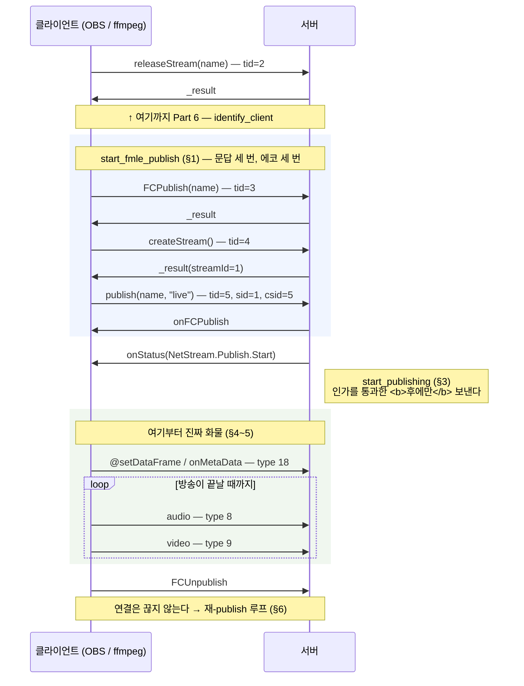
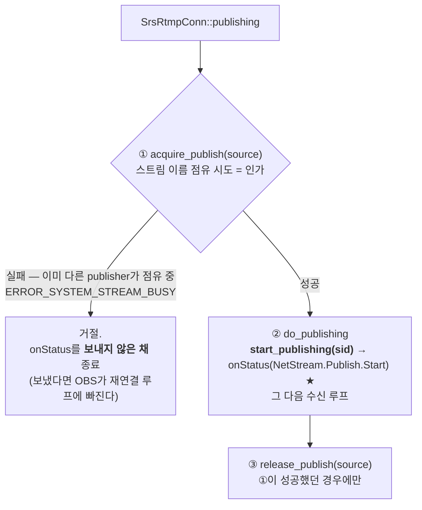
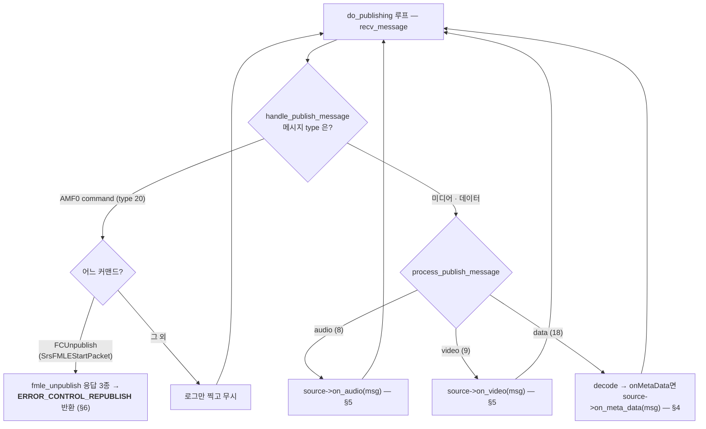
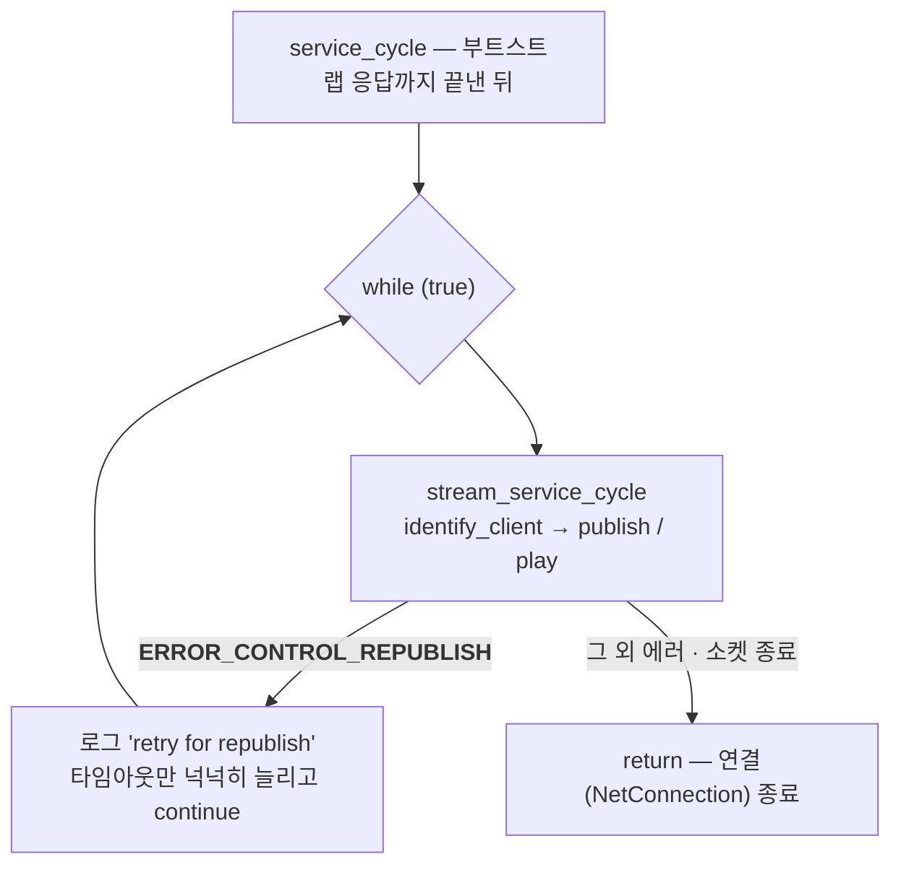

# RTMP 깊이 읽기 (7) — 커맨드 흐름 (2): publish와 미디어 메시지

> **시리즈 안내**: 이 시리즈는 교육용 RTMP 서버 [srs_simple](../README.md)의 코드를 읽기 위해 필요한
> RTMP 프로토콜 이론을 핸드셰이크부터 모든 패킷까지 정리한다. srs_simple은 원본
> [SRS](https://github.com/ossrs/srs)의 클래스/파일/메서드 이름을 1:1로 미러링하므로,
> 여기서 익힌 내용은 원본 SRS를 읽을 때 그대로 통한다.
>
> **시리즈 목차**
>
> 1. [RTMP 조감도 — 메시지, 청크, 스트림](part1-overview.md)
> 2. [핸드셰이크 — 연결의 첫 3,073+1,536 바이트](part2-handshake.md)
> 3. [청크 스트림 — RTMP의 심장](part3-chunk-stream.md)
> 4. [프로토콜 컨트롤 메시지 5종](part4-control-messages.md)
> 5. [AMF0 — 커맨드의 언어](part5-amf0.md)
> 6. [커맨드 흐름 (1) — connect와 스트림 생성](part6-netconnection.md)
> 7. **커맨드 흐름 (2) — publish와 미디어 메시지** (이 글)
> 8. [커맨드 흐름 (3) — play와 중간 입장 문제](part8-play.md)
> 9. [(보너스) 서버 내부 — 팬아웃, 캐시, 지터](part9-server-internals.md)

이 글은 Part 6까지 읽었다고 가정한다.

Part 6은 `identify_client`가 releaseStream을 보고 "이 클라이언트는 FMLE publisher다"라고
판별하고 releaseStream의 `_result`까지 보낸 지점에서 끝났다. 이번 파트는 그 나머지
절반이다: FCPublish부터 publish까지의 커맨드 시퀀스, 송출 허가장인
onStatus(NetStream.Publish.Start), 그리고 허가가 떨어진 뒤 쏟아지는 진짜 화물 —
@setDataFrame/onMetaData와 audio(8)/video(9) 메시지 — 의 구조까지.

CLAUDE.md §2.5의 publisher 다이어그램에서 이번 파트가 확대하는 구간은 여기다:



---

## 1. start_fmle_publish — 세 번의 문답, 세 번의 에코

identify가 끝나면 [`stream_service_cycle`](../src/app/srs_app_rtmp_conn.cpp#L199)이
소스를 찾은 뒤
[`rtmp->start_fmle_publish(stream_id)`](../src/app/srs_app_rtmp_conn.cpp#L253)를
호출한다. 이 함수
([`SrsRtmpServer::start_fmle_publish`](../src/protocol/srs_protocol_rtmp_stack.cpp#L1894),
원본 `protocol/srs_protocol_rtmp_stack.cpp:2647`)는 남은 시퀀스를 위에서 아래로
직선으로 처리한다. Part 6에서 본 `expect_message<T>` 관용구("T가 나올 때까지 받고,
다른 타입은 버린다")가 세 번 연달아 나온다:

1. **FCPublish 대기** → tid를 기억해 두고 `_result`
   ([`SrsFMLEStartResPacket`](../src/protocol/srs_protocol_rtmp_stack.cpp#L2604) —
   Part 6에서 본 `_result + tid + Null + Undefined`) 응답
2. **createStream 대기** → `_result(streamId=1)` 응답
   (player 경로에서는 identify가 하던 일을, publisher 경로에서는 여기서 한다)
3. **publish 대기** → 응답으로 **onFCPublish** 송신

시퀀스라고 부르지만 서버 입장에서는 상태 기계랄 것도 없다 — 클라이언트가 보내는
순서가 FMLE 이래 고정돼 있어서, 순서대로 기다리고 에코하면 끝이다. utest의
[FmlePublishLifecycle](../utest/srs_utest_server.cpp#L287)이 이 파이프라인을
실소켓으로 재현한다: 클라이언트가 releaseStream/FCPublish/createStream/publish를
**한꺼번에 파이프라인으로 밀어 넣고**, 응답 넷을 순서대로 검증한다. 실제 ffmpeg도
이렇게 응답을 기다리지 않고 밀어 넣는다 — Part 6 §6에서 본 "커맨드는 대부분
fire-and-forget"의 publisher판이다.

3번의 응답인 onFCPublish는 낯선 모양새다:

```cpp
// start_fmle_publish 내부 (rtmp_stack.cpp:1952)
SrsOnStatusCallPacket* pkt = new SrsOnStatusCallPacket();
pkt->command_name = RTMP_AMF0_COMMAND_ON_FC_PUBLISH;   // "onFCPublish"
pkt->data->set(StatusCode,        SrsAmf0Any::str(StatusCodePublishStart));
pkt->data->set(StatusDescription, SrsAmf0Any::str("Started publishing stream."));
```

FCPublish의 예고("곧 publish하겠다")에 대응하는 통보("시작됐다")로, FC 접두사
커맨드들과 같은 FMLE 유산이다. ffmpeg/OBS는 이 메시지를 사실상 무시한다 —
클라이언트가 실제로 기다리는 것은 다음 절의 진짜 onStatus다. 그런데 그 onStatus는
`start_fmle_publish`가 보내지 않는다.
[함수 끝의 주석](../src/protocol/srs_protocol_rtmp_stack.cpp#L1964)이 이 파트의
타이밍 규칙 하나를 예고한다: **onStatus(NetStream.Publish.Start)는 인가 통과 후
`start_publishing`이 분리 송신한다**. 왜 분리인지는 §3에서.

---

## 2. SrsPublishPacket — 스트림 위의 첫 커맨드

시퀀스의 마지막 커맨드인 publish를 바이트로 보자. tid=5, 페이로드는 40바이트다:

```text
02 00 07 70 75 62 6C 69 73 68                   string(7)  "publish"
00 40 14 00 00 00 00 00 00                      number 5.0            ← tid
05                                              null                  ← command object
02 00 0A 6C 69 76 65 73 74 72 65 61 6D          string(10) "livestream" ← 스트림 이름
02 00 04 6C 69 76 65                            string(4)  "live"       ← publish type
```

[`SrsPublishPacket::decode`](../src/protocol/srs_protocol_rtmp_stack.cpp#L2714)가
읽는 필드는 둘이다:

- **stream_name**: 드디어 스트림 이름이 확정된다. Part 6 §2.1에서 예고했듯
  `stream_service_cycle`이 이 이름을 tcUrl에 붙여
  [`srs_discovery_tc_url`을 재호출](../src/app/srs_app_rtmp_conn.cpp#L209)하고,
  `vhost/app/stream` 키로 `SrsLiveSource`를 찾는다
- **type**: `"live"` / `"record"` / `"append"`. record/append는 FMS의 서버 측 녹화
  지시였고, 라이브 서버에서 의미 있는 값은 live뿐이다. 생략하고 보내는 클라이언트도
  있어서 [필드가 없으면 기본값 "live"](../src/protocol/srs_protocol_rtmp_stack.cpp#L2737)로
  둔다

주목할 것은 이 패킷의
[`get_prefer_cid` = RTMP_CID_OverStream(5)](../src/protocol/srs_protocol_rtmp_stack.cpp#L2744)다.
connect/createStream은 csid 3
([RTMP_CID_OverConnection](../src/kernel/srs_kernel_flv.hpp#L42))으로 흘렀는데,
publish부터 csid가 5로 옮겨간다. Part 1의 구분을 다시 쓰면: **연결에 대한 대화**
(csid 3)와 **스트림에 대한 대화**(csid 5)를 다른 전송 채널로 분리하는 관례다.
논리 축도 함께 옮겨간다 — publish는 createStream이 발급한 **sid=1**로 오는 첫
커맨드다 (utest에서 `send_and_free_packet(pkt, 1)`로 보내는 이유). 이후의 onStatus와
모든 미디어 메시지도 sid=1로 흐른다.

---

## 3. onStatus — RTMP의 상태 통보 관용구, 그리고 타이밍 규칙

### 3.1 패킷의 일반형

[`SrsOnStatusCallPacket`](../src/protocol/srs_protocol_rtmp_stack.hpp#L799)은
서버가 스트림 수준 사건을 통보하는 만능 패킷이다. 페이로드 구조는 커맨드 일반형
그대로인데, 응답이 아니므로 **tid=0**이고 마지막 Object(`data`)에 사건 내용이 담긴다
([encode_packet](../src/protocol/srs_protocol_rtmp_stack.cpp#L2968)):

```text
02 00 08 6F 6E 53 74 61 74 75 73             string(8)  "onStatus"
00 00 00 00 00 00 00 00 00                   number 0.0    ← tid (응답이 아니므로 항상 0)
05                                           null          ← args
03                                           object 시작
   00 05 6C 65 76 65 6C                        key   "level"          (마커 없는 utf8!)
   02 00 06 73 74 61 74 75 73                    value string "status"
   00 04 63 6F 64 65                           key   "code"
   02 00 17 4E 65 74 53 74 72 65 ...             value string "NetStream.Publish.Start"  ★
   00 0B 64 65 73 63 72 69 70 ...              key   "description"
   02 00 1A 53 74 61 72 74 65 64 ...             value string "Started publishing stream."
   00 08 63 6C 69 65 6E 74 69 64               key   "clientid"
   02 00 08 41 53 41 49 43 69 73 73              value string "ASAICiss"
00 00 09                                     object end
```

level/code/description 3종 세트는 Part 6의 `NetConnection.Connect.Success`에서 이미
본 관용구다. **클라이언트가 기계적으로 검사하는 것은 code 하나**이고
(`NetStream.` 네임스페이스의 [상수 목록](../src/protocol/srs_protocol_rtmp_stack.hpp#L80)),
description은 사람용, clientid(`"ASAICiss"`)는 FMS가 보내던 값을 흉내 낸 장식이다.
srs_simple에서 이 패킷을 만드는 곳은 전부 서버 파사드다 — Publish.Start(§3.2),
Unpublish.Success(§6), 그리고 Part 8에서 볼 Play.Reset/Play.Start.

### 3.2 왜 onStatus만 뒤로 미루는가 — 인가와 원자적 점유

`start_fmle_publish`가 끝나도 서버는 아직 송출 허가를 내리지 않았다. 호출자
[`SrsRtmpConn::publishing`](../src/app/srs_app_rtmp_conn.cpp#L399)
(원본 `app/srs_app_rtmp_conn.cpp:925`)의 순서가 규칙이다:



[`acquire_publish`](../src/app/srs_app_rtmp_conn.cpp#L418)는 "이 스트림 이름을
이미 다른 publisher가 점유 중인가"를 검사한다. 같은 이름으로 두 명이 publish하면
`ERROR_SYSTEM_STREAM_BUSY`로 거절된다 (검사+점유는 pthread 경쟁을 피하려고
[`SrsLiveSource::on_publish` 내부에서 원자적으로](../src/app/srs_app_source.cpp#L954)
수행한다 — CLAUDE.md §5.6 S8. 원본은 ST 단일 스레드라 conn 쪽 검사로 충분하다).

이 인가를 통과한 **후에만**
[`start_publishing`](../src/protocol/srs_protocol_rtmp_stack.cpp#L2010)
(원본 :2800)이 onStatus(NetStream.Publish.Start)를 보낸다. 원본이 이슈 #4037로
onFCPublish와 onStatus를 분리한 이유가 이것이다(CLAUDE.md §5.3 규칙 5): OBS는
**onStatus를 받는 순간 "송출 성공"으로 판정**한다. 인가 검사 전에 onStatus를 먼저
보내고 나서 거절하면, OBS는 성공 직후 끊긴 것으로 보고 즉시 재접속한다 — 거절당할
접속을 무한 반복하는 재연결 루프다. 허가장은 모든 심사가 끝난 뒤에 발급해야 한다.

---

## 4. @setDataFrame / onMetaData — 스트림의 명함

허가가 떨어지면 ffmpeg/OBS가 가장 먼저 보내는 것은 미디어가 아니라 **메타데이터**다.
type 18(AMF0 data) 메시지로, 커맨드(type 20)와 구조는 같지만 tid가 없고 응답도 없는
단방향 통보다. 페이로드를 열면 이중 래핑이 보인다:

```text
02 00 0D 40 73 65 74 44 61 74 61 46 72 61 6D 65   string "@setDataFrame"  ← 바깥 껍질
02 00 0A 6F 6E 4D 65 74 61 44 61 74 61            string "onMetaData"     ← 진짜 이름
08 00 00 00 10                                    ecma-array, count=16    ← 본문
  00 05 77 69 64 74 68     00 40 9E 00 00 ...        width: 1920
  00 06 68 65 69 67 68 74  00 40 90 E0 00 ...        height: 1080
  00 0C 76 69 64 65 6F 63 6F 64 65 63 69 64 00 ...   videocodecid: 7 (AVC)
  00 0C 61 75 64 69 6F 63 6F 64 65 63 69 64 00 ...   audiocodecid: 10 (AAC)
  ... (framerate, videodatarate, audiosamplerate, encoder ...)
  00 00 09                                           end
```

이중 래핑의 유래는 Flash API다. 클라이언트는 서버의 NetStream 객체에 대고
`@setDataFrame("onMetaData", {...})` — "이 스트림의 데이터 프레임을 설정하라"는
원격 호출 — 을 보내는 것이고, 서버는 껍질을 벗긴 `onMetaData({...})`를 구독자들에게
중계한다.
[`SrsOnMetaDataPacket::decode`](../src/protocol/srs_protocol_rtmp_stack.cpp#L3054)의
첫 분기가 정확히 그 껍질 벗기기다: 이름이 `@setDataFrame`이면
[이름을 한 번 더 읽는다](../src/protocol/srs_protocol_rtmp_stack.cpp#L3063).

본문이 Object(0x03)가 아니라 **EcmaArray(0x08)**인 것은 Part 5 §4에서 예고한
현실이다 — ffmpeg가 그렇게 보낸다. decode는 둘 다 허용하고, EcmaArray면
[프로퍼티를 Object로 복사](../src/protocol/srs_protocol_rtmp_stack.cpp#L3087)해서
내부 표현을 통일한다.

수신 경로는 [`process_publish_message`](../src/app/srs_app_rtmp_conn.cpp#L542) →
[`SrsLiveSource::on_meta_data`](../src/app/srs_app_source.cpp#L817) →
[`SrsMetaCache::update_data`](../src/app/srs_app_source.cpp#L605)다. 캐시에 넣기
전에 서버가 내용에 손을 대는 지점이 흥미롭다:

- [`duration` 프로퍼티 제거](../src/app/srs_app_source.cpp#L614) — VOD 파일을
  `ffmpeg -re`로 재송출하면 파일의 duration이 딸려 오는데, 라이브 스트림에
  duration이 있으면 일부 플레이어(ExoPlayer)가 유한 길이 재생으로 오동작한다
- [`server`/`server_version` 주입](../src/app/srs_app_source.cpp#L634) — 서버
  식별 정보를 붙여 재인코딩한다. 플레이어 쪽에서 `ffprobe`로 보면 이 필드가 보인다

수정본은 `SrsSharedPtrMessage`로 다시 직렬화되어 **MetaCache에 저장**된다. 왜
저장하는가 — 지금 접속해 있는 플레이어에게는 즉시 중계하면 되지만, **나중에 올
플레이어**는 이 메시지를 못 봤다. onMetaData는 스트림당 사실상 한 번만 오기
때문이다. 이 "한 번만 오는 것들"의 문제는 §5의 시퀀스 헤더에서 더 심각해지고,
Part 8의 주인공이 된다.

---

## 5. audio(8) / video(9) — 페이로드는 FLV 태그 본문이다

이제 본류다. publish 이후 연결을 흐르는 메시지의 대부분은 type 8(audio)과
type 9(video)이고, 그 페이로드 형식은 RTMP 스펙이 아니라 **FLV 파일 포맷 스펙**
(video_file_format_spec_v10_1.pdf)에 정의돼 있다 — RTMP와 FLV가 같은 Flash
생태계에서 나온 형제이기 때문이다. 서버가 라이브 릴레이에 필요한 정보는 놀랍게도
**첫 1~2바이트**에 다 있다.

### 5.1 video 첫 바이트: frame_type | codec_id

```text
video (type 9) 페이로드 = FLV VIDEODATA
 |<--- 1st byte --->|
┌──────────┬─────────┬────────────────┬───────────────────┬──────────
│frame_type│codec_id │ AVCPacketType  │ composition time  │ data ...
│  4 bit   │  4 bit  │      1B        │        3B         │
└──────────┴─────────┴────────────────┴───────────────────┴──────────
  1=keyframe  7=AVC     0=시퀀스 헤더
  2=inter     (H.264)   1=NALU

첫 바이트 조합
  0x17 = 0001 0111 = keyframe    + AVC
  0x27 = 0010 0111 = inter frame + AVC
```

첫 바이트 뒤의 **AVCPacketType**이 두 종류의 화물을 가른다:

- **0 = 시퀀스 헤더**: 데이터가 AVCDecoderConfigurationRecord — SPS/PPS(해상도,
  프로파일 등 디코더 초기화 파라미터)를 담은 상자다. `0x17 0x00`으로 시작한다
- **1 = NALU**: 실제 압축 프레임. `0x17 0x01`(키프레임) 또는 `0x27 0x01`(중간
  프레임)로 시작한다

[`SrsFlvVideo`](../src/kernel/srs_kernel_codec.cpp#L12)의 세 판별자가 이 두
바이트만 읽는다: [`keyframe`](../src/kernel/srs_kernel_codec.cpp#L12)은 상위
4비트==1, [`h264`](../src/kernel/srs_kernel_codec.cpp#L47)는 하위 4비트==7,
[`sh`](../src/kernel/srs_kernel_codec.cpp#L27)는 "AVC이고 keyframe이고 둘째
바이트==0". H.264 비트스트림(NALU 내부)은 서버가 열어보지 않는다 — 릴레이 서버의
분류 기준은 여기까지고, 그 안쪽은 디코더의 영역이다.

### 5.2 audio 첫 바이트: format | rate | size | channel

```text
audio (type 8) 페이로드 = FLV AUDIODATA
 |<-------------- 1st byte -------------->|
┌────────────┬──────────┬──────────┬───────┬────────────────┬──────────
│SoundFormat │   rate   │   size   │ chan  │ AACPacketType  │ data ...
│   4 bit    │  2 bit   │  1 bit   │ 1 bit │      1B        │
└────────────┴──────────┴──────────┴───────┴────────────────┴──────────
   10=AAC       3=44kHz    1=16bit   1=st     0=시퀀스 헤더 (AudioSpecificConfig)
                                              1=raw AAC frame

  0xAF = 1010 1111 = AAC + 44.1kHz + 16bit + stereo
  0xAF 0x00 → AAC 시퀀스 헤더        0xAF 0x01 → raw AAC frame
```

AAC의 경우 rate/size/channel 비트는 사실상 장식이다 — 진짜 파라미터는
**AACPacketType=0**인 시퀀스 헤더의 데이터, AudioSpecificConfig(2바이트 안팎)에
들어 있다. utest의
[`send_media`](../utest/srs_utest_server.cpp#L246)가 보내는 최소 오디오 메시지
`AF 01 00`을 읽어 보면: `0xAF`(AAC/44.1k/16bit/stereo) + `0x01`(raw frame) +
데이터 1바이트. [`SrsFlvAudio::sh/aac`](../src/kernel/srs_kernel_codec.cpp#L68)의
판별도 video와 대칭이다.

### 5.3 시퀀스 헤더는 왜 특별한가

[`SrsLiveSource::on_video_imp`](../src/app/srs_app_source.cpp#L912)
(원본 `app/srs_app_source.cpp:2408`, audio는
[on_audio_imp](../src/app/srs_app_source.cpp#L860)가 대칭)가 위의 판별자를 쓰는
방식이 시퀀스 헤더의 지위를 보여준다:

```cpp
bool is_sequence_header = SrsFlvVideo::sh(msg->payload, msg->size);

if (is_sequence_header) meta->update_vsh(msg);   // ① MetaCache에 저장
for (컨슈머마다) consumer->enqueue(msg);          // ② 현재 플레이어에게 팬아웃
if (is_sequence_header) return;                  // ③ GOP 캐시에는 넣지 않음!
gop_cache->cache(msg);
```

시퀀스 헤더는 "프레임"이 아니라 "디코더 설정"이다. 그래서 취급이 다르다:

- **스트림당 사실상 한 번**, publish 직후에만 온다. 놓친 플레이어는 이후의 모든
  NALU를 디코드할 수 없다 — 그래서 onMetaData처럼 MetaCache에 별도 보관한다
- **GOP 캐시에는 넣지 않는다** (CLAUDE.md §5.3 규칙 6). GOP 캐시는 키프레임에서
  clear되는 롤링 버퍼(Part 8)라서, 시퀀스 헤더를 섞어 두면 clear에 쓸려 나가
  유실되거나 재생분에 중복 주입된다. "설정은 MetaCache, 프레임은 GopCache" —
  수명이 다른 데이터는 다른 캐시에

이 세 줄이 Part 8 중간 입장 문제의 복선이다: 방송 30초 후에 접속한 플레이어에게
서버는 MetaCache(onMetaData + 시퀀스 헤더 2종)와 GopCache를 **이 순서대로** 먼저
부어 줘야 한다.

---

## 6. publishing 루프와 재-publish — 연결은 스트림보다 오래 산다

허가 이후의 서버는 단순 반복이다.
[`do_publishing`](../src/app/srs_app_rtmp_conn.cpp#L445)의 루프는 `recv_message`
→ [`handle_publish_message`](../src/app/srs_app_rtmp_conn.cpp#L486)로 메시지를
분류한다:



눈여겨볼 것은 **종료가 아니라 순환**이라는 점이다. publisher가 정상 종료하면
(ffmpeg에 `kill -INT`) FCUnpublish를 보내는데, 서버는
[`fmle_unpublish`](../src/protocol/srs_protocol_rtmp_stack.cpp#L1970)로 3종 응답
— onFCUnpublish(NetStream.Unpublish.Success) → FCUnpublish의 `_result` →
onStatus(NetStream.Unpublish.Success) — 을 보낸 뒤, 연결을 끊는 대신
`ERROR_CONTROL_REPUBLISH`를 반환한다. 이것은 진짜 에러가 아니라 **제어 흐름
신호**다(srs_error_t 체계를 제어에도 재활용하는 SRS 이디엄).
[`service_cycle`의 루프](../src/app/srs_app_rtmp_conn.cpp#L151)가 이 코드를
알아보고, 타임아웃만 넉넉히 늘린 채 `stream_service_cycle`로 — 즉 Part 6의
`identify_client`로 — 되돌아간다.



왜 이런 구조인가 — FMLE류 인코더는 방송을 껐다 켤 때 **TCP 연결은 유지한 채**
FCUnpublish → (잠시 후) releaseStream부터 다시 시작한다. connect와 핸드셰이크를
다시 할 필요가 없기 때문이다. 연결(NetConnection)의 수명과 스트림(NetStream)의
수명이 다르다는 Part 6 서두의 구분이 코드 구조로 나타난 것이 이 이중 루프다.
README의 데모 시나리오에서 publisher를 `kill -INT`로 죽였다 다시 붙이면 서버 로그에
`retry for republish`가 찍히고 접속해 있던 플레이어가 이어서 수신하는 것이 이 경로다
(utest [FmlePublishLifecycle](../utest/srs_utest_server.cpp#L352)의 후반부가 같은
것을 검증한다).

한편 §5의 미디어 팬아웃 경로에서 `source->on_audio/on_video`가 받는 인자는
`SrsCommonMessage`(수신 측, 단일 소유)인데, 팬아웃 직전에
[`SrsSharedPtrMessage`로 변환](../src/app/srs_app_source.cpp#L850)된다(refcount
공유, 페이로드 무복사). 두 메시지 클래스의 분업과 GOP 캐시 알고리즘은 Part 8~9의
주제이므로 여기서는 이름만 짚어 둔다.

---

## 7. 정리

publisher 경로에서 들고 갈 것:

1. **publish 시퀀스는 고정 파이프라인이다.** releaseStream(→Part 6 identify) →
   FCPublish → createStream → publish를 클라이언트가 응답을 기다리지 않고 밀어
   넣고, 서버는 순서대로 에코한다 (`start_fmle_publish`). publish부터 대화는
   csid 5, sid 1로 옮겨간다
2. **onStatus는 code가 전부다.** level/code/description Object를 실은 만능 통보
   패킷(`SrsOnStatusCallPacket`)이고, 클라이언트는 `NetStream.Publish.Start` 같은
   code 문자열로 판정한다
3. **허가장은 인가 후에.** onFCPublish까지는 시퀀스 에코지만,
   onStatus(Publish.Start)는 스트림 점유(`acquire_publish`)가 원자적으로 성공한
   뒤에만 보낸다 — 먼저 보내면 OBS가 재연결 루프에 빠진다 (#4037)
4. **미디어 페이로드 = FLV 태그 본문.** 서버의 분류 기준은 첫 1~2바이트가 전부다:
   video는 frame_type|codec_id + AVCPacketType, audio는 SoundFormat 4비트 +
   AACPacketType. 비트스트림 내부는 열지 않는다
5. **시퀀스 헤더와 onMetaData는 "한 번만 오는 것들"이다.** 팬아웃과 별도로
   MetaCache에 보관하고, 시퀀스 헤더는 GOP 캐시에 넣지 않는다 — 나중에 올
   플레이어를 위한 준비다
6. **연결은 스트림보다 오래 산다.** FCUnpublish는 연결 종료가 아니라
   `ERROR_CONTROL_REPUBLISH` 신호이고, service_cycle이 identify부터 다시 돈다

다음 파트는 이 화물의 수신자다. play 시퀀스의 서버 응답 5연타(StreamBegin,
onStatus 2종, |RtmpSampleAccess, 그리고 프리필)를 해부하고, 이 파트에서 심어 둔
복선 — 방송 도중에 접속한 플레이어는 이미 지나간 onMetaData/SPS/PPS/키프레임을
어떻게 받는가 — 를 세 캐시(MetaCache/GopCache/consumer_dumps)로 회수한다.

---

_이 글은 [srs_simple](../README.md) 프로젝트의 RTMP 이론 시리즈 Part 7이다.
코드 대조 기준: srs_simple `src/protocol/srs_protocol_rtmp_stack.{hpp,cpp}`
(`SrsRtmpServer::start_fmle_publish:1894`, `fmle_unpublish:1970`,
`start_publishing:2010`, `SrsPublishPacket::decode:2714`,
`SrsOnStatusCallPacket:2926`, `SrsOnMetaDataPacket::decode:3054`, onStatus 상수
hpp:69-88), `src/kernel/srs_kernel_codec.{hpp,cpp}`(`SrsFlvVideo::keyframe:12`,
`sh:27`, `h264:47`, `SrsFlvAudio::sh:68`, `aac:85`),
`src/app/srs_app_rtmp_conn.cpp`(`service_cycle:122`, `publishing:399`,
`acquire_publish:418`, `do_publishing:445`, `handle_publish_message:486`,
`process_publish_message:522`),
`src/app/srs_app_source.cpp`(`SrsMetaCache::update_data:605`, `on_meta_data:817`,
`on_audio_imp:860`, `on_video_imp:912`, `on_publish:945`) / 원본 SRS 6.0
`trunk/src/protocol/srs_protocol_rtmp_stack.cpp:2647`(start_fmle_publish),
`:2800`(start_publishing, 이슈 #4037), `trunk/src/app/srs_app_rtmp_conn.cpp:925`
(publishing), `trunk/src/app/srs_app_source.cpp:2408`(on_video_imp).
실측 시퀀스: `utest/srs_utest_server.cpp`의 `FmlePublishLifecycle:287`,
`MockRtmpClient::send_media:239`._
