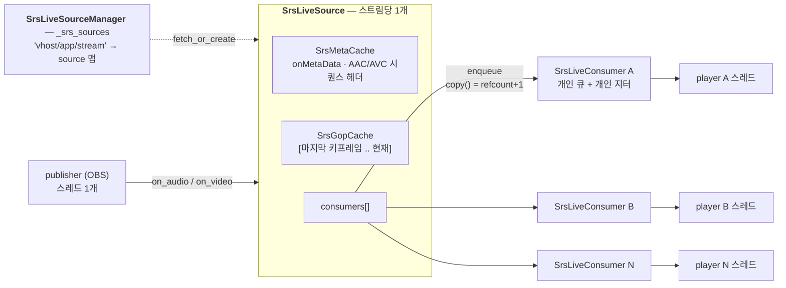
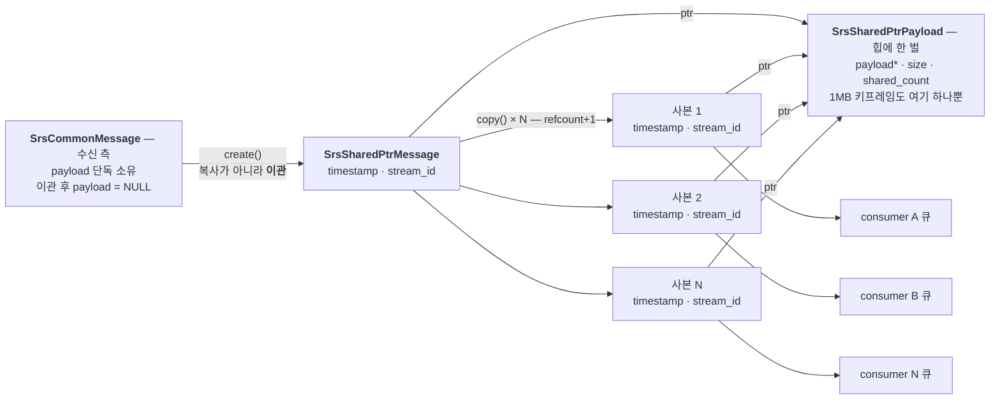
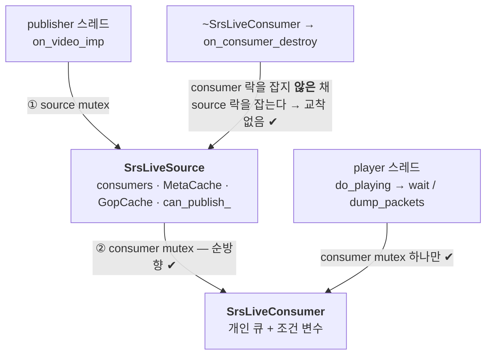

# RTMP 깊이 읽기 (9) — 서버 내부: 팬아웃, 캐시, 지터

> **시리즈 안내**: 이 시리즈는 교육용 RTMP 서버 [srs_simple](../README.md)의 코드를 읽기 위해 필요한
> RTMP 프로토콜 이론을 핸드셰이크부터 모든 패킷까지 정리한다. srs_simple은 원본
> [SRS](https://github.com/ossrs/srs)의 클래스/파일/메서드 이름을 1:1로 미러링하므로,
> 여기서 익힌 내용은 원본 SRS를 읽을 때 그대로 통한다.
>
> **시리즈 목차**
>
> 1. [RTMP 조감도 — 메시지, 청크, 스트림](part1-overview.md)
> 2. [핸드셰이크 — 연결의 첫 3,073+1,536 바이트](part2-handshake.md)
> 3. [청크 스트림 — RTMP의 심장](part3-chunk-stream.md)
> 4. [프로토콜 컨트롤 메시지 5종](part4-control-messages.md)
> 5. [AMF0 — 커맨드의 언어](part5-amf0.md)
> 6. [커맨드 흐름 (1) — connect와 스트림 생성](part6-netconnection.md)
> 7. [커맨드 흐름 (2) — publish와 미디어 메시지](part7-publish.md)
> 8. [커맨드 흐름 (3) — play와 중간 입장 문제](part8-play.md)
> 9. **(보너스) 서버 내부 — 팬아웃, 캐시, 지터** (이 글)
> 10. [(보너스 2) HLS — 같은 스트림을 HTTP로 배달하기](part10-hls.md)
> 11. [(보너스 3) LL-HLS — 지연과의 싸움: 파트, 블로킹 리로드, fMP4](part11-llhls.md)

이 글은 Part 8까지 읽었다고 가정한다.

Part 1~8은 전부 와이어 위의 이야기였다 — 어떤 바이트가 어떤 순서로 오가는가.
이번 파트는 와이어를 벗어난다. OBS 한 대가 publish하는 스트림을 플레이어 1,000명이
본다고 하자. 와이어 포맷은 지금까지 본 그대로다. 그런데 서버 안에서는 세 가지
질문이 새로 생긴다:

1. 1MB짜리 키프레임 하나를 1,000개의 소켓으로 보내야 한다. **1,000번 복사하는가?**
2. 플레이어마다 입장 시점이 다르다. **누구의 타임라인을 기준으로 타임스탬프를 찍는가?**
3. 1,000명 중 한 명의 회선이 느리다. **그 큐가 무한히 자라게 둘 것인가?**

Part 1~8이 메커니즘(바이트를 읽고 쓰는 법)이었다면, 이 세 질문에 대한 답이
정책이다 — 그리고 전부 [srs_app_source.cpp](../src/app/srs_app_source.cpp) 한
파일에 모여 있다. 마지막에는 이 시리즈의 원래 목적지인 원본 SRS로 넘어가는 다리를
놓는다.

---

## 1. 스트림 허브 — 주소 체계와 등장인물

Part 7의 publish 루프와 Part 8의 play 루프는 서로를 모른다. publisher의 스레드는
`source->on_video(msg)`를 부르고 끝, player의 스레드는 `consumer->dump_packets`로
꺼내 갈 뿐이다. 둘을 잇는 것이 스트림 허브다:



스트림의 주소는 [`SrsRequest::get_stream_url`](../src/protocol/srs_protocol_rtmp_stack.cpp#L1692)이
만드는 `"vhost/app/stream"` 문자열이다 — `rtmp://localhost/live/test`로 접속하면
`"localhost/live/test"` (tcUrl에 `?vhost=` 쿼리가 없으면 host가 그대로 vhost가 되고,
vhost가 기본값 `__defaultVhost__`일 때만 키에서 생략된다). publisher든 player든 연결이 이 키로
[`fetch_or_create`](../src/app/srs_app_source.cpp#L836)
(원본 `app/srs_app_source.cpp:1769`)를 부르면 같은 `SrsLiveSource`를 받는다.
같은 키 → 같은 소스라는 이 한 줄이 "publisher와 player가 만나는" 전부이고, utest
[SourceManagerFetchOrCreate](../utest/srs_utest_source.cpp#L306)가 검증하는 것도
정확히 이것이다. 참고로 player가 publisher보다 먼저 접속해도 소스는 이 시점에
만들어진다 — Part 8 §4에서 본 "대기 시청"이 공짜로 되는 이유다.

등장인물의 소유 관계도 여기서 정리해 두자. `SrsLiveSource`는 스트림당 1개이고
(단순화로 프로세스 종료까지 산다 — CLAUDE.md §5.6), 캐시 2종(MetaCache/GopCache)을
소유한다. `SrsLiveConsumer`는 **play 연결당 1개**로, 개인 재생 큐(`SrsMessageQueue`)와
개인 지터(`SrsRtmpJitter`)를 소유한다. consumer는
[`create_consumer`](../src/app/srs_app_source.cpp#L1185)로 소스의 `consumers`
목록에 등록되고, [소멸자](../src/app/srs_app_source.cpp#L296)가
[`on_consumer_destroy`](../src/app/srs_app_source.cpp#L1230)로 스스로를 뺀다 —
플레이어가 나가도 소스와 방송은 계속된다.

"큐와 지터가 왜 consumer마다 개인 소유인가"가 이번 파트의 복선이다. 큐가 개인
소유인 이유는 §5(느린 소비자)에서, 지터가 개인 소유인 이유는 §4(입장 시점마다 다른
타임라인)에서 답이 나온다.

---

## 2. 무복사 팬아웃 — 메시지 클래스가 두 개인 이유

srs_simple에는 메시지 클래스가 둘 있다. 처음 코드를 열면 "왜 하나로 안 했지?"
싶은 지점인데, 서두의 질문 1(1,000번 복사하는가?)의 답이 바로 이 구분에 있다
(CLAUDE.md §5.2).

**[`SrsCommonMessage`](../src/kernel/srs_kernel_flv.hpp#L124)는 수신 측이다.**
Part 3의 청크 재조립기가 만들고, 페이로드를 단독 소유한다
([소멸자](../src/kernel/srs_kernel_flv.cpp#L124)가 무조건 `delete[]`). 재조립
중인 메시지는 어차피 한 연결의 것이므로 소유권 고민이 필요 없다.

**[`SrsSharedPtrMessage`](../src/kernel/srs_kernel_flv.hpp#L178)는 송신 측이다.**
publisher 스레드가 받은 `SrsCommonMessage`는 팬아웃 직전
[`SrsSharedPtrMessage::create(msg)`](../src/kernel/srs_kernel_flv.cpp#L187)를
통과하는데, 여기서 페이로드가 **복사되는 게 아니라 이관**된다 — 내부
`SrsSharedPtrPayload`가 포인터를 넘겨받고 원본의 `payload`는 NULL이 된다(이중
해제 방지). 이후 [`copy()`](../src/kernel/srs_kernel_flv.cpp#L286)는 페이로드를
건드리지 않고 `shared_count`만 올린다:



1MB 키프레임을 1,000명에게 보내도 힙에 있는 페이로드는 한 벌이고, 복사되는 것은
포인터와 헤더 몇 바이트짜리 래퍼뿐이다. 해제는 refcount의 거울상이다 —
[소멸자](../src/kernel/srs_kernel_flv.cpp#L176)에서 `shared_count`가 0이면(마지막
소유자) 페이로드를 해제하고, 아니면 감소만 한다. 마지막으로 소켓에 쓴 consumer가
정리 담당이 되는 셈이다.

그림에서 눈여겨볼 디테일이 하나 있다: `timestamp`와 `stream_id`는 공유 페이로드가
아니라 **래퍼 쪽**에 있다. 사본마다 타임스탬프가 다를 수 있다는 뜻인데, 이것이
우연이 아니다 — §4의 지터 보정이 consumer마다 `msg->timestamp`를 **고쳐 쓰기**
때문이다. 페이로드는 전원이 공유하되 타임라인은 각자 소유한다는 분리가 이 클래스
설계의 요지다.

---

## 3. 팬아웃 지점 — on_video 한 바퀴

이제 publisher 스레드가 비디오 메시지 하나를 들고 허브에 도착했을 때 일어나는 일을
따라가자. Part 7의 publish 루프 끝
([`process_publish_message`](../src/app/srs_app_rtmp_conn.cpp#L522))이
[`SrsLiveSource::on_video`](../src/app/srs_app_source.cpp#L1071)를 부르고, 소스
락을 잡은 채 [`on_video_imp`](../src/app/srs_app_source.cpp#L1086)
(원본 `app/srs_app_source.cpp:2408`, 팬아웃은 :2457)로 들어간다. 한 바퀴는 네
동작이다:

```cpp
bool is_sequence_header = SrsFlvVideo::sh(msg->payload, msg->size);

if (is_sequence_header) meta->update_vsh(msg);       // ① sh → MetaCache
hub->on_video(msg, is_sequence_header);               // ② OriginHub → HLS/LL-HLS (Part 10/11)
for (컨슈머마다) consumer->enqueue(msg, jitter);      // ③ 팬아웃 ← copy() = refcount+1
if (is_sequence_header) return;                       //    sh는 GOP 캐시 제외
gop_cache->cache(msg);                                // ④ GOP 캐시
```

①과 ④는 Part 8에서 소비하는 쪽을 이미 봤다 — 시퀀스 헤더는 MetaCache로, 프레임은
GopCache로, 그리고 새 플레이어의 `consumer_dumps`가 그 보관소를 재생한다. 오디오
쪽 [`on_audio_imp`](../src/app/srs_app_source.cpp#L1029)도 대칭인데, 한 가지
차이만 있다: [시퀀스 헤더가 아니어도 첫 패킷이면 캐시한다](../src/app/srs_app_source.cpp#L1052)
— MP3처럼 시퀀스 헤더 개념이 없는 코덱의 보험이다.

②는 RTMP 밖으로 나가는 소비자(HLS, 그리고 S13에서 더해진 LL-HLS)의 분기점이다 — 팬아웃보다
먼저, publisher 스레드에서 실행된다는 위치만 기억하고 [Part 10](part10-hls.md)/[Part 11](part11-llhls.md)로 미룬다.

③이 이 파트의 주인공이다. [`SrsLiveConsumer::enqueue`](../src/app/srs_app_source.cpp#L321)
(원본 :450)는 세 단계다: `copy()`로 refcount 사본을 뜨고(§2), 그 사본의
타임스탬프를 지터로 고쳐 쓰고(§4), 개인 큐에 넣는다(§5). 큐가 충분히
찼으면(mw_msgs 128개와 350ms치를 둘 다 넘으면 — Part 8 §7의 merged-write) 대기 중인 player
스레드의 조건 변수를 깨운다. publisher 스레드는 여기까지만 하고 다음 recv로
돌아간다 — **소켓에 쓰는 것은 언제나 player 스레드 자신이다.** 느린 플레이어의
소켓이 publisher를 막지 못하는 구조적 이유다.

④의 GopCache 내부에는 Part 8 §5에서 본 가드들이 있는데, 서버 내부 관점에서 다시
보면 전부 "publisher의 의도를 추측하는 휴리스틱"이다. 비디오 프레임 없이 오디오만
[115개(약 3초)](../src/app/srs_app_source.cpp#L474) 연속으로 오면 "비디오를 끈
방송"으로 추정해 캐시를 비우고([`SRS_PURE_AUDIO_GUESS_COUNT`](../src/app/srs_app_source.cpp#L35),
[GopCachePureAudio](../utest/srs_utest_source.cpp#L159)), 그래도
[2,500프레임](../src/app/srs_app_source.cpp#L492)을 넘기면 "키프레임을 안 보내는
비정상 인코더"로 보고 비운다. RTMP에는 "지금부터 오디오 전용"이라고 알려 주는
메시지가 없으므로, 서버는 관찰로 추측할 수밖에 없다.

전체 경로 — sh 분류, 팬아웃, 프리필, consumer 소멸 후 지속 — 를 한 번에 검증하는
테스트가 [LiveSourceFanoutAndMidJoin](../utest/srs_utest_source.cpp#L231)이다.

---

## 4. 지터 보정 — 타임라인을 믿지 말고 재구성하라

서두의 질문 2로 가자. consumer 큐에 들어오는 메시지의 타임스탬프는 제각각이다 —
GOP 프리필분은 30초 과거이고(Part 8 §6), 재-publish 직후에는 0으로 점프하고(Part 7
§6), 인코더에 따라서는 임의의 값에서 시작하기도 한다. 이걸 그대로 내보내면
플레이어는 멈추거나 버벅인다.

[`SrsRtmpJitter::correct`](../src/app/srs_app_source.cpp#L50)
(원본 `app/srs_app_source.cpp:74-132`)의 해법은 한 문장이다: **입력 타임스탬프의
절대값을 믿지 않고, 위생 처리한 델타만 누적한다.** FULL 알고리즘의 전문은 이게
전부다:

```cpp
int64_t delta = time - last_pkt_time;              // 이전 입력과의 차이만 취한다
if (delta < -250 || delta > 250) delta = 10;       // 비정상 델타는 10ms로 클램프
last_pkt_correct_time = srs_max(0, last_pkt_correct_time + delta);
msg->timestamp = last_pkt_correct_time;            // 출력은 누적값 — 절대값은 버렸다
last_pkt_time = time;
```

utest [RtmpJitterCorrect](../utest/srs_utest_source.cpp#L56)의 시퀀스로 동작을
따라가면:

| 입력 ts | delta | 판정 | 출력 ts |
| --- | --- | --- | --- |
| 0 | — | 첫 패킷 | 0 |
| 40 | +40 | 정상 — 그대로 누적 | 40 |
| 10000 | +9960 | 점프(>250) → 10ms 클램프 | 50 |
| 9000 | −1000 | 역행(<−250) → 10ms 클램프 | 60 |
| 12345 (메타데이터) | — | 비 A/V는 무조건 0 | 0 |

한 줄로 겹쳐 보면 이 알고리즘이 하는 일이 보인다:

```text
입력 ts    0 ──▶ 40 ──────────────▶ 10000 ──────────▶ 9000
                                     ▲ 점프 +9960      ▲ 역행 -1000
                                     (재-publish · GOP 프리필 · 시계 역행)

출력 ts    0 ──▶ 40 ──▶ 50 ──▶ 60
                        ▲ 클램프 10ms  ▲ 클램프 10ms
                        └─ 위생 처리된 델타만 0에서부터 누적한다
```

입력이 10000으로 튀든 9000으로 돌아가든 출력은 40 → 50 → 60으로 담담하게 흐른다.
GOP 프리필(과거)도, 재-publish(0으로 점프)도, 이 관점에서는 그냥 "비정상 델타
한 번"일 뿐이다 — 클램프된 10ms를 물고 타임라인은 계속 전진한다. 클램프 값이
0이 아니라 10ms인 것도 의도다(원본 이슈 #425): 완전히 같은 타임스탬프가 반복되면
문제를 숨기게 되므로, 미세하게 전진시켜 "스트림에 문제가 있었음"을 흔적으로 남긴다.

정확히 읽어 둘 미묘함이 둘 있다. 첫째, **±250ms 이내의 음수 델타는 통과한다.**
B-프레임 재정렬처럼 정상 스트림에도 미세 역행은 있으므로, 클램프는 "점프"만 잡고
미세 역행은 허용한다(출력의 완전한 단조 증가가 아니라 `srs_max(0, ...)`의 음수
방지까지만 보장). 둘째, 알고리즘이 셋이다 — FULL(위 전문, 기본값), ZERO(첫
타임스탬프만 빼서 0 시작으로 만들고 델타는 손대지 않음), OFF(무보정). srs_simple은
FULL 고정이지만 원본은 vhost 설정으로 고른다.

그리고 §1의 복선 회수: 지터가 **consumer마다 개인 소유**인 이유. 30초 시점에 들어온
플레이어와 5분 시점에 들어온 플레이어는 "0으로 삼을 기준점"이 다르다. 누적 상태
(`last_pkt_time`/`last_pkt_correct_time`)가 공유되면 한 명의 타임라인이 다른 명을
오염시킨다. §2에서 본 "타임스탬프는 사본마다 개별"이라는 메모리 설계가 여기서
필요조건이 된다 — 지터는 공유 페이로드가 아니라 자기 사본의 타임스탬프를 고쳐 쓴다.

---

## 5. 느린 소비자 — 큐를 지키는 대신 라이브를 지킨다

서두의 질문 3이 남았다. player 스레드가 소켓에 쓰는 속도보다 publisher가 미는
속도가 빠르면 — 회선이 느리거나, 플레이어가 멈췄거나 — 그 consumer의 개인 큐가
자란다. [`SrsMessageQueue::enqueue`](../src/app/srs_app_source.cpp#L142)는 큐의
길이를 개수가 아니라 **시간**으로 잰다: 첫/끝 메시지의 타임스탬프 차이(duration)가
상한([`_srs_config->queue_length`](../src/app/srs_app_config.hpp) = 30초)을
넘으면 [`shrink`](../src/app/srs_app_source.cpp#L227)
(원본 `app/srs_app_source.cpp:339`)가 발동한다.

순진한 정책은 "오래된 N개 드롭"일 것이다. 그런데 Part 8 §3을 통과한 지금은 그게 왜
안 되는지 보인다 — GOP 중간을 자르면 남은 P/B 프레임들은 참조를 잃은, 디코드
불가능한 쓰레기다. 그래서 shrink의 정책은 과격하다:

```text
shrink 전   [vsh][ash][key][P][P][P][key][P][P] … 30초치 …    ← 30초 뒤처진 플레이어
                       └────────── 전부 버린다 ──────────┘
                       (부분 드롭 X — GOP 중간을 자르면 남은 P/B는 디코드 불가 쓰레기)

shrink 후   [vsh][ash]                                        ← 최신 시퀀스 헤더만 재주입
              └─ 타임스탬프는 둘 다 "큐 끝 시각"으로 맞춘다
                 다음 enqueue부터 라이브 — 뒤처짐이 0으로 리셋된다
```

**전체를 비우고, 큐를 훑으며 챙겨 둔 최신 시퀀스 헤더만 큐 끝 시각으로 재주입한다.**
효과는 "뒤처진 플레이어를 라이브 시점으로 스냅"이다 — 30초 밀린 재생을 계속 끌고
가는 대신, 중간을 통째로 건너뛰고 지금부터 다시 본다. 시퀀스 헤더를 남기는 이유도
Part 8 §3 그대로다: 버린 구간에 새 sh가 지나갔을 수 있고, sh 없는 스트림은 그
순간부터 영원히 디코드 불가다. 재주입 직후 도착할 첫 라이브 키프레임까지는 잠깐
화면이 멈추지만, 그것이 "무한히 자라는 큐" 또는 "영원히 뒤처진 재생"보다 낫다는
것이 이 정책의 판단이다. [MessageQueueShrink](../utest/srs_utest_source.cpp#L95)가
최소 재현이다 — 100ms 상한의 큐에 190ms치 5개를 넣으면 sh 2개만 남고, 둘 다
큐 끝 시각(200ms)을 달고 있다.

이것이 큐가 **consumer마다 개인 소유**인 이유의 답이기도 하다(§1 복선 회수).
느린 것은 그 플레이어 하나다. 큐가 공유라면 한 명의 느린 회선이 전원의 재생을
망치지만, 개인 큐라면 shrink도 그 한 명에게만 일어난다 — 옆 플레이어는 아무것도
모른다.

---

## 6. 동시성 — 원본은 코루틴, 여기는 pthread, 코드는 같은 모양

마지막 주제는 이 모든 것이 **어느 스레드에서** 도는가다. 여기가 srs_simple이
원본과 구현을 달리한 유일한 큰 지점이므로(CLAUDE.md §5.1), 원본을 읽으러 가기 전에
정확히 정리해 둘 가치가 있다.

원본 SRS는 state-threads(ST) 코루틴을 쓴다 — OS 스레드 **한 개** 위에서 연결마다
코루틴을 만들고, IO 블록 시점마다 협조적으로 양보해 수만 연결을 처리한다. 단일
스레드이므로 락이 아예 없고, `st_thread_interrupt`는 블록된 IO를 즉시 깨울 수 있다.
srs_simple은 이를 pthread(1 연결 = 1 스레드)로 바꿨다. 하지만 **인터페이스는 원본
그대로 유지했다**: 연결은 [`ISrsCoroutineHandler::cycle()`](../src/app/srs_app_st.hpp#L52)을
구현하고, [`SrsSTCoroutine`](../src/app/srs_app_st.hpp#L119)이 그것을 실행하며,
루프는 매 바퀴 [`pull()`](../src/app/srs_app_st.cpp#L198)로 "계속 돌아도
되는가"를 확인한다. Part 7~8의 publish/play 루프 첫 줄이 전부 `trd->pull()`이었던
이유다. 이 구조 덕에 원본 코드를 열어도 같은 모양이 보인다 — ST 호출만 pthread로
치환해서 읽으면 된다.

대신 두 가지 대가를 치른다.

**첫째, 블록된 IO를 깨울 수 없다.** [`interrupt()`](../src/app/srs_app_st.cpp#L184)가
하는 일은 플래그와 에러를 세팅하는 것뿐이라, `recv()`에 블록된 스레드는 그걸 볼 수
없다. 그래서 srs_simple의 모든 블로킹 지점에는 타임아웃이 깔려 있다 — 소켓은
`SO_RCVTIMEO`(30초), consumer의 [`wait`](../src/app/srs_app_source.cpp#L383)는
100ms 조건 변수 타임아웃, 리스너와 리소스 매니저도 100ms poll/wait. 주기적으로
깨어난 스레드가 `pull()`에서 인터럽트를 발견하고 스스로 종료하는 구조다. 그마저도
느린 소멸 경로에서는 [`~SrsRtmpConn`](../src/app/srs_app_rtmp_conn.cpp#L68)이
`shutdown(fd, SHUT_RDWR)`로 블록된 recv를 강제로 깨운 뒤 join한다.

**둘째, 락이 생겼다.** ST에서는 공짜였던 공유 상태 접근이 pthread에서는 데이터
레이스다. `SrsLiveSource`는 내부 mutex로 consumers/캐시/`can_publish_`를 보호하고,
`SrsLiveConsumer`는 mutex + 조건 변수로 개인 큐를 보호한다. 규칙은 하나 — **락
순서는 항상 source → consumer**다:



§3의 팬아웃이 소스 락을 잡은 채 consumer 락을 잡는 `enqueue`를 부르는 것이 순방향의
예다. 역방향처럼 보이는 `~SrsLiveConsumer` → `on_consumer_destroy`(소스 락)는
consumer 락을 잡지 않은 채 호출되므로 교착이 없다.

락이 생기면 원본에서는 원자적이던 시퀀스가 깨질 수 있다. 대표가 publish 점유다:
[`acquire_publish`](../src/app/srs_app_rtmp_conn.cpp#L418)는 `can_publish()`를
확인한 뒤 `on_publish()`를 부르는데, ST에서는 그 사이에 다른 코루틴이 끼어들 수
없지만 pthread에서는 publisher 두 명이 검사를 동시에 통과할 수 있다. 그래서
검사+점유가 [`on_publish`](../src/app/srs_app_source.cpp#L1124) **내부에서 락을
잡은 채** 원자적으로 다시 일어난다 — 진 쪽은 `ERROR_SYSTEM_STREAM_BUSY`를 받는다
([LiveSourcePublishBusy](../utest/srs_utest_source.cpp#L208)).

마지막으로, 이 아키텍처의 고전적 함정 하나(CLAUDE.md §5.3 규칙 1): **연결은 자기
스레드에서 `delete this` 하면 안 된다.** 자기 스택이 소멸된 객체 위에서 계속
실행되는 use-after-free다. 그래서 종료하는 연결은
[`SrsResourceManager::remove`](../src/app/srs_app_conn.cpp#L134)로 자신을 좀비
목록에 등록만 하고, 매니저의 [별도 스레드](../src/app/srs_app_conn.cpp#L102)가
해제한다. 해제는 [락 밖에서](../src/app/srs_app_conn.cpp#L158) 한다 — delete가
연결 스레드 join으로 이어지고, 그 스레드가 종료 경로에서 같은 락을 잡으려 할 수
있기 때문이다. 원본도 정확히 같은 구조다(reaper 코루틴).

---

## 7. 정리 — 그리고 원본 SRS로

서버 내부에서 들고 갈 것:

1. **허브 모델**: `"vhost/app/stream"` 키로 `fetch_or_create` — 같은 키는 같은
   `SrsLiveSource`. publisher와 player는 서로를 모르고 소스만 안다
2. **무복사 팬아웃**: 수신은 `SrsCommonMessage`(단일 소유), 송신은
   `SrsSharedPtrMessage`(refcount). `copy()`는 refcount+1일 뿐 — 페이로드는 힙에 한
   벌, 타임스탬프는 사본마다 개별
3. **지터 보정**: 입력 타임스탬프의 절대값을 버리고 위생 처리한 델타(±250ms 초과는
   10ms 클램프)만 누적 — consumer마다 0 기반 타임라인을 재구성한다
4. **느린 소비자**: 큐 duration이 30초를 넘으면 전체를 비우고 최신 시퀀스 헤더만
   재주입 — 부분 드롭은 디코드 불가 쓰레기를 남기므로, 라이브로 스냅한다
5. **동시성**: `cycle()`/`pull()` 인터페이스는 원본과 동일, 구현만 ST → pthread.
   블록 IO는 타임아웃으로 깨고, 락 순서는 source → consumer, publish 점유는
   `on_publish` 내부에서 원자화, 해제는 남의 스레드(리소스 매니저)가 한다

이것으로 RTMP 편이 끝났다. 핸드셰이크의 첫 바이트(Part 2)부터 청크 재조립(Part 3),
컨트롤(Part 4)과 AMF0(Part 5), 커맨드 3부작(Part 6~8), 그리고 그 위의 서버 정책(이
글)까지 — OBS의 3073바이트가 1,000명의 ffplay에 복사 0회로 도착하는 전체 경로를
지나왔다. 보너스가 하나 더 남아 있다: §3에서 이름만 지나간 `SrsOriginHub` 분기 —
같은 허브의 두 번째 출구로, RTMP 프레임을 TS 세그먼트로 바꿔 브라우저에 배달하는
[HLS 경로](part10-hls.md)다 (Part 10).

**이제 원본 SRS를 열자.** 이 시리즈의 존재 이유는 srs_simple이 원본의 이름과 구조를
1:1로 미러링한다는 것이었다. `SrsProtocol::recv_interlaced_message`도,
`SrsLiveSource::on_video_imp`도, `SrsGopCache::cache`도 원본에 같은 이름으로 있고,
이 시리즈에서 읽은 코드의 확장판이 보인다. 원본의 어디를 열면 되는지는 srs_simple의
CLAUDE.md §7 "탐색 가이드"에 file:line 단위로 매핑해 두었다 — 예컨대 팬아웃은
`trunk/src/app/srs_app_source.cpp:2457`, 지터는 `:74-132`, shrink는 `:339`다. 원본에서
낯선 것(설정 시스템, HTTP API, RTC/SRT, edge 클러스터, iovec 배칭)을 만나면 대부분
"라이브 RTMP 경로의 이해에는 건너뛰어도 되는 것"이다 — 그 판별 목록도 CLAUDE.md
§1에 있다. 좋은 여행이 되길.

---

_이 글은 [srs_simple](../README.md) 프로젝트의 RTMP 이론 시리즈 Part 9다.
코드 대조 기준: srs_simple `src/app/srs_app_source.cpp`(`SrsRtmpJitter::correct:50`,
`SrsMessageQueue::enqueue:142`, `shrink:227`, `SrsLiveConsumer::enqueue:321`,
`wait:383`, `SrsGopCache::cache:441`, `fetch_or_create:836`, `on_audio_imp:1029`,
`on_video_imp:1086`, `on_publish:1124`, `create_consumer:1185`,
`on_consumer_destroy:1230`), `src/kernel/srs_kernel_flv.{hpp,cpp}`
(`SrsCommonMessage` hpp:124, `SrsSharedPtrMessage` hpp:178, `create:187/204`,
`copy:286`, 소멸자:176), `src/app/srs_app_st.{hpp,cpp}`(`SrsSTCoroutine` hpp:119,
`stop:157`, `interrupt:184`, `pull:198`), `src/app/srs_app_conn.cpp`
(`SrsResourceManager::cycle:102`, `remove:134`, `clear:158`),
`src/app/srs_app_rtmp_conn.cpp`(`~SrsRtmpConn:68`, `acquire_publish:418`,
`process_publish_message:522`) / 원본 SRS 6.0
`trunk/src/app/srs_app_source.cpp:74-132`(jitter), `:339`(shrink),
`:450/527`(consumer enqueue/wait), `:611`(GopCache), `:1769`(fetch_or_create),
`:2408/2457`(on_video_imp/팬아웃), `trunk/src/app/srs_app_st.cpp`(SrsFastCoroutine,
interrupt는 :274).
실측 시퀀스: `utest/srs_utest_source.cpp`의 `RtmpJitterCorrect:56`,
`MessageQueueShrink:95`, `GopCachePureAudio:159`, `LiveSourcePublishBusy:208`,
`LiveSourceFanoutAndMidJoin:231`, `SourceManagerFetchOrCreate:306`._
